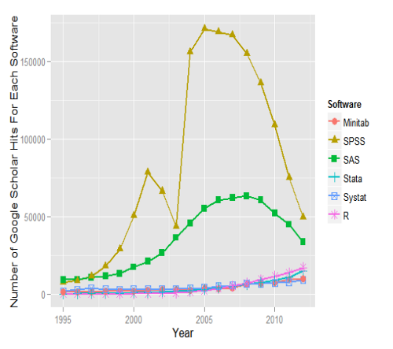
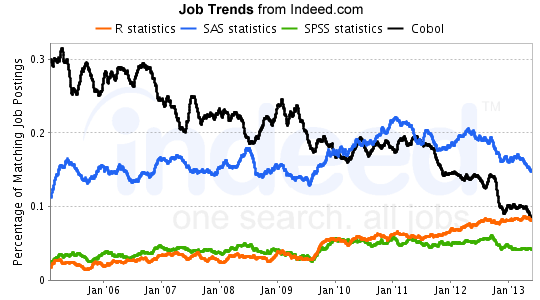

```{r, echo=FALSE, include=FALSE}
pkgs <- c("png", "grid", "shiny")
lapply(pkgs, library, character.only = T)
```

Introduction
========================================================


This course is brought to you the Consumer Data Research Centre
([CDRC](http://geotalisman.org/)), a
project based at the University of Leeds and UCL. It is 
funded by the ESRC's ([Big Data Network](http://www.esrc.ac.uk/research/major-investments/Big-Data/BDN-Phase2.aspx))

Course agenda
=======================================================


During this course we will cover these topics

- An introduction to R (14:00 - 15:00)
- Loading, interrogating and manipulating spatial data (15:00 - 16:00)
- Making maps with ggplot2 (16:00 - 16:30)
- Questions, answers and experimenting with R

<!--

LUNCH

- Making maps in ggplot2 (13:30 - 14:30)
- Basemaps (14:30 - 15:30)
- More advanced visuals (15:30 - 16:00)
- Taking it further + Q & A (16:00 onwards)
-->

```{r, echo=FALSE}
# During this course we will cover these topics
# 
# - An introduction to R                    (9:30 - 10:30)
# - Loading and interrogating spatial data (10:30 - 11:30)
# - Manipulating spatial objects (11:30 - 12:30)
# 
# LUNCH
# 
# - Making maps in ggplot2 (13:30 - 14:30)              
# - Basemaps (14:30 - 15:30)
# - More advanced visuals (15:30 - 16:00)
# 
# - Taking it further + Q & A (16:00 onwards)
```


A bit about R
========================================================

- Named after S and its creators
- De-facto standard for advanced statistical analysis
- A programming language in its own right
- The power of the command line
- Used by an increasing number of organisations

Why R?
========================================================

- **Performace**: stable, light and fast
- **Support network** 
 - documentation, community, developers
- **Reproducibility**
 - anyone anywhere can reproduce results
 - enables dissemination (RPubs, RMarkdown, .RPres) - this presentation is a .Rmd file!
- **Versatility**: unified solution to *almost* any numerical problem, graphical capabilities
- **Ethics** removes economic barrier to statistics, is open and democratic

R is up and coming I
=====================
 

Source: [r4stats.com](http://r4stats.com/articles/popularity/) 

II - Increasing popularity in academia
========================


Source: [r4stats.com](http://r4stats.com/articles/popularity/) 

III - R vs Python
====================

```{r, echo=FALSE, fig.height=4}
grid.raster(readPNG("~/Pictures/Selection_198.png"))
# 
```


Source: [Data Camp](http://i0.wp.com/blog.datacamp.com/wp-content/uploads/2015/05/R-vs-Python-216-2.png)

IV - employment market
=====================



Source: [revolution analytics](http://blog.revolutionanalytics.com/2013/08/job-trends-for-statistics-packages.html)


Why R for spatial data?
===================================================

- Extensive and rapidly expanding spatial packages
- Interface with 'conventional' GIS software
- The advantages of the command-line:

> "With the advent of “modern” GIS software, most people want 
> to point and click their way through life.
> That’s good, but there is a tremendous amount of 
> flexibility and power waiting for you with the command
> line. Many times you can do something on the command
> line in a fraction of the time you can do it with
> a GUI (Sherman 2008, p. 283)

Why R for spatial data II
=============================
It can take data in a wide range of formats.
E.g. MySQL database dump gives you this:

LINESTRING(-1.81 52.55,-1.81 52.55, … )  - solved:


```{r, eval=FALSE}
ps <- as.list(ps) # make a list
for(i in 1:length(ps)){
  ps[[i]] <- gsub("LINESTRING\\(", "", ps[[i]])
  ps[[i]] <- gsub("\\)", "", ps[[i]])
  ps[[i]] <- gsub(" ", ",", ps[[i]])
  ps[[i]] <- matrix(ps[[i]], ncol=2, byrow=T)
  ps[[i]] <- Line(ps[[i]])
}
```

And if you get stuck? Just ask!

Example: I could not load a `MultiFeature` GeoJSON. So I asked: http://stackoverflow.com/q/29066198/1694378


Visualisation
===========================

- R's visualisation capabilities have evolved over time
- Used to create plots in the best academic journals
- ggplot2 has **revolutionised** the visualisation of quantitative 
information in R, and (possibly) overall
- Thus there are different camps with different preferences when it comes to maps in R

Why focus on visualisation?
===============

If you cannot visualise your data, it is very difficult to understand your data. 
Conversely, visualisation will greatly aid in communicating your results.

> Human beings are remarkably adept at discerning relationships from visual
> representations. A well-crafted graph can help you make meaningful comparisons among thousands of pieces of information, extracting patterns not easily found through other methods. ... Data analysts need to look at their data, and this is one area where R shines.
(Kabacoff, 2009, p. 45).

Maps, the 'base graphics' way
==========


Source: Cheshire and Lovelace (2014) - [available online](https://github.com/geocomPP/sdvwR)

The 'ggplot2' way (source: [This tutorial](https://github.com/Robinlovelace/Creating-maps-in-R)!)
===============

```{r, echo=FALSE, fig.height=7, fig.cap="Source: [This tutorial](https://github.com/Robinlovelace/Creating-maps-in-R)!"}
grid.raster(readPNG("figure/facet_london.png"))
# 
```

R in the wild 1: Maps of all census variables for local authorities
===========


R in the wild 2: Global shipping routes in the late 1700s
===========

```{r, echo=FALSE}
grid.raster(readPNG("figure/dutch_shipping1750_1800.png"))
# 
```


Source: [R-Bloggers](http://www.r-bloggers.com/mapped-british-and-spanish-shipping-1750-1800/)

R in the wild 3: The national propensity to cycle tool (NPCT)
============

```{r, echo=FALSE, fig.height=4}
# runApp("~/other-repos/pct-shiny/master/")
grid.raster(readPNG("~/Pictures/Selection_115.png"))
```

See https://github.com/npct/pct-shiny

```{r, echo=FALSE}
# Energy use of commuting - my [thesis](https://github.com/Robinlovelace/thesis-reproducible) and [RPubs](http://rpubs.com/RobinLovelace/7178)
# # Online planning tool built in R
# 
# <iframe src="http://geo8.webarch.net/master/"></iframe>
```

# R in the wild 4: Mapping bicycle crashes in West Yorkshire I. | Source: [Lovelace, Roberts and Kellar](http://eprints.whiterose.ac.uk/83930/) (2015)

```{r, fig.height=6, echo=FALSE}
grid.raster(readPNG("~/repos/bikeR/figures/seriousWY.png"))
```

Source: [Lovelace, Roberts and Kellar (2015)](http://eprints.whiterose.ac.uk/83930/)

# R in the wild 4: Mapping bicycle crashes in West Yorkshire II

```{r, fig.height=6, echo=FALSE}
grid.raster(readPNG("~/repos/bikeR/figures/wy-overview.png"))
```

R in the wild 5: Infographic of housing project finances
================

<!--

-->

<div style="float:center"></div>

Flexibility of ggplot2 - see [robinlovelace.net](http://robinlovelace.net/r/2013/12/27/coxcomb-plots-spiecharts-R.html)


Getting up-and-running for the tutorial
===========
Before progressing further: **Any questions?**

**Course materials** are all available online from a [GitHub repository](https://github.com/Robinlovelace/Creating-maps-in-R). Click "Download ZIP" to download all the test data, ready to procede.

The main document to accompany this tutorial is a [pdf](https://github.com/Robinlovelace/Creating-maps-in-R/raw/master/intro-spatial-rl.pdf) within the main repository. This is to be made available for free worldwide - any comments/corrections welcome.

