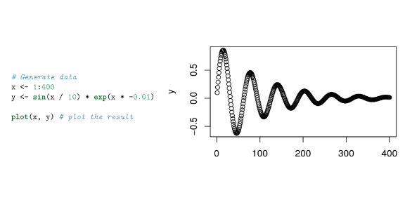
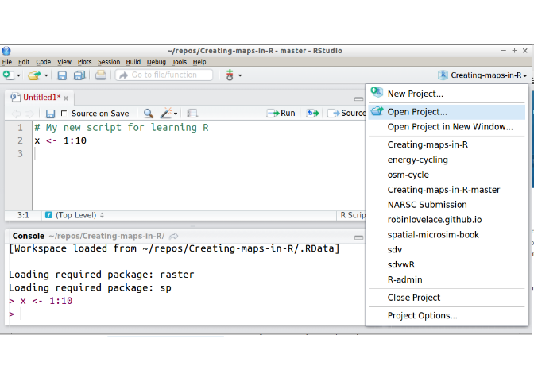
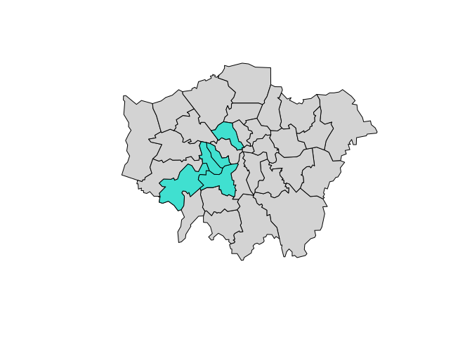
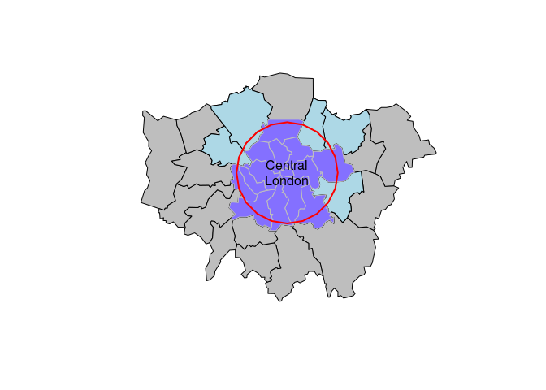
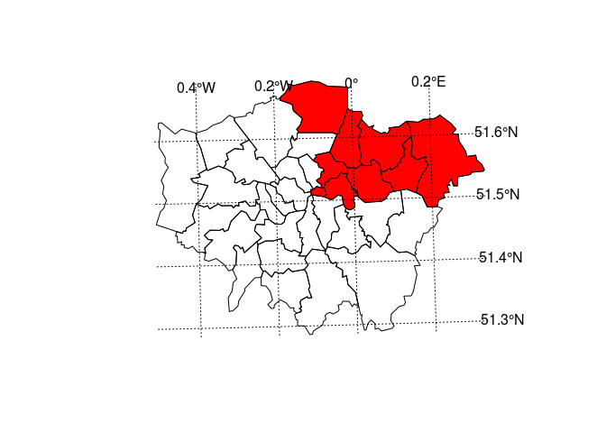
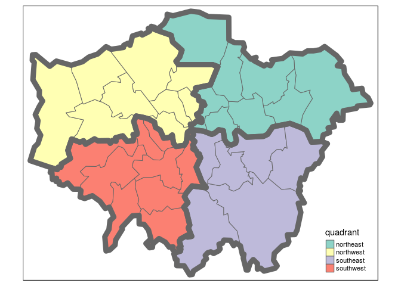
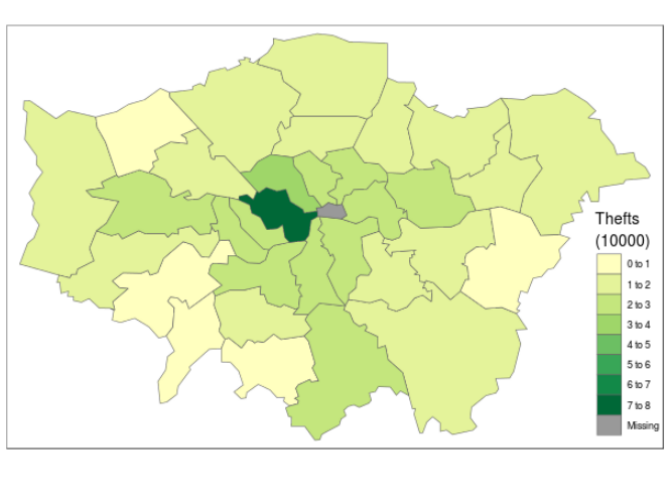
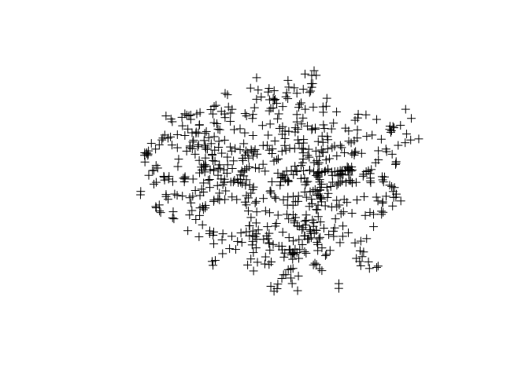
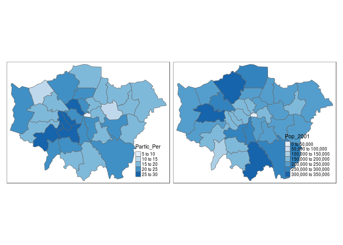
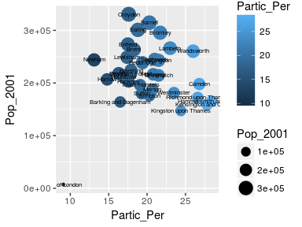

Introduction to visualising spatial data in R
================

Preface
-------

This tutorial is an introduction to visualising and analysing spatial data in R based on the **sp** class system. For a guide to the more recent **sf** package check out [Chapter 2](http://robinlovelace.net/geocompr/spatial-class.html) of the in-development book [Geocomputation with R](https://github.com/Robinlovelace/geocompr), the source code of which can be found at [github.com/Robinlovelace/geocompr](https://github.com/Robinlovelace/geocompr).

Although **sf** supersedes **sp** in many ways, there is still merit in learning the content in this tutorial, which teaches principles that will be useful regardless of software. Specifically this tutorial focusses on map-making with R's 'base' graphics and various dedicated map-making packages for R including **tmap** and **leaflet**. It aims to teach the basics of using R as a fast, user-friendly and extremely powerful command-line Geographic Information System (GIS).

By the end of the tutorial you should have the confidence and skills needed to convert a diverse range of geographical and non-geographical datasets into meaningful analyses and visualisations. Using data and code provided in this repository all of the results are reproducible, culminating in publication-quality maps such as the faceted map of London's population below:


The course will even show you how to make your maps animated:


An up-to-date pdf version of this tutorial is maintained for teaching purposes in the file [intro-spatial-rl.pdf](https://github.com/Robinlovelace/Creating-maps-in-R/blob/master/intro-spatial-rl.pdf).

If you have any feedback on this tutorial please let us know via email or via this repository. Contibutions to the `.Rmd` file ([README.Rmd](https://github.com/Robinlovelace/Creating-maps-in-R/blob/master/README.Rmd)) are welcome. Happy mapping!

The tutorial is practical in nature: you will load-in, visualise and manipulate spatial data. We assume no prior knowledge of spatial data analysis but some experience with R will help. If you have not used R before, it may be worth following an introductory tutorial, such as *Efficient R Programming* ([Gillespie and Lovelace, 2016](https://csgillespie.github.io/efficientR/)), *R for Data Science* ([Grolemund and Wickham, 2016](http://r4ds.had.co.nz/)) or tutorials suggested on [rstudio.com](https://www.rstudio.com/online-learning/) and [cran.r-project.org](https://cran.r-project.org/other-docs.html).

...

Now you know some R, it's time to turn your attention towards spatial data with R. To that end, this tutorial is organised as follows:

1.  Introduction: provides a guide to R's syntax and preparing for the tutorial
2.  Spatial data in R: describes basic spatial functions in R
3.  Creating and manipulating spatial data: includes changing projection, clipping and spatial joins
4.  Map making with **tmap**, **ggplot2** and **leaflet**: this section demonstrates map making with more advanced visualisation tools
5.  Taking spatial analysis in R further: a compilation of resources for furthering your skills

To distinguish between prose and code, please be aware of the following typographic conventions used in this document: R code (e.g. `plot(x, y)`) is written in a `monospace` font and package names (e.g. **rgdal**) are written in **bold**. A double hash (`##`) at the start of a line of code indicates that this is output from R. Lengthy outputs have been omitted from the document to save space, so do not be alarmed if R produces additional messages: you can always look up them up on-line.

As with any programming language, there are often many ways to produce the same output in R. The code presented in this document is not the only way to do things. We encourage you to play with the code to gain a deeper understanding of R. Do not worry, you cannot 'break' anything using R and all the input data can be re-loaded if things do go wrong. As with learning to skateboard, you learn by falling and getting an `Error:` message in R is much less painful than falling onto concrete! We encourage `Error:`s --- it means you are trying new things.

Part I: Introduction
====================

Prerequisites
-------------

For this tutorial you need a copy of R. The latest version can be downloaded from <http://cran.r-project.org/>.

We also suggest that you use an R editor, such as [RStudio](http://www.rstudio.com/), as this will improve the user-experience and help with the learning process. This can be downloaded from <http://www.rstudio.com>. The R Studio interface is comprised of a number of windows, the most important being the console window and the script window. Anything you type directly into the console window will not be saved, so use the script window to create scripts which you can save for later use. There is also a Data Environment window which lists the dataframes and objects being used. Familiarise yourself with the R Studio interface before getting started on the tutorial.

When writing code in any language, it is good practice to use consistent and clear conventions, and R is no exception. Adding comments to your code is also useful; make these meaningful so you remember what the code is doing when you revisit it at a later date. You can add a comment by using the `#` symbol before or after a line of code, as illustrated in the block of code below. This code should create Figure 1 if typed correctly into the Console window:



This first line in this block of code creates a new *object* called `x` and assigns it to a range of integers between 1 and 400. The second line creates another object called `y` which is assigned to a mathematical formula, and the third line plots the two together to create the plot shown.

Note `<-`, the directional "arrow" assignment symbol which creates a new object and assigns it to the value you have given.[1]

If you require help on any function, use the `help` command, e.g. `help(plot)`. Because R users love being concise, this can also be written as `?plot`. Feel free to use it at any point you would like more detail on a specific function (although R's help files are famously cryptic for the un-initiated). Help on more general terms can be found using the `??` symbol. To test this, try typing `??regression`. For the most part, *learning by doing* is a good motto, so let's crack on and download some packages and data.

R Packages
----------

R has a huge and growing number of spatial data packages. We recommend taking a quick browse on R's main website to see the spatial packages available: <http://cran.r-project.org/web/views/Spatial.html>.

In this tutorial we will use the packages from the '**sp**verse', that use the **sp** package:

-   **ggmap**: extends the plotting package **ggplot2** for maps
-   **rgdal**: R's interface to the popular C/C++ spatial data processing library [gdal](http://www.gdal.org/)
-   **rgeos**: R's interface to the powerful vector processing library [geos](http://trac.osgeo.org/geos/)
-   **maptools**: provides various mapping functions
-   [**dplyr**](http://cran.r-project.org/web/packages/dplyr/index.html) and [**tidyr**](http://blog.rstudio.org/2014/07/22/introducing-tidyr/): fast and concise data manipulation packages
-   **tmap**: a new packages for rapidly creating beautiful maps

For a tutorial based on the recent [**sf**](https://github.com/edzer/sfr) package you will have to look elsewhere, like the [geocompr](https://bookdown.org/robinlovelace/geocompr/) website, the online home of the forthcoming book *Geocomputation with R*.

Some packages may already be installed on your computer. To test if a package is installed, try to load it using the `library` function; for example, to test if **ggplot2** is installed, type `library(ggplot2)` into the console window. If there is no output from R, this is good news: it means that the library has already been installed on your computer.

If you get an error message,you will need to install the package using `install.packages("ggplot2")`. The package will download from the Comprehensive R Archive Network (CRAN); if you are prompted to select a 'mirror', select one that is close to current location. If you have not done so already, install these packages on your computer now. A [quick way](http://stackoverflow.com/questions/8175912/load-multiple-packages-at-once) to do this in one go is to enter the following lines of code:

``` r
x <- c("ggmap", "rgdal", "rgeos", "maptools", "dplyr", "tidyr", "tmap")
 # install.packages(x) # warning: uncommenting this may take a number of minutes
lapply(x, library, character.only = TRUE) # load the required packages
```

Part II: Spatial data in R
==========================

Starting the tutorial and downloading the data
----------------------------------------------

Now that we have looked at R's basic syntax and installed the necessary packages,let's load some real spatial data. The next part of the tutorial will focus on plotting and interrogating spatial objects.

The data used for this tutorial can be downloaded from: <https://github.com/Robinlovelace/Creating-maps-in-R>. Click on the "Download ZIP" button on the right hand side of the screen and once downloaded, unzip this to a new folder on your computer.

Open the existing 'Creating-maps-in-R' project using `File -> Open File...` on the top menu.

Alternatively, use the *project menu* to open the project or create a new one. It is *highly recommended* that you use RStudio's projects to organise your R work and that you organise your files into sub-folders (e.g. `code`, `input-data`, `figures`) to avoid digital clutter (Figure 2). The RStudio website contains an overview of the software: [rstudio.com/products/rstudio/](http://www.rstudio.com/products/rstudio/).



Opening a project sets the current working directory to the project's parent folder, the `Creating-maps-in-R` folder in this case. If you ever need to change your working directory, you can use the 'Session' menu at the top of the page or use the [`setwd` command](http://www.statmethods.net/interface/workspace.html).

The first file we are going to load into R Studio is the "london\_sport" [shapefile](http://en.wikipedia.org/wiki/Shapefile) located in the 'data' folder of the project. It is worth looking at this input dataset in your file browser before opening it in R. You will notice that there are several files named "london\_sport", all with different file extensions. This is because a shapefile is actually made up of a number of different files, such as .prj, .dbf and .shp.

You could also try opening the file "london\_sport.shp" file in a conventional GIS such as QGIS to see what a shapefile contains.

You should also open "london\_sport.dbf" in a spreadsheet program such as LibreOffice Calc. to see what this file contains. Once you think you understand the input data, it's time to open it in R. There are a number of ways to do this, the most commonly used and versatile of which is `readOGR`. This function, from the **rgdal** package, automatically extracts the information regarding the data.

**rgdal** is R’s interface to the "Geospatial Abstraction Library (GDAL)" which is used by other open source GIS packages such as QGIS and enables R to handle a broader range of spatial data formats. If you've not already *installed* and loaded the **rgdal** package (see the 'prerequisites and packages' section) do so now:

``` r
library(rgdal)
lnd <- readOGR(dsn = "data/london_sport.shp")
# lnd <- readOGR(dsn = "data", layer = "london_sport")
```

In the second line of code above the `readOGR` function is used to load a shapefile and assign it to a new spatial object called `lnd`, short for London.

`readOGR` is a *function* of the **rgdal** package, the first *argument* of which `dsn`: "data source name", the file or directory of the geographic data to be loaded. Thanks to recent developments in **rgdal**, the layer no longer has to be specified (as it is in the 3 line of code which has been *commented out*).[2]

`lnd` is now an object representing the population of London Boroughs in 2001 and the percentage of the population participating in sporting activities according to the [Active People Survey](http://data.london.gov.uk/datastore/package/active-people-survey-kpi-data-borough). The boundary data is from the [Ordnance Survey](http://www.ordnancesurvey.co.uk/oswebsite/opendata/).

For information about how to load different types of spatial data, see the help documentation for `readOGR`. This can be accessed by typing `?readOGR`. For another worked example, in which a GPS trace is loaded, please see Cheshire and Lovelace (2014).

The structure of spatial data in R
----------------------------------

Spatial objects like the `lnd` object are made up of a number of different *slots*, the key *slots* being `@data` (non geographic *attribute data*) and `@polygons` (or `@lines` for line data). The data *slot* can be thought of as an attribute table and the geometry *slot* is the polygons that make up the physcial boundaries. Specific *slots* are accessed using the `@` symbol. Let's now analyse the sport object with some basic commands:

``` r
head(lnd@data, n = 2)
```

    ##   ons_label                 name Partic_Per Pop_2001
    ## 0      00AF              Bromley       21.7   295535
    ## 1      00BD Richmond upon Thames       26.6   172330

``` r
mean(lnd$Partic_Per) # short for mean(lnd@data$Partic_Per) 
```

    ## [1] 20.05455

Take a look at the output created (note the table format of the data and the column names). There are two important symbols at work in the above block of code: the `@` symbol in the first line of code is used to refer to the data *slot* of the `lnd` object. The `$` symbol refers to the `Partic_Per` column (a variable within the table) in the `data` *slot*, which was identified from the result of running the first line of code.

The `head` function in the first line of the code above simply means "show the first few lines of data" (try entering `head(lnd@data)`, see `?head` for more details). The second line calculates finds the mean sports participation per 100 people for zones in London. The results works because we are dealing with numeric data. To check the classes of all the variables in a spatial dataset, you can use the following command:

``` r
sapply(lnd@data, class)
```

    ##  ons_label       name Partic_Per   Pop_2001 
    ##   "factor"   "factor"  "numeric"   "factor"

This shows that, unexpectedly, `Pop_2001` is a factor. We can *coerce* the variable into the correct, numeric, format with the following command:

``` r
lnd$Pop_2001 <- as.numeric(as.character(lnd$Pop_2001))
```

Type the function again but this time hit `tab` before completing the command. RStudio has auto-complete functionality which can save you a lot of time in the long run (see Figure 3).


To explore `lnd` object further, try typing `nrow(lnd)` (display number of rows) and record how many zones the dataset contains. You can also try `ncol(lnd)`.

One issue with the data that we have loaded is that it has no coordinate reference system (CRS):

``` r
lnd@proj4string
```

    ## CRS arguments:
    ##  +proj=tmerc +lat_0=49 +lon_0=-2 +k=0.9996012717 +x_0=400000
    ## +y_0=-100000 +ellps=airy +units=m +no_defs

Basic plotting
--------------

Now we have seen something of the structure of spatial objects in R, let us look at plotting them. Note, that plots use the *geometry* data, contained primarily in the `@polygons` slot.

``` r
plot(lnd) # not shown in tutorial - try it on your computer
```

`plot` is one of the most useful functions in R, as it changes its behaviour depending on the input data (this is called *polymorphism* by computer scientists). Inputting another object such as `plot(lnd@data)` will generate an entirely different type of plot. Thus R is intelligent at guessing what you want to do with the data you provide it with.

R has powerful subsetting capabilities that can be accessed very concisely using square brackets,as shown in the following example:

``` r
# select rows of lnd@data where sports participation is less than 13
lnd@data[lnd$Partic_Per < 13, 1:3]
```

    ##    ons_label           name Partic_Per
    ## 32      00AA City of London        9.1

The above line of code asked R to select only the rows from the `lnd` object, where sports participation is lower than 13, in this case rows 17, 21 and 32, which are Harrow, Newham and the city centre respectively. The square brackets work as follows: anything before the comma refers to the rows that will be selected, anything after the comma refers to the number of columns that should be returned. For example if the data frame had 1000 columns and you were only interested in the first two columns you could specify `1:2` after the comma. The ":" symbol simply means "to", i.e. columns 1 to 2. Try experimenting with the square brackets notation (e.g. guess the result of `lnd@data[1:2, 1:3]` and test it).

So far we have been interrogating only the attribute data *slot* (`@data`) of the `lnd` object, but the square brackets can also be used to subset spatial objects, i.e. the geometry *slot*. Using the same logic as before try to plot a subset of zones with high sports participation.

``` r
# Select zones where sports participation is between 20 and 25%
sel <- lnd$Partic_Per > 20 & lnd$Partic_Per < 25
plot(lnd[sel, ]) # output not shown here
head(sel) # test output of previous selection (not shown)
```

This plot is quite useful, but it only displays the areas which meet the criteria. To see the sporty areas in context with the other areas of the map simply use the `add = TRUE` argument after the initial plot. (`add = T` would also work, but we like to spell things out in this tutorial for clarity). What do you think the `col` argument refers to in the below block? (see Figure 5).

If you wish to experiment with multiple criteria queries, use `&`.

``` r
plot(lnd, col = "lightgrey") # plot the london_sport object
sel <- lnd$Partic_Per > 25
plot(lnd[ sel, ], col = "turquoise", add = TRUE) # add selected zones to map
```



Congratulations! You have just interrogated and visualised a spatial object: where are areas with high levels of sports participation in London? The map tells us. Do not worry for now about the intricacies of how this was achieved: you have learned vital basics of how R works as a language; we will cover this in more detail in subsequent sections.

As a bonus stage, select and plot only zones that are close to the centre of London (see Figure 5). Programming encourages rigorous thinking and it helps to define the problem more specifically:

> **Challenge**: Select all zones whose geographic centroid lies within 10 km of the geographic centroid of inner London.[3]



Selecting quadrants
-------------------

<!-- In this example we will now interrogate the shapefile for London and split it into quadrants using lines of latitude and longitude. This will work in a similar way to the previous example. Once we have the centre point we will then use this create the lines of latitude and longitude on which the centre of the wards will be tested against. -->
The code below should help understand the way spatial data work in R.

``` r
# Find the centre of the london area
easting_lnd <- coordinates(gCentroid(lnd))[[1]]
northing_lnd <- coordinates(gCentroid(lnd))[[2]]

# arguments to test whether or not a coordinate is east or north of the centre
east <- sapply(coordinates(lnd)[,1], function(x) x > easting_lnd)
north <- sapply(coordinates(lnd)[,2], function(x) x > northing_lnd)

# test if the coordinate is east and north of the centre
lnd$quadrant <- "unknown" # prevent NAs in result
lnd$quadrant[east & north] <- "northeast"
```

> **Challenge**: Based on the the above code as refrence try and find the remaining 3 quadrants and colour them as per Figure 6. Hint - you can use the **llgridlines** function in order to overlay the long-lat lines. For bonus points try to desolve the quadrants so the map is left with only 4 polygons.


<p class="caption">
The 4 quadrants of London and dissolved borders. Challenge: recreate a plot that looks like this.
</p>

<!-- ## Attribute data -->
<!-- As we discovered in the previous section, shapefiles contain both attribute data and geometry data, both of which are automatically loaded into R when the  -->
<!-- `readOGR` function is used. Let's look again at the attribute data of the `lnd` object by looking at the headings contained within it: `names(lnd)` -->
<!-- Remember, the attribute data is contained in the `data` *slot* that can be accessed using the `@` symbol: `lnd@data`. This is useful if you do not wish to work with the spatial components of the data at all times. -->
<!-- Type `summary(lnd)` to get some additional information about the -->
<!-- data object. Spatial objects in R contain -->
<!-- much additional information: -->
<!-- ``` -->
<!-- summary(lnd) -->
<!-- ## Object of class SpatialPolygonsDataFrame -->
<!-- ## Coordinates: -->
<!-- ## min max -->
<!-- ## x 503571.2 561941.1 -->
<!-- ## y 155850.8 200932.5 -->
<!-- ## Is projected: TRUE -->
<!-- ## proj4string : -->
<!-- ## [+proj=tmerc +lat_0=49 +lon_0=-2 +k=0.9996012717 ....] -->
<!-- ... -->
<!-- ``` -->
<!-- The first line of the above output tells us that `lnd` is a special spatial class: a `SpatialPolygonsDataFrame`. -->
<!-- This means it is composed of -->
<!-- various polygons, each of which has a number of attributes. -->
<!-- (Summaries of the attribute data are also provided, but are not printed above.) This is the ideal -->
<!-- class of data to represent administrative zones. The coordinates tell -->
<!-- us what the maximum and minimum x and y values are (the spatial extent of the data - useful for plotting). -->
<!-- Finally, we are told something of the coordinate reference system -->
<!-- with the `Is projected` and `proj4string` lines. -->
<!-- In this case, we have a projected system, which means the data is relative to some point on the Earth's surface. -->
<!-- We will cover reprojecting data in the next part of the tutorial. -->

Part III: Creating and manipulating spatial data
================================================

Alongside visualisation and interrogation, a GIS must also be able to create and modify spatial data. R's spatial packages provide a very wide and powerful suite of functionality for processing and creating spatial data.

*Reprojecting* and *joining/clipping* are fundamental GIS operations, so in this section we will explore how these operations can be undertaken in R. Firstly We will join non-spatial data to spatial data so it can be mapped. Finally we will cover spatial joins, whereby information from two spatial objects is combined based on spatial location.

Creating new spatial data
-------------------------

R objects can be created by entering the name of the class we want to make. `vector` and `data.frame` objects for example, can be created as follows:

``` r
vec <- vector(mode = "numeric", length = 3)
df <- data.frame(x = 1:3, y = c(1/2, 2/3, 3/4))
```

We can check the class of these new objects using `class()`:

``` r
class(vec)
```

    ## [1] "numeric"

``` r
class(df)
```

    ## [1] "data.frame"

The same logic applies to spatial data. The input must be a numeric matrix or data.frame:

``` r
sp1 <- SpatialPoints(coords = df)
```

We have just created a spatial points object, one of the fundamental data types for spatial data. (The others are lines, polygons and pixels, which can be created by `SpatialLines`, `SpatialPolygons` and `SpatialPixels`, respectively.) Each type of spatial data has a corollary that can accepts non-spatial data, created by adding `DataFrame`. `SpatialPointsDataFrame()`, for example, creates points with an associated `data.frame`. The number of rows in this dataset must equal the number of features in the spatial object, which in the case of `sp1` is 3.

``` r
class(sp1)
```

    ## [1] "SpatialPoints"
    ## attr(,"package")
    ## [1] "sp"

``` r
spdf <- SpatialPointsDataFrame(sp1, data = df)
class(spdf)
```

    ## [1] "SpatialPointsDataFrame"
    ## attr(,"package")
    ## [1] "sp"

The above code extends the pre-existing object `sp1` by adding data from `df`. To see how strict spatial classes are, try replacing `df` with `mat` in the above code: it causes an error. All spatial data classes can be created in a similar way, although `SpatialLines` and `SpatialPolygons` are much more complicated (Bivand et al. 2013). More frequently your spatial data will be read-in from an externally-created file, e.g. using `readOGR()`. Unlike the spatial objects we created above, most spatial data comes with an associate 'CRS'.

Projections: setting and transforming CRS in R
----------------------------------------------

The *Coordinate Reference System* (CRS) of spatial objects defines where they are placed on the Earth's surface. You may have noticed '`proj4string` 'in the summary of `lnd` above: the information that follows represents its CRS. Spatial data should always have a CRS. If no CRS information is provided, and the correct CRS is known, it can be set as follow:

``` r
proj4string(lnd) <- NA_character_ # remove CRS information from lnd
proj4string(lnd) <- CRS("+init=epsg:27700") # assign a new CRS
```

R issues a warning when the CRS is changed. This is so the user knows that they are simply changing the CRS, not *reprojecting* the data. An easy way to refer to different projections is via [EPSG codes](http://www.epsg-registry.org/).

Under this system `27700` represents the British National Grid. 'WGS84' (`epsg:4326`) is a very commonly used CRS worldwide. The following code shows how to search the list of available EPSG codes and create a new version of `lnd` in WGS84:[4]

``` r
EPSG <- make_EPSG() # create data frame of available EPSG codes
EPSG[grepl("WGS 84$", EPSG$note), ] # search for WGS 84 code 
```

    ##      code     note                                         prj4
    ## 249  4326 # WGS 84          +proj=longlat +datum=WGS84 +no_defs
    ## 4890 4978 # WGS 84 +proj=geocent +datum=WGS84 +units=m +no_defs

``` r
lnd84 <- spTransform(lnd, CRS("+init=epsg:4326")) # reproject
```

Above, `spTransform` converts the coordinates of `lnd` into the widely used WGS84 CRS. Now we've transformed `lnd` into a more widely used CRS, it is worth saving it. R stores data efficiently in `.RData` or `.Rds` formats. The former is more restrictive and maintains the object's name, so we use the latter.

``` r
# Save lnd84 object (we will use it in Part IV)
saveRDS(object = lnd84, file = "data/lnd84.Rds")
```

Now we can remove the `lnd84` object with the `rm` command. It will be useful later. (In RStudio, notice it also disappears from the Environment in the top right panel.)

``` r
rm(lnd84) # remove the lnd object
# we will load it back in later with readRDS(file = "data/lnd84.Rds")
```

Attribute joins
---------------

Attribute joins are used to link additional pieces of information to our polygons. In the `lnd` object, for example, we have 4 attribute variables --- that can be found by typing `names(lnd)`. But what happens when we want to add more variables from an external source? We will use the example of recorded crimes by London boroughs to demonstrate this.

To reaffirm our starting point, let's re-load the "london\_sport" shapefile as a new object and plot it:

``` r
library(rgdal) # ensure rgdal is loaded
# Create new object called "lnd" from "london_sport" shapefile
lnd <- readOGR("data/london_sport.shp")
plot(lnd) # plot the lnd object (not shown)
nrow(lnd) # return the number of rows (not shown)
```

The non-spatial data we are going to join to the `lnd` object contains records of crimes in London. This is stored in a comma separated values [(`.csv`)](https://raw.githubusercontent.com/Robinlovelace/Creating-maps-in-R/master/data/mps-recordedcrime-borough.csv) file called "mps-recordedcrime-borough". If you open the [file](https://raw.githubusercontent.com/Robinlovelace/Creating-maps-in-R/master/data/mps-recordedcrime-borough.csv) in a separate spreadsheet application first, we can see each row represents a single reported crime. We are going to use a function called `aggregate` to aggregate the crimes at the borough level, ready to join to our spatial `lnd` dataset. A new object called `crime_data` is created to store this data.

``` r
# Create and look at new crime_data object
crime_data <- read.csv("data/mps-recordedcrime-borough.csv",
  stringsAsFactors = FALSE)

head(crime_data$CrimeType) # information about crime type

# Extract "Theft & Handling" crimes and save
crime_theft <- crime_data[crime_data$CrimeType == "Theft & Handling", ]
head(crime_theft, 2) # take a look at the result (replace 2 with 10 to see more rows)

# Calculate the sum of the crime count for each district, save result
crime_ag <- aggregate(CrimeCount ~ Borough, FUN = sum, data = crime_theft)
# Show the first two rows of the aggregated crime data
head(crime_ag, 2)
```

You should not expect to understand all of this upon first try: simply typing the commands and thinking briefly about the outputs is all that is needed at this stage. Here are a few things that you may not have seen before that will likely be useful in the future:

-   In the first line of code when we read in the file we specify its location (check in your file browser to be sure).
-   The `==` function is used to select only those observations that meet a specific condition i.e. where it is equal to, in this case all crimes involving "Theft and Handling".
-   The `~` symbol means "by": we aggregated the `CrimeCount` variable by the district name.

Now that we have crime data at the borough level, the challenge is to join it to the `lnd` object. We will base our join on the `Borough` variable from the `crime_ag` object and the `name` variable from the `lnd` object. It is not always straight-forward to join objects based on names as the names do not always match. Let's see which names in the `crime_ag` object match the spatial data object, `lnd`:

``` r
# Compare the name column in lnd to Borough column in crime_ag to see which rows match.
lnd$name %in% crime_ag$Borough
```

    ##  [1]  TRUE  TRUE  TRUE  TRUE  TRUE  TRUE  TRUE  TRUE  TRUE  TRUE  TRUE
    ## [12]  TRUE  TRUE  TRUE  TRUE  TRUE  TRUE  TRUE  TRUE  TRUE  TRUE  TRUE
    ## [23]  TRUE  TRUE  TRUE  TRUE  TRUE  TRUE  TRUE  TRUE  TRUE  TRUE FALSE

``` r
# Return rows which do not match
lnd$name[!lnd$name %in% crime_ag$Borough]
```

    ## [1] City of London
    ## 33 Levels: Barking and Dagenham Barnet Bexley Brent Bromley ... Westminster

The first line of code above uses the `%in%` command to identify which values in `lnd$name` are also contained in the Borough names of the aggregated crime data. The results indicate that all but one of the borough names matches. The second line of code tells us that it is 'City of London'. This does not exist in the crime data. This may be because the City of London has it's own Police Force.[5] (The borough name in the crime data does not match `lnd$name` is 'NULL'. Check this by typing `crime_ag$Borough[!crime_ag$Borough %in% lnd$name]`.)

> **Challenge:** identify the number of crimes taking place in borough 'NULL', less than 4,000.

Having checked the data found that one borough does not match, we are now ready to join the spatial and non-spatial datasets. It is recommended to use the `left_join` function from the **dplyr** package but the `merge` function could equally be used. Note that when we ask for help for a function that is not loaded, nothing happens, indicating we need to load it:

``` r
library(dplyr) # load dplyr 
```

We use `left_join` because we want the length of the data frame to remain unchanged, with variables from new data appended in new columns (see `?left_join`). The `*join` commands (including `inner_join` and `anti_join`) assume, by default, that matching variables have the same name. Here we will specify the association between variables in the two data sets:

``` r
head(lnd$name) # dataset to add to (results not shown)
head(crime_ag$Borough) # the variables to join

# head(left_join(lnd@data, crime_ag)) # test it works
lnd@data <- left_join(lnd@data, crime_ag, by = c('name' = 'Borough'))
```

    ## Warning: Column `name`/`Borough` joining factor and character vector,
    ## coercing into character vector

Take a look at the new `lnd@data` object. You should see new variables added, meaning the attribute join was successful. Congratulations! You can now plot the rate of theft crimes in London by borough (see Fig 8).

``` r
library(tmap) # load tmap package (see Section IV)
qtm(lnd, "CrimeCount") # plot the basic map
```


<p class="caption">
Number of thefts per borough.
</p>

> **Optional challenge:** create a map of additional variables in London

With the attribute joining skills you have learned in this section, you should now be able to take datasets from many sources, e.g. [data.london.gov.uk](http://data.london.gov.uk/dataset/london-borough-profiles), and join them to your geographical data.

<!-- Using this dataset and the methods developed above, Figure 8 was -->
<!-- created: the proportion of council seats won by the Conservatives -->
<!-- in the 2014 local elections. The **challenge** is to create  -->
<!-- a similar map of a different variable (you may need to skip to -->
<!-- Part IV to plot continuous variables).^[Hint: the solution relies on the -->
<!-- **rgeos** function `gCentroid()`. To -->
<!-- see how this map was created, see the code -->
<!-- in README.Rmd at [github.com/Robinlovelace/Creating-maps-in-R/blob/master/README.Rmd](https://github.com/Robinlovelace/Creating-maps-in-R/blob/master/README.Rmd).] -->
<!-- ```{r, echo=FALSE, results='hide', message=FALSE, warning=FALSE, fig.cap="Proportion of council seats won by Conservatives in the 2014 local elections using data from data.london.gov and joined using the methods presented in this section", , out.width="48%", fig.align="center"} -->
<!-- # install.packages("ggmap") -->
<!-- library(maptools) -->
<!-- library(ggmap) -->
<!-- borough_dat <- read.csv("data/london-borough-profiles-2014.csv") -->
<!-- names(borough_dat) -->
<!-- borough_dat <- dplyr::rename(borough_dat, conservative = Proportion.of.seats.won.by.Conservatives.in.2014.election) -->
<!-- borough_dat$conservative <- as.numeric(as.character(borough_dat$conservative)) -->
<!-- summary(borough_dat$conservative) -->
<!-- head(lnd$ons_label) -->
<!-- head(borough_dat$Code) -->
<!-- # check the joining variables work -->
<!-- summary(borough_dat$Code %in% lnd$ons_label) -->
<!-- # select the data to join -->
<!-- to_join <- select(borough_dat, Code, conservative) -->
<!-- lnd@data <- left_join(lnd@data, to_join, by = c('ons_label' = 'Code')) -->
<!-- lnd_f <- fortify(lnd, region = "ons_label") -->
<!-- lnd_f <- left_join(lnd_f, to_join, by = c('id' = 'Code')) -->
<!-- map <- ggplot(lnd_f, aes(long, lat, group = group, fill = conservative)) + -->
<!--   geom_polygon() + -->
<!--   coord_equal() + -->
<!--   labs(x = "Easting (m)", y = "Northing (m)", fill = "% Tory") + -->
<!--   scale_fill_continuous(low = "grey", high = "blue") + -->
<!--   theme_nothing(legend = T) -->
<!-- map -->
<!-- ``` -->
Clipping and spatial joins
--------------------------

In addition to joining by attribute (e.g. Borough name), it is also possible to do [spatial joins](http://help.arcgis.com/en/arcgisdesktop/10.0/help/index.html#//00080000000q000000) in R. We use transport infrastructure points as the spatial data to join, with the aim of finding out about how many are found in each London borough.

``` r
library(rgdal)
# create new stations object using the "lnd-stns" shapefile.
stations <- readOGR(dsn = "data/lnd-stns.shp")
# stations = read_shape("data/lnd-stns.shp") # from tmap
proj4string(stations) # this is the full geographical detail.
proj4string(lnd) # what's the coordinate reference system (CRS)
bbox(stations) # the extent, 'bounding box' of stations
bbox(lnd) # return the bounding box of the lnd object
```

The `proj4string()` function shows that the Coordinate Reference System (CRS) of `stations` differs from that of our `lnd` object. OSGB 1936 (or [EPSG 27700](http://spatialreference.org/ref/epsg/27700/)) is the official CRS for the UK, so we will convert the 'stations' object to this:

``` r
# Create reprojected stations object
stations <- spTransform(stations, CRSobj = CRS(proj4string(lnd)))
plot(lnd) # plot London 
points(stations) # overlay the station points
```


Note the `stations` points now overlay the boroughs but that the spatial extent of `stations` is greater than that of `lnd`.

To clip the `stations` so that only those falling within London boroughs are retained we can use `sp::over`, or simply the square bracket notation for subsetting tabular data (enter `?gIntersects` to find out another way to do this):

``` r
stations <- stations[lnd, ] 
plot(stations) # test the clip succeeded
```



<!-- The above line of code says: "output all `stations` within -->
<!-- the `lnd` object bounds", a concise way -->
<!-- of clipping that is consistent -->
<!-- with R's syntax for non-spatial clipping. -->
<!-- To prove it worked, only stations within the London boroughs appear in the plot. -->
`gIntersects` can achieve the same result, but with more lines of code (see [www.rpubs.com/RobinLovelace](http://www.rpubs.com/RobinLovelace/11796) for more on this) .

<!-- It may seem confusing that two different functions -->
<!-- can be used to generate the same result. However, -->
<!-- this is a common issue in R; the question -->
<!-- is finding the most appropriate solution. -->
<!-- In its less concise form (without use of square brackets), -->
<!-- `over` takes two main input arguments: -->
<!-- the target layer (the layer to be altered) and the -->
<!-- source layer by which the target layer is to be clipped. -->
<!-- The output of `over` is a data frame of the same -->
<!-- dimensions as the original object (in this case `stations`), -->
<!-- except that the points which fall outside the zone of interest are set to a value of `NA` ("no answer"). -->
<!-- We can use this to make a subset of the original polygons, -->
<!-- remembering the square bracket notation described in the first section. -->
<!-- We create a new object, `sel` (short for "selection"), -->
<!-- containing the indices of all relevant polygons: -->
<!-- ```{r, eval=FALSE} -->
<!-- sel <- over(stations_backup, lnd) -->
<!-- stations2 <- stations_backup[!is.na(sel[,1]),] -->
<!-- ``` -->
<!-- Typing `summary(sel)` should provide insight into how this -->
<!-- worked: it is a data frame with 1801 NA values, representing -->
<!-- zones outside of the London polygon. -->
<!-- Note that the preceding two lines of code is equivalent to the -->
<!-- single line of code, `stations <- stations[lnd, ]`. -->
<!-- The next section demonstrates -->
<!-- spatial aggregation, a more advanced version of spatial subsetting. -->
<!-- ## Spatial aggregation -->
<!-- As with R's very terse code for spatial subsetting, the base function -->
<!-- `aggregate` (which provides summaries of variables based on some grouping variable) -->
<!-- also behaves differently when the inputs are spatial objects. -->
<!-- ```{r} -->
<!-- stations_agg <- aggregate(x = stations["CODE"], by = lnd, FUN = length) -->
<!-- head(stations_agg@data) -->
<!-- ``` -->
<!-- The above code performs a number of steps in just one line: -->
<!-- - `aggregate` identifies which `lnd` polygon (borough) each `station` is located in and groups them accordingly. The use of the syntax `stations["CODE"]` tells R that we are -->
<!-- interested in the spatial data from `stations` and its `CODE` variable (any variable -->
<!-- could have been used here as we are merely counting how many points exist). -->
<!-- - It counts the number of `stations` points in each borough, using the function `length`. -->
<!-- - A new spatial object is created, with the same geometry as `lnd`, and assigned the name `stations_agg`, the count of stations. -->
<!-- It may seem confusing that the result of the aggregated function is a new shape, -->
<!-- not a list of numbers --- this is because values are assigned to the elements within -->
<!-- the `lnd` object. To extract the raw count data, one could enter `stations_agg$CODE`. -->
<!-- This variable could be added to the original `lnd` object as a new field, as follows: -->
<!-- ```{r} -->
<!-- lnd$n_points <- stations_agg$CODE -->
<!-- ``` -->
<!-- As shown below, the spatial implementation of -->
<!-- `aggregate` can provide summary statistics of variables, as well as simple counts. -->
<!-- In this case we take the variable `NUMBER` -->
<!-- and find its mean value for the stations in each ward.^[See the  -->
<!-- miniature Vignette 'Clipping and aggregating spatial data with -->
<!-- gIntersects' for more information on this: http://rpubs.com/RobinLovelace/83834 .] -->
<!-- ```{r} -->
<!-- lnd_n <- aggregate(stations["NUMBER"], by = lnd, FUN = mean) -->
<!-- ``` -->
<!-- For an optional advanced task, let us analyse and plot the result. -->
<!-- ```{r fig.cap="Choropleth map of mean values of stations in each borough"} -->
<!-- q <- cut_number(lnd_n$NUMBER,4) # a nice little function from ggplot2 -->
<!-- q <- factor(q, labels = grey.colors(n = 4)) -->
<!-- summary(q) # check what we've created -->
<!-- qc <- as.character(q) # convert to character class to plot -->
<!-- plot(lnd_n, col = qc) # plot (not shown in printed tutorial) -->
<!-- legend(legend = paste0("Q", 1:4), fill = levels(q), "topright") -->
<!-- areas <- sapply(lnd_n@polygons, function(x) x@area) -->
<!-- ``` -->
<!-- This results in a simple choropleth map and a new vector containing the area of each -->
<!-- borough (the basis for Figure 11). As an additional step, try comparing the mean -->
<!-- area of each borough with the -->
<!-- mean value of `stations` points within it: `plot(lnd_n$NUMBER, areas)`. -->
<!-- *Adding different symbols for tube stations and train stations* -->
<!-- Imagine now that we want to display all tube and train stations -->
<!-- on top of the previously created choropleth map. How would we do this? -->
<!-- The shape of points in R is determined by the `pch` argument, as demonstrated by the -->
<!-- result of entering the following code: `plot(1:10, pch=1:10)`. -->
<!-- To apply this knowledge to our map, try adding the following -->
<!-- code to the chunk above (output not shown): -->
<!-- ```{r, eval=F} -->
<!-- levels(stations$LEGEND) # see A roads and rapid transit stations (RTS) (not shown) -->
<!-- sel <- grepl("A Road Sing|Rapid", stations$LEGEND) # selection for plotting  -->
<!-- sym <- as.integer(stations$LEGEND[sel]) # symbols -->
<!-- points(stations[sel,], pch = sym) -->
<!-- legend(legend = c("A Road", "RTS"), "bottomright", pch = unique(sym)) -->
<!-- ``` -->
<!-- ```{r , echo=FALSE, eval=FALSE} -->
<!-- # , fig.cap="Symbol levels for train station types in London" -->
<!-- q <- cut(lnd_n$NUMBER, breaks= c(quantile(lnd_n$NUMBER)), include.lowest=T) -->
<!-- clr <- as.character(factor(q, labels = paste0("grey", seq(20, 80, 20)))) -->
<!-- plot(lnd_n, col = clr) -->
<!-- legend(legend = paste0("q", 1:4), fill = paste0("grey", seq(20, 80, 20)), "topright") -->
<!-- sel <- grepl("A Road Sing|Rapid", stations$LEGEND) # selection for plotting  -->
<!-- sym <- as.integer(stations$LEGEND[sel]) # symbols -->
<!-- points(stations[sel,], pch = sym) -->
<!-- legend(legend = c("A Road", "RTS"), "bottomright", pch = unique(sym)) -->
<!-- ``` -->
<!-- The above block of code first identifies which types of transport -->
<!-- points are present in the map with `levels` (this command only works on -->
<!-- factor data). Next we select a subset of `stations` using a new command, `grepl`, to -->
<!-- determine which points we want to plot. Note that `grepl`'s first argument -->
<!-- is a text string (hence the quote marks) and the second is a factor -->
<!-- (try typing `class(stations$LEGEND)` to test this). -->
<!-- `grepl` uses *regular expressions* to match whether each element in a vector -->
<!-- of text or factor names match the text pattern we want. In this case, -->
<!-- because we are only interested in roundabouts that are A roads and -->
<!-- Rapid Transit systems (RTS). Note the use of the vertical separator `|` to -->
<!-- indicate that we want to match `LEGEND` names that contain either "A Road" -->
<!-- *or* "Rapid". Based on the positive matches (saved as `sel`, a vector of -->
<!-- `TRUE` and `FALSE` values), we subset the stations. Finally we plot these as points, -->
<!-- using the integer of their name to decide the symbol and add a legend. -->
<!-- (See the documentation of `?legend` for detail on the complexities of -->
<!-- legend creation in R's base graphics.) -->
<!-- This may seem a frustrating and unintuitive way of altering -->
<!-- map graphics compared with something like QGIS. That's because it is! -->
<!-- It may not be worth stressing too -->
<!-- much about base graphics because there are intuitive alternatives -->
<!-- for quickly creating beautiful maps in R, including -->
<!-- **tmap**, **ggplot** and **leaflet**.  -->

Part IV: Making maps with tmap, ggplot2 and leaflet
===================================================

<!-- This section introduces -->
<!-- alternative methods for creating maps with R that overcome -->
<!-- some of the limitations and clunkiness of R's base graphics.  -->
<!-- Having worked hard to manipulate the spatial data, -->
<!-- it is now time to display the results clearly, beautifully -->
<!-- and, in the case of **leaflet**, interactively. -->
<!-- We try the newest of the three packages, **tmap**, first -->
<!-- as it is the easiest to use. Then we progress to explore the -->
<!-- powerful **ggplot2** paradigm before outlining **leaflet**. -->
**tmap**
--------

[**tmap**](https://github.com/mtennekes/tmap) was created to overcome some of the limitations of base graphics and **ggmap**. A concise introduction to **tmap** can be accessed (after the package is installed) by using the vignette function:

``` r
# install.packages("tmap") # install the CRAN version
library(tmap)
vignette("tmap-nutshell")
```

A couple of basic plots show the package's intuitive syntax and attractive default parameters.

``` r
qtm(shp = lnd, fill = "Partic_Per", fill.palette = "-Blues") # not shown
```

``` r
qtm(shp = lnd, fill = c("Partic_Per", "Pop_2001"), fill.palette = "Blues", ncol = 2) 
```



The plot above shows the ease with which tmap can create maps next to each other for different variables. The plot produced by the following code chunk (not shown) demonstrates the power of the `tm_facets` command. Note that all the maps created with the `qtm` function can also be created with `tm_shape`, followed by `tm_fill` (or another `tm_` function).

``` r
tm_shape(lnd) +
    tm_fill("Pop_2001", thres.poly = 0) +
tm_facets("name", free.coords = TRUE, drop.units = TRUE)
```

To create a basemap with tmap, you can use the `read_osm` function, from the [**tmaptools** package](https://github.com/mtennekes/tmaptools) as follows. Note that you must first transform the data into a *geographical* CRS:

``` r
# Transform the coordinate reference system
lnd_wgs = spTransform(lnd, CRS("+init=epsg:4326"))
if(curl::has_internet()) {
  osm_tiles = tmaptools::read_osm(bbox(lnd_wgs)) # download images from OSM
  tm_shape(osm_tiles) + tm_raster() +
    tm_shape(lnd_wgs) +
    tm_fill("Pop_2001", fill.title = "Population, 2001", scale = 0.8, alpha = 0.5) +
    tm_layout(legend.position = c(0.89, 0.02)) 
} else {
  tm_shape(lnd_wgs) +
    tm_fill("Pop_2001", fill.title = "Population, 2001", scale = 0.8, alpha = 0.5) +
    tm_layout(legend.position = c(0.89, 0.02))
}
```

    ## Warning: Current projection unknown. Long lat coordinates (wgs84) assumed.


Another way to make **tmap** maps have a basemap is by entering `tmap_mode("view")`. This will make the maps appear on a zoomable webmap powered by **leaflet**. There are many other intuitive and powerful functions in **tmap**. Check the documentation to find out more:

``` r
?tmap # get more info on tmap
```

<!-- A more established plotting paradigm is **ggplot2** -->
<!-- package. This has been subsequently -->
<!-- adapted to maps thank to **ggmap**, as described below. -->
**ggmap**
---------

**ggmap** is based on the **ggplot2** package, an implementation of the Grammar of Graphics (Wilkinson 2005). **ggplot2** can replace the base graphics in R (the functions you have been plotting with so far). It contains default options that match good visualisation practice and is well-documented: <http://docs.ggplot2.org/current/> .

As a first attempt with **ggplot2** we can create a scatter plot with the attribute data in the `lnd` object created previously:

``` r
library(ggplot2)
p <- ggplot(lnd@data, aes(Partic_Per, Pop_2001))
```

<!-- What you have just done is set up a ggplot object where -->
<!-- you say where you want the input data to come from. -->
<!-- `lnd@data` is actually a data frame contained within the -->
<!-- wider spatial object `lnd` (the `@` enables you to -->
<!-- access the attribute table of the shapefile). The characters inside the `aes` argument -->
<!-- refer to the parts of that data frame you wish to use (the variables `Partic_Per` and `Pop_2001`). -->
<!-- This has to happen within the brackets of `aes()`, which means, -->
<!-- roughly speaking 'aesthetics that vary'. -->
<!-- If you just type p and hit enter you get the error `No layers in plot`. -->
<!-- This is because you have not told `ggplot` what you want -->
<!-- to do with the data. We do this by adding so-called "geoms", -->
<!-- in this case `geom_point()`. -->
<!-- ```{r fig.cap="A simple graphic produced with **ggplot2**", fig.height=1.7, fig.width=3} -->
<!-- p + geom_point() -->
<!-- ``` -->
<!-- Within the brackets you can alter the nature of the points. Try something like `p + geom_point(colour = "red", size=2)` and experiment. -->
<!-- If you want to scale the points by borough population and colour them by sports participation this is also fairly easy by adding another `aes()` argument. -->
<!-- ```{r fig.cap="ggplot with aesthetics", eval=FALSE} -->
<!-- p + geom_point(aes(colour=Partic_Per, size=Pop_2001)) # not shown -->
<!-- ``` -->
The real power of **ggplot2** lies in its ability to add layers to a plot. In this case we can add text to the plot.

``` r
p + geom_point(aes(colour = Partic_Per, size = Pop_2001)) +
  geom_text(size = 2, aes(label = name))
```



This idea of layers (or geoms) is quite different from the standard plot functions in R, but you will find that each of the functions does a lot of clever stuff to make plotting much easier (see the documentation for a full list).

In the following steps we will create a map to show the percentage of the population in each London Borough who regularly participate in sports activities.

**ggmap** requires spatial data to be supplied as `data.frame`, using `tidy()`. The generic plot() function can use `Spatial*` objects directly; **ggplot2** cannot. Therefore we need to extract them as a data frame. The `tidy` function was written specifically for this purpose. For this to work, **broom** package must be installed.

``` r
lnd_f <- broom::tidy(lnd)
```

    ## Regions defined for each Polygons

This step has lost the attribute information associated with the lnd object. We can add it back using the `left_join` function from the **dplyr** package (see `?left_join`).

``` r
head(lnd_f, n = 2) # peak at the fortified data
lnd$id <- row.names(lnd) # allocate an id variable to the sp data
head(lnd@data, n = 2) # final check before join (requires shared variable name)
lnd_f <- left_join(lnd_f, lnd@data) # join the data
```

    ## Joining, by = "id"

The new`lnd_f` object contains coordinates alongside the attribute information associated with each London Borough. It is now straightforward to produce a map with **ggplot2**. `coord_equal()` is the equivalent of `asp = T` in regular plots with R:

``` r
map <- ggplot(lnd_f, aes(long, lat, group = group, fill = Partic_Per)) +
  geom_polygon() + coord_equal() +
  labs(x = "Easting (m)", y = "Northing (m)",
    fill = "% Sports\nParticipation") +
  ggtitle("London Sports Participation")
```

Entering `map` should result in your first ggplot-made map of London. The default colours are really nice but we may wish to produce the map in black and white, which should produce a map like the one shown below. Try changing the colours and saving plots with `ggsave()`.

``` r
map + scale_fill_gradient(low = "white", high = "black")
```


Creating interactive maps with **leaflet**
------------------------------------------

[Leaflet](http://leafletjs.com/) is the world's premier web mapping system, serving hundreds of thousands of maps worldwide each day. The JavaScript library actively developed at [github.com/Leaflet/Leaflet](https://github.com/Leaflet/Leaflet), has a strong user community. It is fast, powerful and easy to learn.

The **leaflet** package creates interactive web maps in few lines of code. One of the exciting things about the package is its tight integration with the R package for interactive on-line visualisation, **shiny**. Used together, these allow R to act as a complete map-serving platform, to compete with the likes of GeoServer! For more information on **rstudio/leaflet**, see [rstudio.github.io/leaflet/](https://rstudio.github.io/leaflet/) and the following on-line tutorial: [robinlovelace.net/r/2015/02/01/leaflet-r-package.html](http://robinlovelace.net/r/2015/02/01/leaflet-r-package.html).

``` r
install.packages("leaflet")
library(leaflet)

lnd84 <- readRDS('data/lnd84.Rds')

leaflet() %>%
  addTiles() %>%
  addPolygons(data = lnd84)
```


Advanced Task: Faceting for Maps
--------------------------------

The below code demonstrates how to read in the necessary data for this task and 'tidy' it up. The data file contains historic population values between 1801 and 2001 for London, again from the London data store.

We `tidy` the data so that the columns become rows. In other words, we convert the data from 'flat' to 'long' format, which is the form required by **ggplot2** for faceting graphics: the date of the population survey becomes a variable in its own right, rather than being strung-out over many columns.

``` r
london_data <- read.csv("data/census-historic-population-borough.csv")
# install.packages("tidyr")
library(tidyr) # if not install it, or skip the next two steps
ltidy <- gather(london_data, date, pop, -Area.Code, -Area.Name)
head(ltidy, 2) # check the output (not shown)
```

In the above code we take the `london_data` object and create the column names 'date' (the date of the record, previously spread over many columns) and 'pop' (the population which varies). The minus (`-`) symbol in this context tells gather not to include the `Area.Name` and `Area.Code` as columns to be removed. In other words, "leave these columns be". Data tidying is an important subject: more can be read on the subject in Wickham (2014) or in a `vignette` about the package, accessed from within R by entering `vignette("tidy-data")`.

Merge the population data with the London borough geometry contained within our `lnd_f` object, using the `left_join` function from the **dplyr** package:

``` r
head(lnd_f, 2) # identify shared variables with ltidy 
```

    ##       long      lat order  hole piece group id ons_label    name
    ## 1 541177.7 173555.7     1 FALSE     1   0.1  0      00AF Bromley
    ## 2 541872.2 173305.8     2 FALSE     1   0.1  0      00AF Bromley
    ##   Partic_Per Pop_2001  quadrant CrimeCount
    ## 1       21.7   295535 southeast      15172
    ## 2       21.7   295535 southeast      15172

``` r
ltidy <- rename(ltidy, ons_label = Area.Code) # rename Area.code variable
lnd_f <- left_join(lnd_f, ltidy)
```

    ## Joining, by = "ons_label"

    ## Warning: Column `ons_label` joining factors with different levels, coercing
    ## to character vector

Rename the date variable (use `?gsub` and Google 'regex' to find out more).

``` r
lnd_f$date <- gsub(pattern = "Pop_", replacement = "", lnd_f$date)
```

We can now use faceting to produce one map per year:

``` r
ggplot(data = lnd_f, # the input data
  aes(x = long, y = lat, fill = pop/1000, group = group)) + # define variables
  geom_polygon() + # plot the boroughs
  geom_path(colour="black", lwd=0.05) + # borough borders
  coord_equal() + # fixed x and y scales
  facet_wrap(~ date) + # one plot per time slice
  scale_fill_gradient2(low = "blue", mid = "grey", high = "red", # colors
    midpoint = 150, name = "Population\n(thousands)") + # legend options
  theme(axis.text = element_blank(), # change the theme options
    axis.title = element_blank(), # remove axis titles
    axis.ticks = element_blank()) # remove axis ticks
```


``` r
# ggsave("figure/facet_london.png", width = 9, height = 9) # save figure
```

There is a lot going on here so explore the documentation to make sure you understand it. Try out different colour values as well.

Try experimenting with the above code block to see what effects you can produce.

> **Challenge 1:** Try creating this plot for the % of population instead of the absolute population.

> **Challenge 2:** For bonus points, try creating an animation of London's evolving population over time (hint: a file called ggnaminate.R may help).

Part V: Taking spatial data analysis in R further
=================================================

The skills taught in this tutorial are applicable to a very wide range of situations, spatial or not. Often experimentation is the most rewarding learning method, rather than just searching for the 'best' way of doing something (Kabakoff, 2011). We recommend you play around with your data.

If you enjoyed this tutorial, you may find the book chapter "Spatial Data Visualisation with R" of interest (Cheshire and Lovelace, 2014). The project's repository can be found on its GitHub page: [github.com/geocomPP/sdvwR](https://github.com/geocomPP/sdvwR). There are also a number of bonus 'vignettes' associated with the present tutorial. These can be found on the [vignettes page](https://github.com/Robinlovelace/Creating-maps-in-R/tree/master/vignettes) of the project's repository.

Other advanced tutorials include

-   The Simple Features vignettes.
-   "solaR: Solar Radiation and Photovoltaic Systems with R", a [technical academic paper](http://www.jstatsoft.org/v50/i09/paper) on the solaR package which contains a number of spatial functions.

Such tutorials are worth doing as they will help you understand R's spatial 'ecosystem' as a cohesive whole rather than as a collection of isolated functions. In R the whole is greater than the sum of its parts.

The supportive on-line communities surrounding large open source programs such as R are one of their greatest assets, so we recommend you become an active "[open source citizen](http://blog.cleverelephant.ca/2013/10/being-open-source-citizen.html)" rather than a passive consumer.

Good resources that will help you further sharpen you R skills include:

-   R's homepage hosts a wealth of [official](http://cran.r-project.org/manuals.html) and [contributed](http://cran.r-project.org/other-docs.html) guides. <http://cran.r-project.org>
-   [StackOverflow](http://stackoverflow.com/search?q=%5Br%5D) and [GIS.StackExchange](http://gis.stackexchange.com/) groups (the "\[R\]" search term limits the results). If your question has not been answered yet, just ask, preferably with a reproducible example.
-   R's [mailing lists](http://www.r-project.org/mail.html), especially [R-sig-geo](https://stat.ethz.ch/pipermail/r-sig-geo/). See [r-project.org/mail.html](http://www.r-project.org/mail.html).

-   Dorman (2014): detailed exposition of spatial data in R, with a focus on raster data. A [free sample](https://www.packtpub.com/packtlib/book/Big%20Data%20&%20Business%20Intelligence/9781783984367/4) of this book is available online.
-   Bivand et al. (2013) : 'Applied spatial data analysis with R' - provides a dense and detailed overview of spatial data analysis.

<!--  \clearpage -->
<!-- # R quick reference -->
<!-- `#`: comments all text until line end -->
<!-- `df <- data.frame(x = 1:9, y = (1:9)^2`: create new object of class `data.frame`, called df, and assign values -->
<!-- `help(plot)`: ask R for basic help on function, the same as `?plot`. Replace `plot` with any function (e.g. `spTransform`). -->
<!-- `library(ggplot2)`: load a package (replace **ggplot2** with your package name) -->
<!-- `install.packages("ggplot2")`: install package --- note quotation marks -->
<!-- `setwd("C:/Users/username/Desktop/")`: set R's *working directory* (set it to your project's folder) -->
<!-- `nrow(df)`: count the number of rows in the object `df` -->
<!-- `summary(df)`: summary statistics of the object `df` -->
<!-- `head(df)`: display first 6 lines of object `df` -->
<!-- `plot(df)`: plot object `df` -->
<!-- `save(df, "C:/Users/username/Desktop/" )`: save df object to specified location -->
<!-- `rm(df)`: remove the `df` object -->
<!-- `proj4string(df)`: query coordinate reference system of `df` object -->
<!-- `spTransform(df, CRS("+init=epsg:4326")`: reproject `df` object to WGS84 -->
<!-- # Further information -->
<!-- the input data can be downloaded as a -->
<!-- [zip file](https://github.com/Robinlovelace/Creating-maps-in-R/archive/master.zip), -->
<!-- as described below. The entire tutorial was written in -->
<!-- [RMarkdown](http://rmarkdown.rstudio.com/), which -->
<!-- allows R code to run as the document compiles, ensuring reproducibility. -->
<!-- Any suggested improvements or new -->
<!-- [vignettes](https://github.com/Robinlovelace/Creating-maps-in-R/tree/master/vignettes) are welcome, via email -->
<!-- to Robin or by [forking](https://help.github.com/articles/fork-a-repo) -->
<!-- the [master version](https://github.com/Robinlovelace/Creating-maps-in-R/blob/master/README.Rmd) of this document. -->
<!-- The colourful syntax highlighting in this document is thanks to -->
<!-- [RMarkdown](http://rmarkdown.rstudio.com/). -->
<!-- We try to follow best practice in terms of style, roughly following -->
<!-- Google's style guide, an in-depth guide written by -->
<!-- [Johnson (2013)](http://cran.r-project.org/web/packages/rockchalk/vignettes/Rstyle.pdf) -->
<!-- and a [chapter](http://adv-r.had.co.nz/Style.html) from -->
<!-- [*Advanced R*](http://adv-r.had.co.nz/) (Wickham, in press). -->
Acknowledgements
================

The tutorial was developed for a series of Short Courses funded by the National Centre for Research Methods (NCRM), via the TALISMAN node (see [geotalisman.org](http://www.geotalisman.org/)). Thanks to the [ESRC](http://www.esrc.ac.uk/) for funding applied methods research. Many thanks to Matt Whittle, Alistair Leak, Hannah Roberts and Phil Jones who helped develop and demonstrate these materials. Amy O'Neill organised the course and encouraged feedback from participants. The final thanks is to all users and developers of open source software for making powerful tools such as R accessible and enjoyable to use.

If you have found this tutorial useful in your work, please [cite](https://raw.githubusercontent.com/Robinlovelace/Creating-maps-in-R/master/citation.bib) it:

Lovelace, R., & Cheshire, J. (2014). Introduction to visualising spatial data in R. National Centre for Research Methods Working Papers, 14(03). Retrieved from <https://github.com/Robinlovelace/Creating-maps-in-R>

References
==========

Bivand, R. S., Pebesma, E. J., & Rubio, V. G. (2013). Applied spatial data analysis with R. Springer. 2nd ed.

Cheshire, J., & Lovelace, R. (2015). Spatial data visualisation with R. In C. Brunsdon & A. Singleton (Eds.), Geocomputation (pp. 1–14). SAGE Publications. Retrieved from <https://github.com/geocomPP/sdv> . Full chapter available from <https://www.researchgate.net/publication/274697165_Spatial_data_visualisation_with_R>

Dorman, M. (2014). Learning R for Geospatial Analysis. Packt Publishing Ltd.

Gillespie, Colin, and Robin Lovelace. 2016. Efficient R Programming: A Practical Guide to Smarter Programming. O’Reilly Media. <https://csgillespie.github.io/efficientR/>.

Kabacoff, R. (2011). R in Action. Manning Publications Co.

Lamigueiro, O. P. (2012). solaR: Solar Radiation and Photovoltaic Systems with R. Journal of Statistical Software, 50(9), 1–32. Retrieved from <http://www.jstatsoft.org/v50/i09>

Wickham, H. (2014). Tidy data. The Journal of Statistical Software, 14(5), Retrieved from <http://www.jstatsoft.org/v59/i10>

Wilkinson, L. (2005). The grammar of graphics. Springer.

[1] Tip: typing `Alt -` on the keyboard will create the arrow in RStudio. The equals sign `=` also works.

[2] The third line of code is included for historical interest and to provide an opportunity to discuss R functions and their arguments (the values inside a function's brackets) in detail. Note the arguments are separated by a comma. The order in which they are specified is important. You do not have to explicitly type `dsn =` or `layer =` as R knows which order they appear. `readOGR("data", "london_sport")` would work just as well. For clarity, it is good practice to include argument names when learning new functions so we will continue to do so.

[3] To see how this map was created, see the code in [README.Rmd](https://github.com/Robinlovelace/Creating-maps-in-R/blob/master/README.Rmd) . This may be loaded by typing `file.edit("README.Rmd")` or online at [github.com/Robinlovelace/Creating-maps-in-R/blob/master/README.Rmd](https://github.com/Robinlovelace/Creating-maps-in-R/blob/master/README.Rmd).

[4] Note: entering `projInfo()` provides additional CRS options. [spatialreference.org](http://spatialreference.org/) provides more information about EPSG codes.

[5] See [www.cityoflondon.police.uk/](https://www.cityoflondon.police.uk/).
