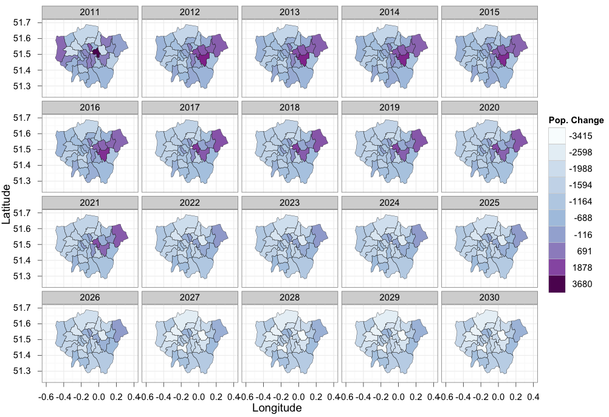

## Housekeeping

- Wifi password: ullyfo
- Network: UoLConferences

## Course materials

- Introduction to visualising spatial data with R (printed)
- An introduction to simple features (printed)
- Point pattern analysis: [vignettes/point-pattern.md](https://github.com/Robinlovelace/Creating-maps-in-R/blob/master/vignettes/point-pattern.md)

Aditional material

- Advanced visualisation: [vignettes/vspd-base-shiny.md](https://github.com/Robinlovelace/Creating-maps-in-R/blob/master/vignettes/vspd-base-shiny.md)

## Course agenda (Morning)

Coffee & set-up: 09:00 - 09:15

- Introduction - R for spatial data (Handout Part I): 09:30 - 09:40
- Loading and interrogating spatial data (Part II): 09:40 - 10:00
- Manipulating spatial objects (Part III): 10:00 - 10:45

Coffee break: 10:45 - 11:00

- Attribute joins and clipping (Part III) 11:00: - 11:30
- Map making and visualisation (Part IV) 11:30: - 12:30

LUNCH and looking at your data: 12:30 - 13:30

## Course agenda (afternoon)

- Wrap-up introductory tutorial: 13:30 - 14:00
- An introduction to **sf** (Handout 2): 14:00 - 14:45

Coffee break: 14:45 - 15:00

- Acquiring spatial data (demonstration): 15:00 - 15:15
- Point pattern analysis and models ([online tutorial](https://github.com/Robinlovelace/Creating-maps-in-R/blob/master/vignettes/point-pattern.md)): 15:15 - 16:00

- Web-maps - the Propensity to Cycle Tool: 16:15
- Your data or additional tutorials: 16:15 onwards

## Why R for spatial data?

- Extensive and rapidly expanding spatial packages
- Interface with 'conventional' GIS software
- The advantages of the command-line:

> "With the advent of “modern” GIS software, most people want 
> to point and click their way through life.
> That’s good, but there is a tremendous amount of 
> flexibility and power waiting for you with the command
> line. Many times you can do something on the command
> line in a fraction of the time you can do it with
> a GUI (Sherman 2008, p. 283)

## Visualisation

- R's visualisation capabilities have evolved over time
- Used to create plots in the best academic journals
- ggplot2 has **revolutionised** the visualisation of quantitative 
information in R, and (possibly) overall
- Thus there are different camps with different preferences when it comes to maps in R

## Why focus on visualisation?

If you cannot visualise your data, it is very difficult to understand your data. 
Conversely, visualisation will greatly aid in communicating your results.

> Human beings are remarkably adept at discerning relationships from visual
> representations. A well-crafted graph can help you make meaningful comparisons among thousands of pieces of information, extracting patterns not easily found through other methods. ... Data analysts need to look at their data, and this is one area where R shines.
(Kabacoff, 2009, p. 45).

## Maps, the 'base graphics' way


Source: Cheshire and Lovelace (2014) - [available online](https://github.com/geocomPP/sdvwR)

## The 'ggplot2' way of doing things



Source: [This tutorial](https://github.com/Robinlovelace/Creating-maps-in-R)!

## R in the wild: Mapping all census variables


## Getting up-and-running for the tutorial

Before progressing further: **Any questions?**

**Course materials** are all available online from a [GitHub repository](https://github.com/Robinlovelace/Creating-maps-in-R). Click "Download ZIP" to download all the test data, ready to procede.

The main document to accompany this tutorial is a [pdf](https://github.com/Robinlovelace/Creating-maps-in-R/raw/master/intro-spatial-rl.pdf) within the main repository. This is to be made available for free worldwide - any comments/corrections welcome.

## Links and notes

- All course material can be found online at [github.com/Robinlovelace/Creating-maps-in-R](https://github.com/Robinlovelace/Creating-maps-in-R)

- In there course notes for today can be found in a file called `2017-03-31-spatial data-lnd.Rmd` in the [course-info](https://github.com/Robinlovelace/Creating-maps-in-R/blob/master/course-info/2017-03-31-spatial-data-lnd.Rmd) folder.

## Getting the data and example code

```{r, eval=FALSE}
# get data (if you don't have it already)
u = "https://github.com/Robinlovelace/Creating-maps-in-R/archive/master.zip"
download.file(u, "master.zip")
unzip("master.zip")


```

- Open the `.Rproj` file in the resulting folder

```{r}
# use Ctrl-Enter
x = 1:5
y = x^2
plot(x, y)

library(sp)
library(rgdal)
lnd = readOGR("data/london_sport.shp")
names(lnd)
lnd$quadrant = "unknown"

plot(lnd)
llgridlines(obj = lnd)

load("data/stations.RData")

points(stations)
lnd_zone = lnd[5,]
plot(lnd_zone)
stations_in_zone =
  stations[lnd_zone,]
points(stations_in_zone, col = "red" )
library(tmap)
tmap_mode("view")
qtm(lnd)
library(dplyr)
lnd@data %>% 
  filter(Partic_Per > 25)
```


## Example: stations in central London

```{r, eval=FALSE}
library(rgdal)
lnd = readOGR("data/london_sport.shp")
```


