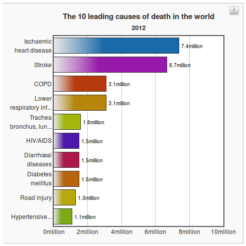

```{r setup, include=FALSE}
knitr::opts_chunk$set(echo = FALSE)
```

## The main killers in the world

```{r, echo=FALSE}

```

Source: http://www.who.int/mediacentre/factsheets/fs310/en/

## Why data analysis?

"The ultimate purpose of data analysis is to convince other people that their beliefs should be altered by the data."

## What is 'Big Data' and how to learn it?

> - An umbrella term used to describe datasets that are difficult to analyse with conventional tools.

> - To run with Big Data you must learn to walk with small data

> - Tiny reproducible examples are the best way to learn

> - Use StackOverflow: reproducible examples are needed

## Why big data?

http://labs.strava.com/clusterer/#m=gcwf5f9k&z=14&c=&dl=0&dh=400&t=Ride

http://www.bikecitizens.net/30000-kilometres-in-one-image/

## Why visualisation

If you cannot visualise your data, it is very difficult to understand your data. 
Conversely, visualisation will greatly aid in communicating your results.

> Human beings are remarkably adept at discerning relationships from visual
> representations. A well-crafted graph can help you make meaningful comparisons among thousands of pieces of information, extracting patterns not easily found through other methods. ... Data analysts need to look at their data, and this is one area where R shines.
(Kabacoff, 2009, p. 45).

## Why program?

<blockquote class="twitter-tweet" data-lang="en"><p lang="en" dir="ltr">If you want to be data scientist you must program 4 &quot;documentation, sharing and scientific repeatability&quot;: <a href="https://t.co/FQhZYMODF8">https://t.co/FQhZYMODF8</a> <a href="https://twitter.com/hashtag/rstats?src=hash">#rstats</a></p>&mdash; Robin Lovelace (@robinlovelace) <a href="https://twitter.com/robinlovelace/status/683276528172548096">January 2, 2016</a></blockquote>
<script async src="//platform.twitter.com/widgets.js" charset="utf-8"></script>

## Why R?

http://www.r-bloggers.com/why-you-should-learn-r-first-for-data-science/

## Maps, the 'base graphics' way


Source: Cheshire and Lovelace (2014) - [available online](https://github.com/geocomPP/sdvwR)

## The 'ggplot2' way

Source: [This tutorial](https://github.com/Robinlovelace/Creating-maps-in-R)!

```{r, echo=FALSE, fig.height=7, fig.cap="Source: [This tutorial](https://github.com/Robinlovelace/Creating-maps-in-R)!"}
knitr::include_graphics("../figure/facet_london.png")
# 
```

## R in the wild 1: Maps of all census variables for local authorities


## R in the wild 2: Global shipping routes in the late 1700s

```{r, echo=FALSE}
knitr::include_graphics("../figure/dutch_shipping1750_1800.png")
# 
```


Source: [R-Bloggers](http://www.r-bloggers.com/mapped-british-and-spanish-shipping-1750-1800/)

## Road traffic casualties


## Global vs local level

http://www.sciencedirect.com/science/article/pii/S0016718513002480

http://www.sciencedirect.com/science/article/pii/S136984781500039X

## The propensity to cycle tool

http://pct.bike/


