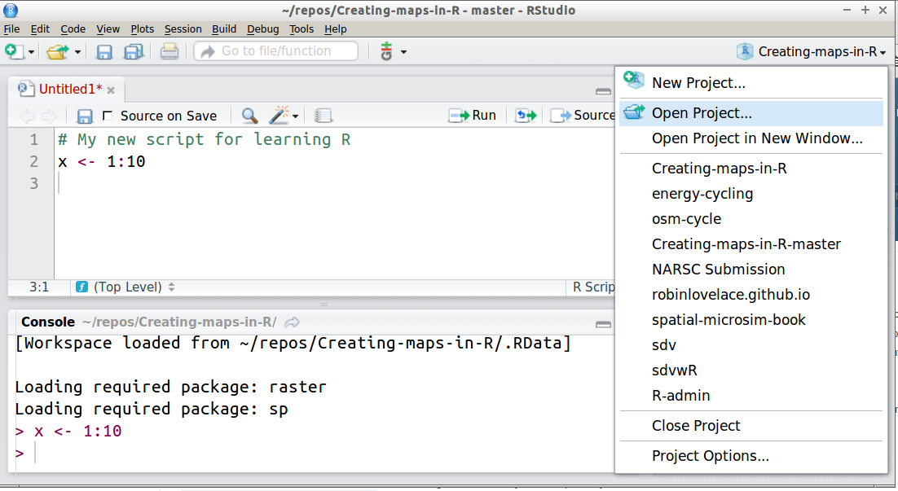

```{r, echo=FALSE}
library(grid)
library(png)
```

# Introduction

```{r, echo=FALSE}
# ## Course structure
# 
# ## Description
# 
# This one day course will get you **up-to-speed** with using R and **RStudio** for daily data processing, analysis and visualisation tasks.
# It is **practical**, so you'll 'learn by doing'.
# Based on material produced by
# [Colin Gillespie](http://www.mas.ncl.ac.uk/~ncsg3/)
# at the [University of Newcastle](http://www.ncl.ac.uk/maths/rcourse/), with
# additional detail on data manipulation.
# 
# ## Introduction
```

## Course outline

- An introduction to R based on Collin Gillespie's Introduction to R (13:30 - 14:00)
- Practical: Working through the Introduction to R booklet (14:00 - 15:00)
- Demonstration of working with transport data in R (15:00 - 15:30)
- Practical: Working through R for [Spatial Planning and Analysis](https://github.com/ITSLeeds/SSPA/blob/master/r4transport.Rmd) (15:30 - 16:30)
- Additional practical: Do the question and answer challenges in the **nclRintroduction** package
- Advanced practical: reproducing the results in the [stplanr-paper](https://cran.r-project.org/web/packages/stplanr/vignettes/stplanr-paper.html)  vignette.

## Context | See the [thesis-reproducible](https://github.com/Robinlovelace/thesis-reproducible/) repo

<!--  -->

<!-- This course is brought to you the Consumer Data Research Centre -->
<!-- ([CDRC](http://cdrc.ac.uk/)) and is  -->
<!-- funded by the ESRC's ([Big Data Network](http://www.esrc.ac.uk/research/major-investments/Big-Data/BDN-Phase2.aspx)). -->

```{r, echo=FALSE, out.width="70%", fig.cap="One of the first maps I made for my thesis"}
knitr::include_graphics("../figure/engenergy.png")
```


## What R can do - Propensity to Cycle Tool

See [pct.bike](http://pct.bike/)

```{r, echo=FALSE}
# file.copy("~/npct/pct/figures/coventry-centroids-4pres.png", "../figure/coventry-centroids.png") # copy file
grid.raster(readPNG("../figure/coventry-centroids.png"))
```

## A bit about R

- Developed by statisticians Ross Ihaka and Robert Gentleman
- De-facto standard for advanced statistical analysis
- A programming language in its own right
- The power of the command line
- Used by an increasing number of organisations

## Why R?

- **Performace**: stable, light and fast
- **Support network** 
 - documentation, community, developers
- **Reproducibility**
 - anyone anywhere can reproduce results
 - enables dissemination (RPubs, RMarkdown, .RPres) - this presentation is a .Rmd file!
- **Versatility**: unified solution to *almost* any numerical problem, graphical capabilities
- **Ethics** removes economic barrier to statistics, is open and democratic

## R is up and coming | Source: [r4stats](http://r4stats.com/articles/popularity/)


```{r, echo=FALSE, out.width="100%"}
knitr::include_graphics("../figure/r-popularity.png")
```


Source: [r4stats.com](http://r4stats.com/articles/popularity/) 


## III - R vs Python | Source: [kdnuggets](http://www.kdnuggets.com/2015/05/r-vs-python-data-science.html)


Source: [Data Camp](http://i0.wp.com/blog.datacamp.com/wp-content/uploads/2015/05/R-vs-Python-216-2.png)

## IV - employment market


Source: [revolution analytics](http://blog.revolutionanalytics.com/2013/08/job-trends-for-statistics-packages.html)

## Visualisation

- R's visualisation capabilities have evolved over time
- Used to create plots in the best academic journals
- ggplot2 has **revolutionised** the visualisation of quantitative 
information in R, and (possibly) overall
- Thus there are different camps with different preferences when it comes to maps in R

```{r, echo=FALSE, eval=FALSE}
## Learning outcomes

By the end of the course you will:

- Understand the syntax of the R language
- Be able to use RStudio for productively working on R projects
- Be able to read in data into R from a variety of sources
- Be confident in how R works to create attractive and insightful graphical outputs

## Agenda - before lunch

Course agenda

- 9:00 - 9:30: Registration and refreshments

- An introduction to R and RStudio (9:30 - 10:30)

> - Practical 1 (Chapter 1)

- Basic R functions and behaviour (10:30 - 12:30)

> - Practical 2 (Chapter 2)

**LUNCH: 12:30 - 13:30**

## Agenda - after lunch

- Reading and writing data (13:30 - 14:30)

> - Practical 3

- Data manipulation (14:30 - 15:00)

- Summary statistics (15:00 - 15:30)

> - Practical 4

**15:30 - 15:45 Refreshments**

- Plotting with R (15:45 - 16:15)

> - Practical 5

- Taking it further + Q & A (16:15 onwards)

```

## Demonstration 1: The RStudio IDE



## R as a giant calculator

```{r, eval=FALSE}
5 * 5
```

```{r, eval=FALSE}
1 + 4 * 5
```

```{r, eval=FALSE}
4 * 5 ^ 2
```

```{r, eval=FALSE}
sin(90)
```

```{r, eval=FALSE}
sin(0.5 * pi)
```

```{r, eval=FALSE, echo=FALSE}
sin(90 * pi / 180)
```

## Objects

```{r}
a <- 1
b <- 2
c <- "c"
x_thingy <- 4
```

```{r, eval=FALSE}
a + b
a * b
a + c
a / x_thingy
```

## Adding and removing objects

```{r}
ls()
x <- x_thingy
rm(x_thingy)
x
ls()
```


## Harmonograph example

- Complex outputs can be created with simple inputs

```{r, warning=FALSE}
t <- 1:1000 / 10 
x <- sin(t) * exp(t * - 0.01)
y <- sin(pi / 2 + t / 3) * exp(t * -0.01)
plot(x, y, "lines")
```

## Practical 1: Getting used to RStudio and R

> - Open RStudio and have a look around
> - Create a new project
> - Create a new R Script: pass code to the console with `Ctl-Enter`
> - Use R as a calculator: what is:

$$
\pi * 9.15^2
$$

> - Explore each of the 'panes'
> - Find and write down some useful shortcuts (`Alt-Shift-K` on Windows/Linux)

# Basic R functions and behaviour

## Functions and objects

**In R:**

- Everything that exists is an object
- Everything that happens is a function

```{r}
# Assignment of x
x <- 5
x
```

```{r, eval=FALSE}
# A trick to print x
(x <- 5)
```

```{r, eval=FALSE}
(y <- x)
```

## Functions

```{r}
sin(x)
exp(x)
factorial(x)
sinx <- sin(x)
```

## Assignment

```{r}
x = 5 # the same as x <- 5
(x = x + 1)
```


## R is vector based

```{r}
x <- c(1, 2, 5)
x
x^2
x + 2
```

```{r, eval=FALSE}
x + rev(x)
```

## The classic programming way: verbose

```{r}
x <- c(1, 2, 5)
for(i in x){
  print(i^2)
}
```

Creating a new vector based on `x`

```{r}
for(i in 1:length(x)){
  if(i == 1) x2 <- x[i]^2
  else x2 <- c(x2, x[i]^2)
}
x2
```

## Data types

R has a hierarchy of data classes, tending to the lowest:

- Binary
- Integer (numeric)
- Double (numeric)
- Character

## Examples of data types

```{r}
a <- TRUE
b <- 1:5
c <- pi
d <- "Hello Leeds"
```

```{r, eval=FALSE}
class(a)
class(b)
class(c)
class(d)
```

## Data type switching

```{r}
ab <- c(a, b)
ab
class(ab)
```


## Test on data types

```{r}
class(c(a, b))
class(c(a, c))
class(c(b, d))
```

## Sequences

```{r}
x <- 1:5
y <- 2:6
plot(x, y)
```

## Sequences with seq

```{r}
x <- seq(1,2, by = 0.2)
length(x)
x <- seq(1, 2, length.out = 5)
length(x)
```


## Practical 

- Work through Colin Gillespie's Introduction to R booklet

> - Optional: install the R package

```{r, eval=FALSE}
install.packages("drat")
drat::addRepo("rcourses")
install.packages("nclRintroduction", type="source")
library(nclRintroduction)
vignette(package = "nclRintroduction", "practical1")
```

## Demo: Transport data with R

- Let's see how R can be used to analyse transport data:

```{r}
library(stplanr)
data("routes_fast")
plot(routes_fast)
```

## Practical - work through the tutorial

- See the source code here: https://github.com/ITSLeeds/SSPA/blob/master/r4transport.Rmd
- Experiment with the content

<!-- # Reading and writing data (13:30 - 14:30) -->

<!-- ## Reading data into R can tricky -->

<!-- - There are dozens of data formats -->
<!-- - Some data formats require additional packages -->
<!-- - Text encoding can cause additional problems -->

<!-- ## Inequality data from the world bank -->

<!-- - Download data from http://www.mas.ncl.ac.uk/~ncsg3/Rcourse/movie.txt -->
<!-- - Open the file with Notepad++ -->
<!-- - Read it in with `read.csv(ineq.csv)`. -->

<!-- ```{r, echo=FALSE} -->
<!-- # url <- "http://www.metoffice.gov.uk/pub/data/weather/uk/climate/stationdata/bradforddata.txt" -->
<!-- # download.file("http://www.metoffice.gov.uk/pub/data/weather/uk/climate/stationdata/bradforddata.txt", "bradforddata.txt") -->
<!-- # df <- read.table("bradforddata.txt", skip = 5, as.is = T) -->
<!-- # df <- read.fwf("bradforddata.txt", widths = 5, skip = 5) -->
<!-- ``` -->

<!-- ## Importing a simple .csv -->

<!-- ```{r} -->
<!-- # Download from the internet: -->
<!-- # url <- "http://www.mas.ncl.ac.uk/~ncsg3/Rcourse/movie.txt" -->
<!-- # download.file(url, "movie.txt") -->
<!-- movie <- read.csv("../movie.txt", header=TRUE, stringsAsFactors=FALSE) -->
<!-- ``` -->

<!-- ## Practical 3: work through Chapter 3 -->

<!-- > - What is the size of the data saved as a .csv? -->
<!-- > - How big is the data save as .Rds? -->
<!-- > - What about if you save it as .xlsx? -->

<!-- ## Practical 3 - Reading R in the wild -->

<!-- > - Identify a medium/large dataset of interest -->
<!-- > - Read it into R -->
<!-- > - If you finish early: go back to the subsetting stage -->
<!-- > - If you finish that: find more datasets! -->
<!-- > - Try saving the data with different file formats -->

<!-- # Data manipulation (14:30 - 15:00) -->

<!-- ## An example dataset -->

<!-- - It's good to start small before going BIG -->
<!-- - A quick exploration with the diamonds dataset: -->

<!-- ```{r} -->
<!-- library(ggplot2) -->
<!-- diamonds[1:3,] -->
<!-- ``` -->

<!-- ## Selecting rows -->

<!-- The base R way -->

<!-- ```{r} -->
<!-- summary(diamonds$color) -->
<!-- head(diamonds[diamonds$color == "I",]) -->
<!-- ``` -->

<!-- The dplyr way -->

<!-- ```{r} -->
<!-- library(dplyr) -->
<!-- filter(diamonds, color == "I") -->
<!-- ``` -->

<!-- ## dplyr is clever -->

<!-- ```{r} -->
<!-- sum(diamonds$color == "I" | diamonds$color == "J") -->
<!-- dfs <- filter(diamonds, color == "I" | color == "J") -->
<!-- nrow(dfs) -->
<!-- ``` -->

<!-- ```{r} -->
<!-- arrange(diamonds, desc(z)) -->
<!-- ``` -->

## Using the 'nclRintroduction' package

```{r, eval=FALSE}
if(!require(devtools))
  install.packages("devtools")
if(!require(nclRintroduction))
  devtools::install_github("rcourses/nclRintroduction", build_vignettes = T)
library(nclRintroduction)
vignette(package = "nclRintroduction")
```

## Advanced challenge

- Reproduce the work documented in the `stplanr-paper` vignette

```{r, eval=FALSE}
vignette("stplanr-paper")
```

- Experiment with the example datasets - can you make different versions of the plots?

