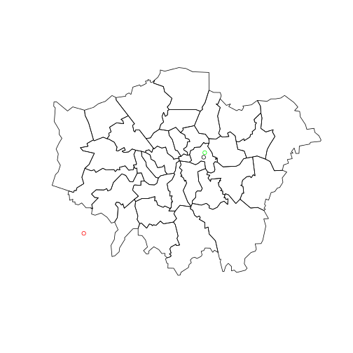
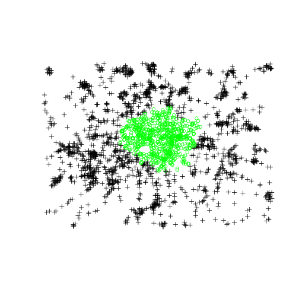

# Clipping with gIntersects

This short piece demonstrates how clipping spatial data can be done using the 
rgeos package in R. A more common method is to use the sp::over function, 
as detailed in another, larger tutorial [see here](https://github.com/Robinlovelace/Creating-maps-in-R/blob/master/intro-spatial-rl.pdf?raw=true).

The test datasets are contained in the data folder of a 
repository called Creating-maps-in-R. These, and the rgeos library
needed for the function can be loaded with the 
following commands:


```r
load("data/lnd.RData")
load("data/stations.RData")
library(rgeos)
```

```
## Loading required package: sp
## rgeos version: 0.2-19, (SVN revision 394)
##  GEOS runtime version: 3.3.8-CAPI-1.7.8 
##  Polygon checking: TRUE
```


Here, we use `gIntersects`,
although we could equally use 
`gContains`, `gWithin` and other `g...` functions. 
The power of these commands can be seen by accessing the 
rgeos help pages, e.g. `?gOverlaps`.
`gIntersects` will output information for each point, telling us which 
polygon it interacts with (i.e. the polygon it is in).

Let's take a look at how the function works on our test data:


```r
int <- gIntersects(stations, lnd, byid = T)  # find which stations intersect 
class(int)  # it's outputed a matrix
dim(int)  # with 33 rows (one for each zone) and 2532 cols (the points)
summary(int[, c(200, 500)])  # not the output of this
plot(lnd)
points(stations[200, ], col = "red")  # note point id 200 is outside the zones
points(stations[500, ], col = "green")  # note point 500 is inside
which(int[, 500] == T)  # this tells us that point 500 intersects with zone 32
points(coordinates(lnd[32, ]), col = "black")  # test the previous statement
```

 


In the above code, only the first line actually 'does' anything
in our workspace, by creating the object `int`. The proceeding 
lines are dedicated to exploring this object and what it means. 
Note that it is a matrix with columns corresponding to the points and 
rows corresponding to boroughs. The borough in which a particular 
point can be extracted from `int` as we shall see below.
For the purposes of clipping, we are only interested in whether
the point intersects with _any_ of the boroughs. This is where the 
function `apply`, which is unique to R, comes into play:


```r
clipped <- apply(int == F, MARGIN = 2, all)
plot(stations[which(clipped), ])  # shows all stations we DO NOT want
stations.cl <- stations[which(!clipped), ]  # use ! to select the invers
points(stations.cl, col = "green")  # check that it's worked
```

 

```r
stations <- stations.cl
rm(stations.cl)  # tidy up: we're only interested in clipped ones
```


The first line instructs R to look at each column (`MARGIN = 2`, we would use
`MARGIN = 1` for row-by-row analysis) and report back whether `all` of the values are
false. This creates the inverse selection that we want, hence the use of `!` to invert it.
We test that the function works on a new object (often a good idea, to avoid overwriting 
useful data) with plots and, once content that the clip has worked, save the sample of 
points to our main `stations` object and remove the now duplicated `stations.cl` object.
