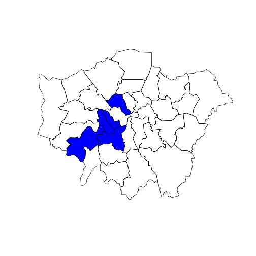
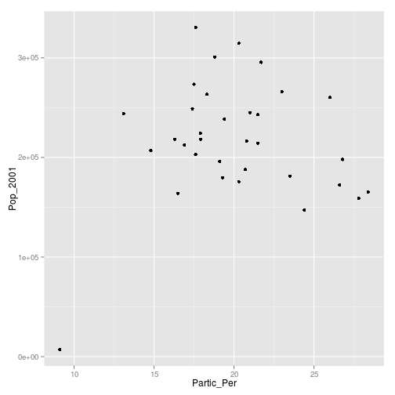
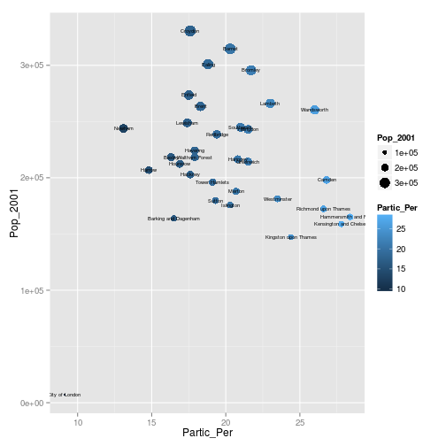
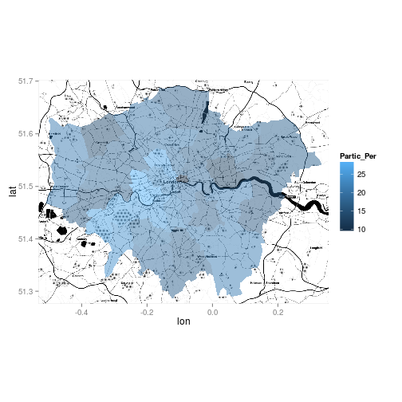
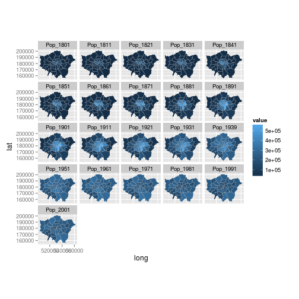

Introduction 
========================================================

This tutorial is an introduction to spatial data in R and map making with 
the popular graphics package `ggplot2`. 
It assumes no prior knowledge of spatial data analysis but 
prior understanding of R command line would be beneficial. 
For people new to R, we recommend working through an
'Introduction to R' type tutorial, such as
"A (very) short introduction to R" 
([Torfs and Brauer, 2012](http://cran.r-project.org/doc/contrib/Torfs+Brauer-Short-R-Intro.pdf)) 
or the more geographically inclined "Short introduction to R" 
([Harris, 2012](http://www.social-statistics.org/wp-content/uploads/2012/12/intro_to_R1.pdf)).

Building on such background material, 
the following set of exercises is concerned with specific functions for spatial data 
and visualisation.
An up-to-date version of this tutorial is maintained at
[https://github.com/Robinlovelace/Creating-maps-in-R](https://github.com/Robinlovelace/Creating-maps-in-R/blob/master/intro-spatial-rl.pdf) and the entire tutorial, including
the input data can be downloaded as a
[zip file](https://github.com/Robinlovelace/Creating-maps-in-R/archive/master.zip), 
as described below. 
Suggested improvements welcome - please 
[fork](https://help.github.com/articles/fork-a-repo), improve and push this document 
to its original home to ensure its longevity.

## Typographic conventions

To ensure reproducibility and allow automatic syntax highlighting, 
this document has been written in RMarkdown. 
We try to follow best practice in terms of style, roughly following 
Google's style guide and the excellent
"Rchaeological Commentary" 
([Johnson 2013](http://cran.r-project.org/web/packages/rockchalk/vignettes/Rstyle.pdf)).

Be aware of the following typographic conventions: R code (e.g. `plot(x, y)`) is
written in a `monospace` font while prose is not. Blocks of code such as, 


```r
c(1:3, 5)^2
```

```
## [1]  1  4  9 25
```


are compiled in-line: the `##` indicates this is output from R. Some of the 
output from the code below is quite long; we only show the output that is 
useful. A single hash (`#`) is a comment for humans to read that R will ignore.
All images in this document are small and low-quality to save space; they should 
display better on your computer screen and can be saved at any resolution.
The code presented here is not the only way to do things: we encourage you to 
play with it and try things out to gain a deeper understanding of R.
Don't worry, you cannot 'break' anything using R and all the input data 
can be re-loaded if things do go wrong.

## Prerequisites and packages

For this tutorial you need to install R, the latest version of which 
can be downloaded from [http://cran.r-project.org/](http://cran.r-project.org/).
A number of R editors such as [RStudio](http://www.rstudio.com/)
can be used to make R more user friendly, 
but these are not needed to complete the tutorial.

R has a huge and growing number of spatial data packages. 
These can be
installed in one go with the `ctv` package and the command `install.views("Spatial")`.
We do NOT recommend running this command for this tutorial: partly because
downloading and compiling all spatial packages takes 
a long time (hundreds of megabytes)
and also because we will add new packages when they are needed 
to see what each does. We do recommend taking a quick browse at the range of 
spatial packages on offer though: 
[http://cran.r-project.org/web/views/Spatial.html](http://cran.r-project.org/web/views/Spatial.html).

The packages we will be using are `ggplot2`, `rgdal`, `rgeos`, `maptools` and `ggmap`.
To test whether ggplot2 is installed, for example, enter `library(ggplot2)`. 
If you get an error message, it needs to be installed: `install.packages("ggplot2")`.
These will be downloaded from CRAN (the Comprehensive R Archive Network); if you are prompted 
to select a 'mirror', select one that is close to your city.

## Downloading the data for the tutorial

The data used for the tutorial can be downloaded from
[https://github.com/Robinlovelace/Creating-maps-in-R](https://github.com/Robinlovelace/Creating-maps-in-R).
Click on the "Download ZIP" button on the right and unzip this to a new folder.
Use the `setwd` command to set the working directory.
If your username is "username" and you saved the files into a 
folder called "Creating-maps-in-R-master" on your Desktop, for example, 
you would type the following:


```r
setwd("C:/Users/username/Desktop/Creating-maps-in-R-master/")
```


If you are working in RStudio, you can create a project that will automatically 
set your working directory. 

# Loading and interogating spatial data

One of the most important steps in handling spatial data with R 
is the ability to read in shapefiles. There are a number of ways to do this, 
the most commonly used and versatile of which is `readOGR`.
This function, from the `rgdal` package, automatically extracts information
about the projection and the attributes of data.
`rgdal` is R’s interface to the "Geospatial Abstraction Library (GDAL)"
which is used by other open source GIS packages such as QGIS and enables 
R to handle a broader range of spatial data formats.


```r
library(rgdal)
sport <- readOGR(dsn = "data", "london_sport")
```

```
## OGR data source with driver: ESRI Shapefile 
## Source: "data", layer: "london_sport"
## with 33 features and 4 fields
## Feature type: wkbPolygon with 2 dimensions
```


In the code above `dsn` stands for "data source name" and is an *argument* of the *function* `readOGR`.
The `dsn` argument this case, specifies the directory in which the dataset is stored. 
R functions have a default order of arguments, so `dsn = ` does not 
actually need to be typed. If there data were stored in the 
current working directory, one could use `readOGR(".", "london_sport")`.
For clarity, it is good practice to include argument names, such as `dsn` when learning new functions. 

The next argument is a *character string*. This is simply the name the file required. 
There is no need to add a file extension (e.g. `.shp`) in this case. 
The files beginning `london_sport` from the 
[example dataset](http://spatial.ly/wp-content/uploads/2013/12/spatialggplot.zip)
contain the borough population and 
the percentage of the population engaging in sporting activities and was taken from the 
[active people survey](http://data.london.gov.uk/datastore/package/active-people-survey-kpi-data-borough).
The boundary data is from the [Ordnance Survey](http://www.ordnancesurvey.co.uk/oswebsite/opendata/).

Now that we have a spatial object loaded into R's workspace, we can try
analysing it with some basic commands:


```r
plot(sport)
head(sport@data)
```

```
##   ons_label                 name Partic_Per Pop_2001
## 0      00AF              Bromley       21.7   295535
## 1      00BD Richmond upon Thames       26.6   172330
## 2      00AS           Hillingdon       21.5   243006
## 3      00AR             Havering       17.9   224262
## 4      00AX Kingston upon Thames       24.4   147271
## 5      00BF               Sutton       19.3   179767
```

```r
plot(sport[sport$Partic_Per > 25, ], col = "blue", add = TRUE)
```

 


Congratualations! You have just interogated and visualised a 
spatial dataset: what kind of places have high levels of sports
participation? The map tells us. Do not worry for now about 
how this was acheived: we will cover this in subsequent sections.

While we are on the topic of loading data, it is worth pointing out
that R can save and load data efficiently into its own data format (`.RData`).
Try `save(sport, file = "sport.RData")` and see what happens. 
If you type `rm(sport)` (which removes the object) and then `load("sport.RData")`
you should see how this works. `sport` will disappear from the workspace and then reappear.

## Attribute data

All shapefiles have both attribute table and geometry data. These are automatically loaded with 
`readOGR`. The loaded attribute data can be treated in a similar way to an R 
[data frame](http://www.statmethods.net/input/datatypes.html). 

R delibrately hides the geometry of spatial data unless you print 
the entire object (try typing `print(sport)`). 
Let's take a look at the headings of sport, using the following command: `names(sport)`
The data contained in spatial data are kept in a 'slot' that can be accessed using 
the @ symbol: `sport@data`. This is useful if you do not wish to work with the spatial components of the data at all times. 

Type `summary(sport)` to get some additional information about the data object. Spatial objects in R contain a variety of additional information:

```
Object of class SpatialPolygonsDataFrame
Coordinates:
       min      max
x 503571.2 561941.1
y 155850.8 200932.5
Is projected: TRUE 
proj4string :
[+proj=tmerc +lat_0=49 +lon_0=-2 +k=0.9996012717 ....]
```

# Manipulating spatial data in R

It is all very well being able to load and interogate spatial data
in R, but to compete with modern GIS packages it must also be able 
to modify these spatial objects before they are visualised
(see '[using R as a GIS](https://github.com/Pakillo/R-GIS-tutorial)'). 
R has
a wide range of very powerful 
functions for this, many of which are in additional packages alluded 
to in the introduction.

This course is introductory so only the most commonly required 
data manipulaiton tasks, *reprojecting* and *joining/clipping* are covered here.
We will look at joining aspatial
datasets to our spatial object via an attribute join. Spatial joins, whereby 
data is added to the target layer depending on the location of the 
origins is also covered. 

## Changing projection

You may have noticed the word `proj4string` in the 
summary of `sport`. This represents the coordinate reference system used in the data. 
In this file it has been incorrectly specified so we can change it with the following:


```r
proj4string(sport) <- CRS("+init=epsg:27700")
```

```
## Warning: A new CRS was assigned to an object with an existing CRS:
## +proj=tmerc +lat_0=49 +lon_0=-2 +k=0.9996012717 +x_0=400000 +y_0=-100000 +ellps=airy +units=m +no_defs
## without reprojecting.
## For reprojection, use function spTransform in package rgdal
```


You will see a warning. This is simply saying that you are changing 
the coordinate reference system, not reprojecting the data. 
Epsg:27700 is the code for British National Grid.
If we wanted to reproject the data into something 
like WGS84 for latitude and longitude we would use the following code:


```r
sport.wgs84 <- spTransform(sport, CRS("+init=epsg:4326"))
```


The different epsg codes are a bit of hassle to remember but you can find them all at 
[spatialreference.org](http://spatialreference.org/).

## Attribute joins

To reaffirm our starting point, let's re-plot the only 
spatial dataset in our workspace, and count the number
of polygons:


```r
library(rgdal)
lnd <- readOGR(dsn = "data", "london_sport")
```

```
## OGR data source with driver: ESRI Shapefile 
## Source: "data", layer: "london_sport"
## with 33 features and 4 fields
## Feature type: wkbPolygon with 2 dimensions
```

```r
plot(lnd)
```

 

```r
nrow(lnd)
```

```
## [1] 33
```


The dataset we will join to the London object is a
dataset on recorded crimes, with one row per crime.
We will use the non-spatial implementation of `aggregate` 
to pre-process this dataset ready to join to our spatial 
`lnd` dataset.


```r
crimeDat <- read.csv("data/mps-recordedcrime-borough.csv", fileEncoding = "UCS-2LE")
head(crimeDat)
summary(crimeDat$MajorText)
crimeTheft <- crimeDat[which(crimeDat$MajorText == "Theft & Handling"), ]
head(crimeTheft, 2)  # change 2 for more rows
crimeAg <- aggregate(CrimeCount ~ Spatial_DistrictName, FUN = "sum", data = crimeTheft)
head(crimeAg, 2)  # show the aggregated crime data
```


Now that we have crime data at the borough level, the challenge is to join it
by name. This is not always straightforward. Let us see which names in the 
crime data match the spatial data:


```r
lnd$name %in% crimeAg$Spatial_DistrictName
```

```
##  [1]  TRUE  TRUE  TRUE  TRUE  TRUE  TRUE  TRUE  TRUE  TRUE  TRUE  TRUE
## [12]  TRUE  TRUE  TRUE  TRUE  TRUE  TRUE  TRUE  TRUE  TRUE  TRUE  TRUE
## [23]  TRUE  TRUE  TRUE  TRUE  TRUE  TRUE  TRUE  TRUE  TRUE  TRUE FALSE
```

```r
lnd$name[which(!lnd$name %in% crimeAg$Spatial_DistrictName)]
```

```
## [1] City of London
## 33 Levels: Barking and Dagenham Barnet Bexley Brent Bromley ... Westminster
```


The first line of code above shows that all but one of the borough names matches;
the second tells us that it is City of London that is named differently in the 
crime data. Look at the results (not shown here) on your computer.


```r
levels(crimeAg$Spatial_DistrictName)
levels(crimeAg$Spatial_DistrictName)[25] <- as.character(lnd$name[which(!lnd$name %in% 
    crimeAg$Spatial_DistrictName)])
lnd$name %in% crimeAg$Spatial_DistrictName  # now all columns match
```


The above code block first identified the row with the faulty name and 
then renamed the level to match the `lnd` dataset. Note that we could not
rename the variable directly, as it is stored as a factor.

We are now ready to join the datasets. It is recommended to use 
the `join` function in the `plyr` package but the `merge` function 
could equally be used.


```r
help(join)
library(plyr)
help(join)  # now help should appear
```


The documentation for join will be displayed if the plyr package is loaded (if not,
load or install and load it!). It requires all joining variables to have the 
same name, so we will rename the variable to make the join work:


```r
head(lnd$name)
head(crimeAg$Spatial_DistrictName)  # the variables to join
crimeAg <- rename(crimeAg, replace = c(Spatial_DistrictName = "name"))
head(join(lnd@data, crimeAg))  # test it works
```

```
## Joining by: name
```

```r
lnd@data <- join(lnd@data, crimeAg)
```

```
## Joining by: name
```


Take a look at the `lnd@data` object. You should 
see new variables added, meaning the attribute join 
was successful. 

## Spatial joins

In addition to joining by zone name, it is also possible to do
[spatial joins](http://help.arcgis.com/en/arcgisdesktop/10.0/help/index.html#//00080000000q000000) 
in R. There are three main varieties: many-to-one, where
the values of many intersecting objects contribute to a new variable in 
the main table, one-to-many, or one-to-one. Because boroughs in London 
are quite large, we will conduct a many-to-one spatial join.
We will be using Tube Stations as the spatial data to join, 
with the aim of finding out which and how many stations
are found in each London borough.


```r
library(rgdal)
stations <- readOGR(dsn = "data", layer = "lnd-stns")
proj4string(stations)  # this is the full geographical detail.
proj4string(lnd)
bbox(stations)
bbox(lnd)
```


The above code loads the data correctly, but also shows that 
there are problems with it: the Coordinate Reference System (CRS)
of the stations differs from that of our `lnd` object. 
OSGB 1936 (or [EPSG 27700](http://spatialreference.org/ref/epsg/27700/)) 
is the official CRS for the UK, so
we will convert the stations dataset to this:
 

```r
stations27700 <- spTransform(stations, CRSobj = CRS(proj4string(lnd)))
stations <- stations27700
rm(stations27700)  # cleaning up
plot(lnd)
points(stations)
```

 


Now we can clearly see that the stations overlay the boroughs.
The problem is that the stations dataset is far more extensive than
London borough dataset; we take a spatially determined subset of the 
former so that they all fit within the latter. This is *clipping*. 


## Clipping

There are a number of functions that we can use to clip the points
so that only those falling within London boroughs are retained. 
These include `overlay`, `sp::over`, and `rgeos::gIntersects`
(the word preceding the `::` symbol refers to the package the function is from).
Use `?` followed by the function to get help on each and find which is 
most appropriate.

`gIntersects` can produce the same output as `over` for basic joins 
[see here](http://gis.stackexchange.com/questions/63793/how-to-overlay-a-polygon-over-spatialpointsdataframe-and-preserving-the-spdf-dat).

In this tutorial we will use the `over` function as it is easiest to use. 
`gIntersects` can acheive the same result, but with more lines of code. 
It may seem confusing that two different functions 
can be used to generate the same result. However, 
this is a common issue in programming; the question
is finding the most appropriate solution.

`over` takes two main input arguments: the target layer to be altered and the 
layer by which it is to be clipped. The output is a data frame of the same 
dimensions as the original dataset, except that the values corresponding to 
areas outside the zone of interest are set to `NA` ("no answer").
We can use this to take a subset of the orginal polygons, 
remembering the square bracket notation.


```r
sel <- over(stations, lnd)
stations <- stations[!is.na(sel[, 1]), ]
```


Because this is a common procedure it is actually possible 
to perform it with a single line of code: 


```r
stations <- stations[lnd, ]
plot(stations)
```

 


As the figure shows, only stations within the London borroughs are now shown.

The *third* way to acheive the 
same result uses the `rgeos` package. 
This is more complex and not included in this tutorial
(interested readers can see a vignette of this, to accomany the tutorial 
on [RPubs.com/Robinlovelace](http://rpubs.com/RobinLovelace/11796)). 
The next section demonstrates
spatial aggregation, a more advanced version of spatial subsetting.

## Spatial aggregation

As with R's very terse code for spatial subsetting, the base function 
`aggregate` (which provides summaries of variables based on some grouping variable)
also behaves differently when the inputs are spatial objects. 


```r
stations.c <- aggregate(stations, lnd, length)
stations.c@data[, 1]
```

```
##  [1] 48 22 43 18 12 13 25 24 12 46 18 20 28 32 38 19 30 25 31  7 10 38 12
## [24] 16 28 17 16 28  4  6 14 26  5
```


The above code performs a number of steps in just one line:

- `aggregate` identifies which `lnd` polygon (borrough) each `station` is located in and groups them accordingly
- it counts the number of stations in each borrough
- a new spatial object is created and assigned the name `stations.c`, the count of stations

As shown below, the spatial implementation of `aggregate` can provide summary statistics of variables.
In this case we take the variable `NUMBER` and find its mean value for the stations in each ward.


```r
stations.m <- aggregate(stations[c("NUMBER")], by = lnd, FUN = mean)
```


For an optional advanced task, let us analyse and plot the result.


```r
q <- cut(stations.m$NUMBER, breaks = c(quantile(stations.m$NUMBER)), include.lowest = T)
summary(q)
```

```
## [1.82e+04,1.94e+04] (1.94e+04,1.99e+04] (1.99e+04,2.05e+04] 
##                   9                   8                   8 
##  (2.05e+04,2.1e+04] 
##                   8
```

```r
clr <- as.character(factor(q, labels = paste0("grey", seq(20, 80, 20))))
plot(stations.m, col = clr)
legend(legend = paste0("q", 1:4), fill = paste0("grey", seq(20, 80, 20)), "topright")
```

 

```r
areas <- sapply(stations.m@polygons, function(x) x@area)
```


This results in a simple choropleth map and a new vector containing the area of each
borrough. As an additional step, try comparing the mean area of each borrough with the 
mean value of stations within it: `plot(stations.m$NUMBER, areas)`.

## Optional advanced task: aggregation with gIntersects

As with clipping, we can also do spatial aggregation with 
the rgeos package. In some ways, this method makes explicit 
the steps taken in `aggregate` 'under the hood'. 
The code is quite involved and intimidating, so feel free to
skip this stage. Working through and thinking about it this alternative method may, however, 
yield dividends if you intend to perform more sophisticated spatial analysis in R.


```r
library(rgeos)
```

```
## rgeos version: 0.2-19, (SVN revision 394)
##  GEOS runtime version: 3.3.8-CAPI-1.7.8 
##  Polygon checking: TRUE
```

```r
int <- gIntersects(stations, lnd, byid = T)  # re-run the intersection query 
head(apply(int, MARGIN = 2, FUN = which))
b.indexes <- which(int, arr.ind = T)
summary(b.indexes)
b.names <- lnd$name[b.indexes[, 1]]
b.count <- aggregate(b.indexes ~ b.names, FUN = length)
head(b.count)
```


The above code first extracts the index of the row (borough) for 
which the corresponding column is true and then converts this into 
names. The final object created, `b.count` contains the number of station 
points in each zone. According to this, Barking and Dagenham should contain
12 station points. It is important to check the output makes sense at 
every stage with R, so let's check to see this is indeed the case with 
a quick plot:


```r
plot(lnd[which(grepl("Barking", lnd$name)), ])
points(stations)
```

 


Now the fun part: count the points in the polygon and report back how many there are!

We have now seen how to load, join and clip data. The second half of this tutorial 
is concerned with *visualisation* of the results. For this, we will use
ggplot2 and begin by looking at how it handles non-spatial data.

# ggplot2

This next section introduces a slightly 
different method of creating plots in R using the 
[ggplot2 package](http://ggplot2.org/). 
The package is an implementation of the Grammar of Graphics (Wilkinson 2005) - 
a general scheme for data visualization that breaks up graphs 
into semantic components such as scales and layers. 
ggplot2 can serve as a replacement for the base graphics in R (the functions you have been plotting with today) and contains a number of default options that match good visualisation practice.

The maps we produce will not be that meaningful - 
the focus here is on sound visualisation with R and not sound analysis 
(obviously the value of the former diminished in the absence of the latter!)
Whilst the instructions are step by step you are encouraged to deviate from them 
(trying different colours for example) to get a better understanding 
of what we are doing. 

`ggplot2` is one of the best documented packages in R. 
The full documentation for it can be found online and it is recommended you 
test out the examples on your own machines and play with them: 
http://docs.ggplot2.org/current/ .

Good examples of graphs can also be found on the website 
[cookbook-r.com](http://www.cookbook-r.com/Graphs/).

Load the package:


```r
library(ggplot2)
```


It is worth noting that the basic `plot()` function requires no 
data preparation but additional effort in colour selection/adding the map key etc. 
`qplot()` and `ggplot()` (from the ggplot2 package) 
require some additional steps to format the spatial data but select 
colours and add keys etc automatically. More on this later.

As a first attempt with ggplot2 we can create a scatter plot with the attribute data in the sport object created above. Type:


```r
p <- ggplot(sport@data, aes(Partic_Per, Pop_2001))
```


What you have just done is set up a ggplot object where 
you say where you want the input data to come from. 
`sport@data` is actually a data frame contained within the 
wider spatial object `sport` (the `@` enables you to
access the attribute table of the 
sport shapefile).  The characters inside the `aes` argument
refer to the parts of that data frame you wish to use (the variables `Partic_Per` and `Pop_2001`).
This has to happen within the brackets of `aes()`, which means, 
roughly speaking 'aesthetics that vary'.  
If you just type p and hit enter you get the error `No layers in plot`. 
This is because you have not told ggplot what you want 
to do with the data. We do this by adding so-called "geoms", 
in this case `geom_point()`.


```r
p + geom_point()
```

 


Within the brackets you can alter the nature of the points. Try something like `p + geom_point(colour = "red", size=2)` and experiment. 

If you want to scale the points by borough population and colour them by sports participation this is also fairly easy by adding another `aes()` argument.


```r
p + geom_point(aes(colour = Partic_Per, size = Pop_2001))
```


The real power of ggplot2 lies in its ability to add layers to a plot. In this case we can add text to the plot.


```r
p + geom_point(aes(colour = Partic_Per, size = Pop_2001)) + geom_text(size = 2, 
    aes(label = name))
```

 


This idea of layers (or geoms) is quite different from the standard plot functions in R, but you will find that each of the functions  does a lot of clever stuff to make plotting much easier (see the documentation for a full list). 
 
The following steps will create a map to show the percentage of the population in each London Borough who regularly participate in sports activities. 

## "Fortifying" spatial objects for ggplot

To get the shapefiles into a format that can be plotted we have to use the `fortify()` function. Spatial objects in R have a number of slots containing the various items of data (polygon geometry, projection, attribute information) associated with a shapefile. Slots can be thought of as shelves within the data object that contain the different attributes. The "polygons" slot contains the geometry of the polygons in the form of the XY coordinates used to draw the polygon outline. The generic plot function can work out what to do with these, ggplot2 cannot. We therefore need to extract them as a data frame. The fortify function was written specifically for this purpose.
For this to work, either `gpclib` or `rgeos` packages must be installed.


```r
# library(gpclib); gpclibPermit() # uncomment if rgeos not installed
sport.f <- fortify(sport, region = "ons_label")
```


This step has lost the attribute information associated with the sport object. We can add it back using the merge function (this performs a data join). To find out how this function works look at 
the output of typing `?merge`.


```r
sport.f <- merge(sport.f, sport@data, by.x = "id", by.y = "ons_label")
```


Take a look at the `sport.f` object to see its contents.  You should see a large data frame containing the latitude and longitude (they are actually Easting and Northing as the data are in British National Grid format) coordinates alongside the attribute information associated with each London Borough. If you type `print(sport.f)` you will just how many coordinate pairs are required!
To keep the output to a minimum, take a peak at the object just using the `head` command:


```r
head(sport.f[, 1:8])
```

```
##     id   long    lat order  hole piece  group           name
## 1 00AA 531027 181611     1 FALSE     1 00AA.1 City of London
## 2 00AA 531555 181659     2 FALSE     1 00AA.1 City of London
## 3 00AA 532136 182198     3 FALSE     1 00AA.1 City of London
## 4 00AA 532946 181895     4 FALSE     1 00AA.1 City of London
## 5 00AA 533411 182038     5 FALSE     1 00AA.1 City of London
## 6 00AA 533843 180794     6 FALSE     1 00AA.1 City of London
```


## Maps in ggplot2

It is now straightforward to produce a map using all the built in tools 
(such as setting the breaks in the data) that ggplot2 has to offer. 
`coord_equal()` is the equivalent of asp=T in regular plots with R:


```r
Map <- ggplot(sport.f, aes(long, lat, group = group, fill = Partic_Per)) + geom_polygon() + 
    coord_equal() + labs(x = "Easting (m)", y = "Northing (m)", fill = "% Sport Partic.") + 
    ggtitle("London Sports Participation")
```


Now, just typing `Map` should result in your first ggplot-made map of London!
There is a lot going on in the code above, so think about it line by line:
what has each of the elements of code above has been designed to do. 
Also note how the `aes()` components can be combined into one set of brackets 
after `ggplot`, that has relevance for all layers, rather than being
broken into separate parts as we did above. 
The different plot functions still know what to do with these. 
The `group=group` points ggplot to the group column added by 
`fortify()` and it identifies the groups of coordinates that pertain 
to individual polygons (in this case London Boroughs). 

The default colours are really nice but we may wish to produce the map in black and white, 
which should produce a map like that shown below (and try changing the colors):


```r
Map + scale_fill_gradient(low = "white", high = "black")
```

 


Saving plot images is also easy. You just need to use `ggsave` after each plot, e.g.
`ggsave("my_map.pdf")` will save the map as a pdf, with default settings. For 
a larger map, you could try the following:


```r
ggsave("my_large_plot.png", scale = 3, dpi = 400)
```


# Adding base maps to ggplot2 with ggmap

[ggmap](http://journal.r-project.org/archive/2013-1/kahle-wickham.pdf) 
is a package that uses the ggplot2 syntax as a 
template to create maps with image tiles taken from map servers 
such as Google and 
[OpenStreetMap](http://www.openstreetmap.org/):


```r
library(ggmap)  # you may have to use install.packages to install it first
```


The `sport` object loaded previously is in British National Grid but the ggmap 
image tiles are in WGS84. We therefore need to use the sport.wgs84 
object created in the reprojection operation earlier. 

The first job is to calculate the bounding box (bb for short) of the 
sport.wgs84 object to identify the geographic extent of the image tiles that we need. 


```r
b <- bbox(sport.wgs84)
b[1, ] <- (b[1, ] - mean(b[1, ])) * 1.05 + mean(b[1, ])
b[2, ] <- (b[2, ] - mean(b[2, ])) * 1.05 + mean(b[2, ])
# scale longitude and latitude (increase bb by 5% for plot) replace 1.05
# with 1.xx for an xx% increase in the plot size
```


This is then fed into the `get_map` function as the location parameter. The syntax below contains 2 functions. `ggmap` is required to produce the plot and provides the base map data.


```r
lnd.b1 <- ggmap(get_map(location = b))
```

```
## Warning: bounding box given to google - spatial extent only approximate.
```


In much the same way as we did above we can then layer the plot with different geoms. 

First fortify the sport.wgs84 object and then merge with the required attribute
data (we already did this step to create the sport.f object).


```r
sport.wgs84.f <- fortify(sport.wgs84, region = "ons_label")
sport.wgs84.f <- merge(sport.wgs84.f, sport.wgs84@data, by.x = "id", by.y = "ons_label")
```


We can now overlay this on our base map.


```r
lnd.b1 + geom_polygon(data = sport.wgs84.f, aes(x = long, y = lat, group = group, 
    fill = Partic_Per), alpha = 0.5)
```


The code above contains a lot of parameters. Use the ggplot2 help pages to find out what they are. 
The resulting map looks okay, but it would be improved with a simpler base map in black and white. 
A design firm called stamen provide the tiles we need and they can be brought into the 
plot with the `get_map` function:


```r
lnd.b2 <- ggmap(get_map(location = b, source = "stamen", maptype = "toner", 
    crop = T))
```


We can then produce the plot as before.


```r
lnd.b2 + geom_polygon(data = sport.wgs84.f, aes(x = long, y = lat, group = group, 
    fill = Partic_Per), alpha = 0.5)
```


Finally, if we want to increase the detail of the base map, get_map has a zoom parameter.


```r
lnd.b3 <- ggmap(get_map(location = b, source = "stamen", maptype = "toner", 
    crop = T, zoom = 11))

lnd.b3 + geom_polygon(data = sport.wgs84.f, aes(x = long, y = lat, group = group, 
    fill = Partic_Per), alpha = 0.5)
```

 


# Advanced Task: Faceting for Maps


```r
library(reshape2)  # this may not be installed. 
# If not install it, or skip the next two steps…
```


Load the data - this shows historic population values between 1801 and 2001 for London, again from the London data store.


```r
london.data <- read.csv("data/census-historic-population-borough.csv")
```


"Melt" the data so that the columns become rows.


```r
london.data.melt <- melt(london.data, id = c("Area.Code", "Area.Name"))
```


Only do this step if reshape and melt failed


```r
london.data.melt <- read.csv("london_data_melt.csv")
```


Merge the population data with the London borough geometry contained within our sport.f object.


```r
plot.data <- merge(sport.f, london.data.melt, by.x = "id", by.y = "Area.Code")
```


Reorder this data (ordering is important for plots).


```r
plot.data <- plot.data[order(plot.data$order), ]
```


We can now use faceting to produce one map per year (this may take a little while to appear). 


```r
ggplot(data = plot.data, aes(x = long, y = lat, fill = value, group = group)) + 
    geom_polygon() + geom_path(colour = "grey", lwd = 0.1) + coord_equal() + 
    facet_wrap(~variable)
```

 


Again there is a lot going on here so explore the documentation to make sure you understand it. 
Try out different colour values as well. 

Add a title and replace the axes names with "easting" and 
"northing" and save your map as a pdf.

# Taking spatial data analysis in R further

The skills you have learned in this tutorial are applicable to a very wide 
range of datasets, spatial or not. Often experimentation is the 
most rewarding learning method, rather than just searching for the 
'best' way of doing something (Kabakoff, 2011). We recommend you play around
with your own data.

If you would like to learn more about R's spatial functionalities, 
including more excercises on loading, saving and manipulating data, 
we recommend a slightly longer and more advanced tutorial (Cheshire and Lovelace, 2014).
An up-to-date repository of this project, including example dataset and all the code used 
to compile the tutorial, can be found on its GitHub page: 
[github.com/geocomPP/sdvwR](https://github.com/geocomPP/sdvwR) . 
Such lengthy tutorials are worth doing to think about spatial data in R systematically, 
rather than seeing R as a discrete collection of functions. In R the whole is greater than 
the sum of its parts.

The supportive online communities surrounding large open source programs such as R
are one of their greatest assets, so we recommend you become an active 
"[open source citizen](http://blog.cleverelephant.ca/2013/10/being-open-source-citizen.html)" rather than a passive consumer (Ramsey & Dubovsky, 2013). 

This does not necessarily mean writing R source code - it can simply mean helping
others use R. We therefore conclude the tutorial with a list of resources
that will help you further sharpen you R skills, find help and contribute 
to the growing online R community:

* R's homepage hosts a wealth of [official](http://cran.r-project.org/manuals.html) and [contributed](http://cran.r-project.org/other-docs.html) guides.
* Stack Exchange and GIS Stack Exchange groups - try searching for "[R]". If your issue has not been not been addressed yet, you could post a polite question.
* R's [mailing lists](http://www.r-project.org/mail.html) - the R-sig-geo list may be of particular interest here.

Books: despite the strength of R's online community, nothing beats a physical book for concentrated learning. We would particularly recommend the following:

 * ggplot2: elegant graphics for data analysis (Wickham 2009)
 * Bivand et al. (2013) Provide a dense and detailed overview of spatial 
 data analysis in an updated version of the book by the developers of many
 of R's spatial functions.
 * Kabacoff (2011) is a more general R book; it has many fun worked examples.


# References

Bivand, R. S., Pebesma, E. J., & Rubio, V. G. (2008). Applied spatial data: analysis with R. Springer.

Cheshire, J. & Lovelace, R. (2014). Manipulating and visualizing spatial data with R. Book chapter in Press.

Harris, R. (2012). A Short Introduction to R. 
[social-statistics.org](http://www.social-statistics.org/).

Johnson, P. E. (2013). R Style. An Rchaeological Commentary. The Comprehensive R Archive Network.

Kabacoff, R. (2011). R in Action. Manning Publications Co.

Ramsey, P., & Dubovsky, D. (2013). Geospatial Software's Open Future. 
GeoInformatics, 16(4). 

Torfs and Brauer (2012). A (very) short Introduction to R. The Comprehensive R Archive Network.

Wickham, H. (2009). ggplot2: elegant graphics for data analysis. Springer.

Wilkinson, L. (2005). The grammar of graphics. Springer.


```r
source("latex/rmd2pdf.R")  # convert .Rmd to .tex file
```


