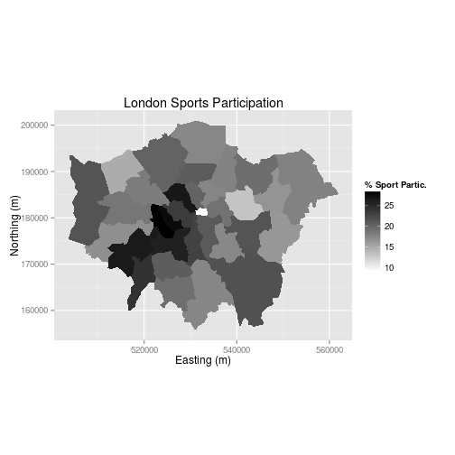

Part I: Introduction 
========================================================

This tutorial is an introduction to spatial data in R and map making with 
R's 'base' graphics and the popular graphics package `ggplot2`. 
It assumes no prior knowledge of spatial data analysis but 
prior understanding of the R command line would be beneficial. 
For people new to R, we recommend working through an
'Introduction to R' type tutorial, such as
"A (very) short introduction to R" 
([Torfs and Brauer, 2012](http://cran.r-project.org/doc/contrib/Torfs+Brauer-Short-R-Intro.pdf)) 
or the more geographically inclined "Short introduction to R" 
([Harris, 2012](http://www.social-statistics.org/wp-content/uploads/2012/12/intro_to_R1.pdf)).

Building on such background material, 
the following set of exercises is concerned with specific functions for spatial data 
and visualisation. It is divided into five parts: 

- Introduction, which provides a guide to R's syntax and preparing for the tutorial
- Spatial data in R, which describes basic spatial functions in R
- Manipulating spatial data, which includes changing projection, clipping and spatial joins
- Map making with `ggplot2`, a recent graphics package for producing beautiful maps quickly
- Taking spatial analysis in R further, a compilation of resources for furthering your skills

An up-to-date version of this tutorial is maintained at
[https://github.com/Robinlovelace/Creating-maps-in-R](https://github.com/Robinlovelace/Creating-maps-in-R/blob/master/intro-spatial-rl.pdf) and the entire tutorial, including
the input data can be downloaded as a
[zip file](https://github.com/Robinlovelace/Creating-maps-in-R/archive/master.zip), 
as described below. The entire tutorial was written in RMarkdown, which 
allows R code to run as the document compiles. Thus all the examples are entirely reproducible.

Suggested improvements welcome - please 
[fork](https://help.github.com/articles/fork-a-repo), improve and push this document 
to its original home to ensure its longevity. The tutorial was developed for 
a series of Short Courses put on by the National Centre for Research Methods (NCRM), 
via the TALISMAN node (see [geotalisman.org](http://www.geotalisman.org/)). 

## Typographic conventions and getting help

To ensure reproducibility and allow automatic syntax highlighting, 
this document has been written in RMarkdown. 
We try to follow best practice in terms of style, roughly following 
Google's style guide and an in-depth guide written by 
[Johnson (2013)](http://cran.r-project.org/web/packages/rockchalk/vignettes/Rstyle.pdf).
It is a good idea to get into the habit of consistent and clear writing in 
any language, and R is no exception. Adding comments to your code is also 
good practice, so you remember at a later date what you've done, aiding the 
learning process. There are two main ways of commenting code using the `#` symbol:
above a line of code or directly following it, as illustrated below.


```r
# Generate data
x <- 1:400
y <- sin(x/10) * exp(x * -0.01)

plot(x, y)  # plot the result
```

 


In the above code we first created a new *object* that we have called `x`. 
Any name could have been used, like `xBumkin`, but `x` works just fine here, 
although it is good practice to give your objects meaningful names.
Note the use of the `<-` "arrow" symbol, which tells R to create a new object.
We will be using this symbol a lot in the tutorial 
(tip: typing `Alt -` on the keyboard will create it in RStudio.). 
Each time it is used, a new
object is created (or an old one is overwritten) with a name of your choosing.

To distinguish between prose and code, please be aware of the following typographic conventions: R code (e.g. `plot(x, y)`) is
written in a `monospace` font while prose is not. Blocks of code such as:


```r
c(1:3, 5)^2
```

```
## [1]  1  4  9 25
```


are compiled in-line: the `##` indicates this is output from R. Some of the 
output from the code below is quite long so we only show the output that is 
useful - it should also be clear when we have decided to omit an image from this document 
to save space. All images in this document are small and low-quality to save space;
they should 
display better on your computer screen and can be saved at any resolution.
The code presented here is not the only way to do things: we encourage you to 
play with it and try things out to gain a deeper understanding of R.
Don't worry, you cannot 'break' anything using R and all the input data 
can be re-loaded if things do go wrong.

If you require help on any function, use the `help` function, 
e.g. `help(plot)`. Because R users love being concise, 
this can also be written as `?plot`. Feel free to use it 
at any point you'd like more detail on a specific function
(although R's help files are famously cryptic for the un-initiated).
Help on more general terms can be found using the `??` symbol. To test this, 
try typing `??regression`.
For the most part, *learning by doing* is a good motto, so let's crack
on and download some packages and then some data.

## Prerequisites and packages

For this tutorial you need to install R, if you haven't already done so, the latest version of which 
can be downloaded from [http://cran.r-project.org/](http://cran.r-project.org/).
A number of R editors such as [RStudio](http://www.rstudio.com/)
can be used to make R more user friendly, 
but these are not needed to complete the tutorial.

R has a huge and growing number of spatial data packages. 
We recommend taking a quick browse on R's main website: 
[http://cran.r-project.org/web/views/Spatial.html](http://cran.r-project.org/web/views/Spatial.html).

The packages we will be using are `ggplot2`, `rgdal`, `rgeos`, `maptools` and `ggmap`.
To test whether a package is installed, ggplot2 for example, enter `library(ggplot2)`. 
If you get an error message, it needs to be installed: `install.packages("ggplot2")`.
These will be downloaded from CRAN (the Comprehensive R Archive Network); if you are prompted 
to select a 'mirror', select one that is close to your home. 
If there is no output from R, this is good news: it means that the library
has already been installed on your computer.
Install these packages now. 

# Part II: Spatial data in R

## Starting the tutorial

Now that we have taken a look at R's syntax and installed the necessary packages, 
we can start looking at some real spatial data. This second part introduces some
spatial datasets that we will download from the internet. Plotting these datasets
and interrogating the attribute data form the foundation of spatial data 
analysis in R, so we will focus on these elements in the next two parts of the tutorial, 
before focussing on creating attractive maps in Part IV.

## Downloading the data

Download the data for this tutorial now from :
[https://github.com/Robinlovelace/Creating-maps-in-R](https://github.com/Robinlovelace/Creating-maps-in-R).
Click on the "Download ZIP" button on the right hand side and once it is downloaded unzip this to a new folder on your PC.
Use the `setwd` command to set the working directory to the folder where the data is saved.
If your username is "username" and you saved the files into a 
folder called "Creating-maps-in-R-master" on your Desktop, for example, 
you would type the following:


```r
setwd("C:/Users/username/Desktop/Creating-maps-in-R-master/")
```


If you are working in RStudio, you can create a project that will automatically 
set your working directory.To do this click "Session" from the top
toolbar and select "Set working directory > choose directory". 

It is also worth taking a look at the input data in your file browser 
before opening them in R, to get a feel for them. You could try opening the 
file "london_sport.shp", within the "data" folder of the project, in a GIS program such as 
QGIS (which can be freely downloaded from the internet), 
for example, to get a feel for it before loading it into R. 
Also note that .shp files are composed of several files for each object:
you should be able to open "london_sport.dbf" in a spreadsheet program such as 
LibreOffice Calc. Once you've understood something of this input data
and where it lives, it's time to open it in R.

## Loading the spatial data

One of the most important steps in handling spatial data with R 
is the ability to read in spatial data, such as 
[shapefiles](http://en.wikipedia.org/wiki/Shapefile) 
(a common geographical file format). There are a number of ways to do this, 
the most commonly used and versatile of which is `readOGR`.
This function, from the `rgdal` package, automatically extracts information
about the projection and the attributes of data.
`rgdal` is R’s interface to the "Geospatial Abstraction Library (GDAL)"
which is used by other open source GIS packages such as QGIS and enables 
R to handle a broader range of spatial data formats. If you've not already
*installed* and loaded the rgdal package (as described above for ggplot2) do so now:


```r
library(rgdal)
sport <- readOGR(dsn = "data", "london_sport")
```

```
## OGR data source with driver: ESRI Shapefile 
## Source: "data", layer: "london_sport"
## with 33 features and 4 fields
## Feature type: wkbPolygon with 2 dimensions
```


In the code above `dsn` stands for "data source name" and is an *argument* of the *function* `readOGR`. Note that each new argument is separated by a comma.
The `dsn` argument in this case, specifies the directory in which the dataset is stored. 
R functions have a default order of arguments, so `dsn = ` does not 
actually need to be typed. If there data were stored in the 
current working directory, one could use `readOGR(".", "london_sport")`.
For clarity, it is good practice to include argument names, such as `dsn` when learning new functions. 

The next argument is a *character string*. This is simply the name of the file required. 
There is no need to add a file extension (e.g. `.shp`) in this case. 
The files beginning `london_sport` from the 
[example dataset](http://spatial.ly/wp-content/uploads/2013/12/spatialggplot.zip)
contain the borough population and 
the percentage of the population participating in sporting activities and was taken from the 
[active people survey](http://data.london.gov.uk/datastore/package/active-people-survey-kpi-data-borough).
The boundary data is from the [Ordnance Survey](http://www.ordnancesurvey.co.uk/oswebsite/opendata/).

For information about how to load different types of spatial data, 
the help documentation for `readOGR` is a good place to start. This can be accessed from 
within R by typing `?readOGR`. For another worked example, in which a GPS trace is loaded, 
please see Cheshire and Lovelace (2014). 

## Basic plotting 

We have now created a new spatial object called "sport" from the "london_sport" shapefile. Spatial objects are made up of a number of different *slots*, mainly the attribute *slot* and the geometry *slot*. The attribute *slot* can be thought of as an attribute table and the geometry *slot* is where the spatial object (and it's attibutes) lie in space. Lets now analyse the sport object with some basic commands:


```r
head(sport@data, n = 2)
```

```
##   ons_label                 name Partic_Per Pop_2001
## 0      00AF              Bromley       21.7   295535
## 1      00BD Richmond upon Thames       26.6   172330
```

```r
mean(sport$Partic_Per)
```

```
## [1] 20.05
```


Take a look at this output and notice the table format of the data and the column names. There are two important symbols at work in the above block of code: the `@` symbol in the first line of code is used to refer to the attribute *slot* of the dataset; the `$` symbol refers to a specific variable (column name) in the attribute *slot* of the dataset, which was identified from the result of running the first line of code. If you are using RStudio, test out the autocompletion functionality
by hitting `tab` before completing the command - this can save you a lot of time in the long run. 

The `head` function in the first line of the code above simply means "show the first few lines of data", i.e. the head. It's default is to output the first 6 rows of the dataset (try simply `head(sport@data)`), 
but we can specify the number of lines with `n = 2` after the comma. 
The second line of the code above calculates the mean value of the variable `Partic_Per` (sports participation per 100 people) for each of the zones in the sport object. 
To explore the sport object further, try typing `nrow(sport)` and record how many zones the dataset contains.You can also try `ncol(sport)`. 

Now we have seen something of the attribute *slot* of the spatial dataset, 
let us look at sport's *geometry* data, which describes where the polygons are located 
in space:


```r
plot(sport)  # not shown in tutorial - try it on your computer
```


`plot` is one of the most useful functions in R, as it changes its behaviour 
depending on the input data (this is called *polymorphism* by computer scientists). 
Inputing another dataset such as `plot(sport@data)` will generate 
an entirely different type of plot. Thus R is intelligent at guessing what you want to 
do with the data you provide it with. 

R has powerful subsetting capabilities that can be accessed very concisely using square brackets, 
as shown in the following example:


```r
# select rows from attribute slot of sport object, where sports
# participation is less than 15.
sport@data[sport$Partic_Per < 15, ]
```

```
##    ons_label           name Partic_Per Pop_2001
## 17      00AQ         Harrow       14.8   206822
## 21      00BB         Newham       13.1   243884
## 32      00AA City of London        9.1     7181
```


The above line of code asked R to select rows from the sport object, where sports participation is lower than 15, 
in this case rows 17, 21 and 32, which are Harrow, Newham and the city centre respectively. The square brackets work as follows:
anything before the comma refers to the rows that will be selected, anything after 
the comma refers to the number of columns that should be returned. For example if the dataset had 1000 columns and you were only interested in the first two columns you could specify `1:2` after the comma. The ":" symbol simply means "to", i.e. columns 1 to 2. Try experimenting with the square brackets notation
(e.g. guess the result of `sport@data[1:2, 1:3]` and test it): it will be useful.

So far we have been interrogating only the attribute *slot* (`@data`) of the `sport` object, but the square brackets can also be used to subset spatial datasets, i.e. the geometry *slot*. Using the same logic as before try 
to plot a subset of zones with high sports participation.


```r
# plot zones from sports object where sports participation is greater than
# 25.
plot(sport[sport$Partic_Per > 25, ])  # output not shown in tutorial
```


This is useful, but it would be great to see these sporty areas in context. 
To do this, simply use the `add = TRUE` argument after the initial plot. 
(`add = T` would also work, but we like to spell things out in this tutorial for clarity).
What does the `col` argument refer to in the below block - it should be obvious.


```r
plot(sport)
plot(sport[sport$Partic_Per > 25, ], col = "blue", add = TRUE)
```

 


Congratulations! You have just interrogated and visualised a 
spatial dataset: what kind of places have high levels of sports
participation? The map tells us. Do not worry for now about 
the intricacies of 
how this was achieved: you have learned vital basics of how R works as a language; 
we will cover this in more detail in subsequent sections.

While we are on the topic of loading data, it is worth pointing out
that R can save and load data efficiently into its own data format (`.RData`).
Try `save(sport, file = "sport.RData")` and see what happens. 
If you type `rm(sport)` (which removes the object) and then `load("sport.RData")`
you should see how this works. `sport` will disappear from the workspace and then reappear.

## Attribute data

All shapefiles have both attribute table and geometry data. These are automatically loaded with 
`readOGR`. The loaded attribute data can be treated in a similar way to an R 
[data frame](http://www.statmethods.net/input/datatypes.html). 

R delibrately hides the geometry of spatial data unless you print 
the entire object (try typing `print(sport)`). 
Let's take a look at the headings of sport, using the following command: `names(sport)`
Remember, the attribute data contained in spatial objects are kept in a 'slot' that can be accessed using the `@` symbol: `sport@data`. This is useful if you do not wish to work with the spatial components of the data at all times. 

Type `summary(sport)` to get some additional information about the 
sport data object. Spatial objects in R contain 
much additional information:

```
summary(sport)

## Object of class SpatialPolygonsDataFrame
## Coordinates:
##       min      max
## x 503571.2 561941.1
## y 155850.8 200932.5
## Is projected: TRUE 
## proj4string :
## [+proj=tmerc +lat_0=49 +lon_0=-2 +k=0.9996012717 ....]
```

The above output tells us that `sport` is a special spatial class, 
in this case a `SpatialPolygonsDataFrame`, meaning it is composed of 
various polygons, each of which has attributes. This is the typical 
class of data found in administrative zones. The coordinates tell 
us what the maximum and minimum x and y values are, for plotting.
Finally, we are told something of the coordinate reference system
with the `Is projected` and `proj4string` lines. 
In this case, we have a projected system, which means it is a 
cartesian reference system, relative to some point on the surface of the Earth.
We will cover reprojecting data in the next part of the tutorial. 

# Part III: Manipulating spatial data

It is all very well being able to load and interrogate spatial data
in R, but to compete with modern GIS packages, R must also be able 
to modify these spatial objects
(see '[using R as a GIS](https://github.com/Pakillo/R-GIS-tutorial)'). 
R has a wide range of very powerful 
functions for this, many of which reside in additional packages alluded 
to in the introduction.

This course is introductory so only commonly required 
data manipulation tasks, *reprojecting* and *joining/clipping* are covered here.
We will first look at joining an aspatial
dataset to our spatial object using an attribute join. We will then cover spatial joins, whereby 
data is joined to other dataset based on spatial location. 

## Changing projection

First things first, before we start data manipulation we will check the reference system of our spatial datasets. You may have noticed the word `proj4string` in the 
summary of the `sport` object above. This represents the coordinate reference system used in the data. 
In this file it has been incorrectly specified so we must change it with the following:


```r
proj4string(sport) <- CRS("+init=epsg:27700")
```

```
## Warning: A new CRS was assigned to an object with an existing CRS:
## +proj=tmerc +lat_0=49 +lon_0=-2 +k=0.9996012717 +x_0=400000 +y_0=-100000 +ellps=airy +units=m +no_defs
## without reprojecting.
## For reprojection, use function spTransform in package rgdal
```


You will see a warning. This simply states that you are changing 
the coordinate reference system, not reprojecting the data. R uses epsg codes to refer to different coordinate reference systems. Epsg:27700 is the code for British National Grid.
If we wanted to reproject the data into something 
like WGS84 for latitude and longitude we would use the following code:


```r
sport.wgs84 <- spTransform(sport, CRS("+init=epsg:4326"))
```


The above line of code uses the function `spTransform`, from the `sp` package, 
to convert the `sport` object into a new form, with the Coordinate Reference System (CRS)
specified as WGS84. 
The different epsg codes are a bit of hassle to remember but you can search for them at 
[spatialreference.org](http://spatialreference.org/).

## Attribute joins

Attribute joins are used to link additional pieces of information to our polygons. 
in the `sport` object, for example, we have 5 attribute variables - that can be
found by typing `names(sport)`. But what happens when  we want to add an additional 
variable from an external data table? We will use the example of recorded crimes by 
borough to demonstrate this. 

To reaffirm our starting point, let's re-load the 
"london_sport" shapefile as a new object and plot it. This is identical to 
the `sport` object in the first instance, but we will give it a new name, 
in case we ever need to re-use `sport`.
We will call this new object 
`lnd`, short for London:


```r
library(rgdal)  # ensure rgdal is loaded
# Create new object called 'lnd' from 'london_sport' shapefile
lnd <- readOGR(dsn = "data", "london_sport")
```

```
## OGR data source with driver: ESRI Shapefile 
## Source: "data", layer: "london_sport"
## with 33 features and 4 fields
## Feature type: wkbPolygon with 2 dimensions
```

```r

plot(lnd)  # plot the lnd object 
```

 

```r
nrow(lnd)  # return the number of rows
```

```
## [1] 33
```


The aspatial dataset we are going to join to the `lnd` object is a
dataset on recorded crimes, this dataset currently resides in a comma delimited (`.csv`) 
file called "mps-recordedcrime-borough" with each row representing a single reported crime.
We are going to use a function called `aggregate` 
to pre-process this dataset ready to join to our spatial 
`lnd` dataset. First we will create a new object called `crimeDat` to store this data. 


```r
# Create new crimeDat object from crime data It has an unusual encoding,
# hence the fileEncoding argument, usually unnecessary
crimeDat <- read.csv("data/mps-recordedcrime-borough.csv", fileEncoding = "UCS-2LE")

head(crimeDat)  # display first 6 lines of the crimeDat object (not shown)
summary(crimeDat$MajorText)  # summarise the column 'MajorText' for the crimeDat object

# Extract 'Theft & Handling' crimes from crimeDat object and save these as
# crimeTheft
crimeTheft <- crimeDat[which(crimeDat$MajorText == "Theft & Handling"), ]
head(crimeTheft, 2)  # take a look at the result (replace 2 with 10 to see more rows)

# Calculate the sum of the crime count for each district and save result as
# a new object
crimeAg <- aggregate(CrimeCount ~ Spatial_DistrictName, FUN = sum, data = crimeTheft)
# Show the first two rows of the aggregated crime data
head(crimeAg, 2)
```


There is a lot going on in the above block of code and you should not expect
to understand all of it upon first try: simply typing the commands and thinking 
briefly about the outputs is all that is needed at this stage to improve your 
intuitive understanding of R. It is worth pointing out, however, that the 
`~` symbol means "by": we aggregated the CrimeCount variable by the district name.

Now that we have crime data at the borough level (`Spatial_DistrictName`), the challenge is to join it to the `lnd` object. We will base our join on the `Spatial_DistrictName` variable from the `crimeAg` object and the `name` variable from the `lnd` object. It is not always straight forward to join objects based on names as the names do not always match. Let us see which names in the `crimeAg` object match the spatial data object, `lnd`:


```r
# Compare the name column in lnd to Spatial_DistrictName column in crimeAg
# to see which rows match.
lnd$name %in% crimeAg$Spatial_DistrictName
```

```
##  [1]  TRUE  TRUE  TRUE  TRUE  TRUE  TRUE  TRUE  TRUE  TRUE  TRUE  TRUE
## [12]  TRUE  TRUE  TRUE  TRUE  TRUE  TRUE  TRUE  TRUE  TRUE  TRUE  TRUE
## [23]  TRUE  TRUE  TRUE  TRUE  TRUE  TRUE  TRUE  TRUE  TRUE  TRUE FALSE
```

```r
# Return rows which do not match
lnd$name[which(!lnd$name %in% crimeAg$Spatial_DistrictName)]
```

```
## [1] City of London
## 33 Levels: Barking and Dagenham Barnet Bexley Brent Bromley ... Westminster
```


The first line of code above uses the `%in%` command to 
identify which values in `lnd$name` are also contained in the names of the 
crime data. The results indicate that all but one of the borough names matches.
The second line of code tells us that it is City of London, row 25, 
that is named differently in the 
crime data. Look at the results (not shown here) on your computer.


```r
# Discover the names of the names
levels(crimeAg$Spatial_DistrictNam)  # not shown n tutorial
```

```
##  [1] "Barking and Dagenham"   "Barnet"                
##  [3] "Bexley"                 "Brent"                 
##  [5] "Bromley"                "Camden"                
##  [7] "Croydon"                "Ealing"                
##  [9] "Enfield"                "Greenwich"             
## [11] "Hackney"                "Hammersmith and Fulham"
## [13] "Haringey"               "Harrow"                
## [15] "Havering"               "Hillingdon"            
## [17] "Hounslow"               "Islington"             
## [19] "Kensington and Chelsea" "Kingston upon Thames"  
## [21] "Lambeth"                "Lewisham"              
## [23] "Merton"                 "Newham"                
## [25] "NULL"                   "Redbridge"             
## [27] "Richmond upon Thames"   "Southwark"             
## [29] "Sutton"                 "Tower Hamlets"         
## [31] "Waltham Forest"         "Wandsworth"            
## [33] "Westminster"
```

```r

# Rename row 25 in crimeAg to match row 25 in lnd, as suggested results form
# above
levels(crimeAg$Spatial_DistrictName)[25] <- as.character(lnd$name[which(!lnd$name %in% 
    crimeAg$Spatial_DistrictName)])
lnd$name %in% crimeAg$Spatial_DistrictName  # now all columns match
```

```
##  [1] TRUE TRUE TRUE TRUE TRUE TRUE TRUE TRUE TRUE TRUE TRUE TRUE TRUE TRUE
## [15] TRUE TRUE TRUE TRUE TRUE TRUE TRUE TRUE TRUE TRUE TRUE TRUE TRUE TRUE
## [29] TRUE TRUE TRUE TRUE TRUE
```


The above code block first identified the row with the faulty name and 
then renamed the level to match the `lnd` dataset. Note that we could not
rename the variable directly, as it is stored as a factor.

We are now ready to join the datasets. It is recommended to use 
the `join` function in the `plyr` package but the `merge` function 
could equally be used. Note that when we ask for help for a function 
that is not loaded, nothing happens, indicating we need to load it:


```r
`?`(join)
library(plyr)
`?`(join)
```


The documentation for join will be displayed if the plyr package is loaded (if not,
load or install and load it!). It requires all joining variables to have the 
same name, so we will rename the variable to make the join work:


```r
head(lnd$name)
head(crimeAg$Spatial_DistrictName)  # the variables to join
crimeAg <- rename(crimeAg, replace = c(Spatial_DistrictName = "name"))
head(join(lnd@data, crimeAg))  # test it works
```

```
## Joining by: name
```

```r
lnd@data <- join(lnd@data, crimeAg)
```

```
## Joining by: name
```


Take a look at the `lnd@data` object. You should 
see new variables added, meaning the attribute join 
was successful. 

## Clipping and spatial joins

In addition to joining by zone name, it is also possible to do
[spatial joins](http://help.arcgis.com/en/arcgisdesktop/10.0/help/index.html#//00080000000q000000) 
in R. There are three main varieties: many-to-one, where
the values of many intersecting objects contribute to a new variable in 
the main table, one-to-many, or one-to-one. Because boroughs in London 
are quite large, we will conduct a many-to-one spatial join.
We will be using Tube Stations as the spatial data to join, 
with the aim of finding out which and how many stations
are found in each London borough.


```r
library(rgdal)
# create new stations object using the 'lnd-stns' shapefile.
stations <- readOGR(dsn = "data", layer = "lnd-stns")
proj4string(stations)  # this is the full geographical detail.
proj4string(lnd)
# return the bounding box of the stations object
bbox(stations)
# return the bounding box of the lnd object
bbox(lnd)
```


The above code loads the data correctly, but also shows that 
there are problems with it: the Coordinate Reference System (CRS)
of the stations differs from that of our `lnd` object. 
OSGB 1936 (or [EPSG 27700](http://spatialreference.org/ref/epsg/27700/)) 
is the official CRS for the UK, so
we will convert the stations dataset to this:
 

```r
# create new stations27700 object which the stations object reprojected into
# OSGB36
stations27700 <- spTransform(stations, CRSobj = CRS(proj4string(lnd)))
# overwrite the stations object with stations27700
stations <- stations27700
rm(stations27700)  # remove the stations27700 object to clear up
plot(lnd)
points(stations)
```

 


Now we can clearly see that the stations overlay the boroughs.
The problem is that the stations dataset is far more extensive than the
London borough dataset; so we will take a spatially determined subset of the 
stations object so that they all fit within the lnd extent. This is *clipping*. 

There are a number of functions that we can use to clip the stations dataset
so that only those falling within London boroughs are retained. 
These include `overlay`, `sp::over`, and `rgeos::gIntersects`
(the word preceding the `::` symbol refers to the package which the function is from).
Use `?` followed by the function to get help on each and find out which is 
most appropriate. `gIntersects` can produce the same output as 
`over` for basic joins (Bivand et al. 2013).

In this tutorial we will use the `over` function as it is easiest to use. 
`gIntersects` can achieve the same result, but with more lines of code. 
It may seem confusing that two different functions 
can be used to generate the same result. However, 
this is a common issue in programming; the question
is finding the most appropriate solution.

`over` takes two main input arguments: the target layer (the layer to be altered) and the 
source layer by which the target layer is to be clipped. The output of `over` is a data frame of the same 
dimensions as the original dataset (in this case `stations`), except that the points which fall outside the zone of interest are set to a value of `NA` ("no answer").
We can use this to make a subset of the original polygons, 
remembering the square bracket notation described in the first section.
We create a new object, `sel` (short for "selection"),
containing the indices of all relevant polygons:


```r
sel <- over(stations, lnd)
stations <- stations[!is.na(sel[, 1]), ]
```


Typing `summary(sel)` should provide insight into how this 
worked: it is a dataframe with 1801 NA values, representing 
zones outside of the London polygon.
Because this is a common procedure it is actually possible 
to perform it with a single line of code: 


```r
stations <- stations[lnd, ]
plot(stations)
```

 


As the figure shows, only stations within the London boroughs are now shown.

The *third* way to achieve the 
same result uses the `rgeos` package. 
This is more complex and not included in this tutorial
(interested readers can see a vignette of this, to accompany the tutorial 
on [RPubs.com/Robinlovelace](http://rpubs.com/RobinLovelace/11796)). 
The next section demonstrates
spatial aggregation, a more advanced version of spatial subsetting.

## Spatial aggregation

As with R's very terse code for spatial subsetting, the base function 
`aggregate` (which provides summaries of variables based on some grouping variable)
also behaves differently when the inputs are spatial objects. 


```r
stations.c <- aggregate(x = stations, by = lnd, FUN = length)
stations.c@data[, 1]
```

```
##  [1] 48 22 43 18 12 13 25 24 12 46 18 20 28 32 38 19 30 25 31  7 10 38 12
## [24] 16 28 17 16 28  4  6 14 26  5
```


The above code performs a number of steps in just one line:

- `aggregate` identifies which `lnd` polygon (borough) each `station` is located in and groups them accordingly
- it counts the number of stations in each borough
- a new spatial object is created and assigned the name `stations.c`, the count of stations

As shown below, the spatial implementation of `aggregate` can provide summary statistics of variables.
In this case we take the variable `NUMBER` and find its mean value for the stations in each ward.


```r
stations.m <- aggregate(stations[c("NUMBER")], by = lnd, FUN = mean)
```


For an optional advanced task, let us analyse and plot the result.


```r
q <- cut(stations.m$NUMBER, breaks = c(quantile(stations.m$NUMBER)), include.lowest = T)
summary(q)
```

```
## [1.82e+04,1.94e+04] (1.94e+04,1.99e+04] (1.99e+04,2.05e+04] 
##                   9                   8                   8 
##  (2.05e+04,2.1e+04] 
##                   8
```

```r
clr <- as.character(factor(q, labels = paste0("grey", seq(20, 80, 20))))
plot(stations.m, col = clr)
legend(legend = paste0("q", 1:4), fill = paste0("grey", seq(20, 80, 20)), "topright")
```

 

```r
areas <- sapply(stations.m@polygons, function(x) x@area)
```


This results in a simple choropleth map and a new vector containing the area of each
borough. As an additional step, try comparing the mean area of each borough with the 
mean value of stations within it: `plot(stations.m$NUMBER, areas)`.

## Optional advanced task: aggregation with gIntersects

As with clipping, we can also do spatial aggregation with 
the rgeos package. In some ways, this method makes explicit 
the steps taken in `aggregate` 'under the hood'. 
The code is quite involved and intimidating, so feel free to
skip this stage. Working through and thinking about it this alternative method may, however, 
yield dividends if you intend to perform more sophisticated spatial analysis in R.


```r
library(rgeos)
```

```
## rgeos version: 0.3-2, (SVN revision 413M)
##  GEOS runtime version: 3.3.8-CAPI-1.7.8 
##  Polygon checking: TRUE
```

```r
int <- gIntersects(stations, lnd, byid = TRUE)  # re-run the intersection query 
head(apply(int, MARGIN = 2, FUN = which))
b.indexes <- which(int, arr.ind = TRUE)
summary(b.indexes)
b.names <- lnd$name[b.indexes[, 1]]
b.count <- aggregate(b.indexes ~ b.names, FUN = length)
head(b.count)
```


The above code first extracts the index of the row (borough) for 
which the corresponding column is true and then converts this into 
names. The final object created, `b.count` contains the number of station 
points in each zone. According to this, Barking and Dagenham should contain
12 station points. It is important to check the output makes sense at 
every stage with R, so let's check to see this is indeed the case with 
a quick plot:


```r
plot(lnd[which(grepl("Barking", lnd$name)), ])
points(stations)
```

 


Now the fun part: count the points in the polygon and report back how many there are!

We have now seen how to load, join and clip data. The second half of this tutorial 
is concerned with *visualisation* of the results. For this, we will use
ggplot2 and begin by looking at how it handles non-spatial data.

# Part IV: Map making with ggplot2

This third part introduces a slightly 
different method of creating plots in R using the 
[ggplot2 package](http://ggplot2.org/), and explains how it can make maps. 
The package is an implementation of the Grammar of Graphics (Wilkinson 2005) - 
a general scheme for data visualisation that breaks up graphs 
into semantic components such as scales and layers. 
ggplot2 can serve as a replacement for the base graphics in R (the functions you have been plotting with today) and contains a number of default options that match good visualisation practice.

The maps we produce will not be that meaningful - 
the focus here is on sound visualisation with R and not sound analysis 
(obviously the value of the former diminished in the absence of the latter!)
Whilst the instructions are step by step you are encouraged to deviate from them 
(trying different colours for example) to get a better understanding 
of what we are doing. 

`ggplot2` is one of the best documented packages in R. 
The full documentation for it can be found online and it is recommended you 
test out the examples on your own machines and play with them: 
http://docs.ggplot2.org/current/ .

Good examples of graphs can also be found on the website 
[cookbook-r.com](http://www.cookbook-r.com/Graphs/).

Load the package:


```r
library(ggplot2)
```


It is worth noting that the basic `plot()` function requires no 
data preparation but additional effort in colour selection/adding the map key etc. 
`qplot()` and `ggplot()` (from the ggplot2 package) 
require some additional steps to format the spatial data but select 
colours and add keys etc. automatically. More on this later.

As a first attempt with ggplot2 we can create a scatter plot with the attribute data in the 'sport' object created above. Type:


```r
p <- ggplot(sport@data, aes(Partic_Per, Pop_2001))
```


What you have just done is set up a ggplot object where 
you say where you want the input data to come from. 
`sport@data` is actually a data frame contained within the 
wider spatial object `sport` (the `@` enables you to
access the attribute table of the 
sport shapefile).  The characters inside the `aes` argument
refer to the parts of that data frame you wish to use (the variables `Partic_Per` and `Pop_2001`).
This has to happen within the brackets of `aes()`, which means, 
roughly speaking 'aesthetics that vary'.  

If you just type p and hit enter you get the error `No layers in plot`. 
This is because you have not told ggplot what you want 
to do with the data. We do this by adding so-called "geoms", 
in this case `geom_point()`.


```r
p + geom_point()
```

 


Within the brackets you can alter the nature of the points. Try something like `p + geom_point(colour = "red", size=2)` and experiment. 

If you want to scale the points by borough population and colour them by sports participation this is also fairly easy by adding another `aes()` argument.


```r
p + geom_point(aes(colour = Partic_Per, size = Pop_2001))
```


The real power of ggplot2 lies in its ability to add layers to a plot. In this case we can add text to the plot.


```r
p + geom_point(aes(colour = Partic_Per, size = Pop_2001)) + geom_text(size = 2, 
    aes(label = name))
```

 


This idea of layers (or geoms) is quite different from the standard plot functions in R, but you will find that each of the functions  does a lot of clever stuff to make plotting much easier (see the documentation for a full list). 
 
The following steps will create a map to show the percentage of the population in each London Borough who regularly participate in sports activities. 

## "Fortifying" spatial objects for ggplot2 maps

To get the shapefiles into a format that can be plotted we have to use the `fortify()` function. Spatial objects in R have a number of slots containing the various items of data (polygon geometry, projection, attribute information) associated with a shapefile. Slots can be thought of as shelves within the data object that contain the different attributes. The "polygons" slot contains the geometry of the polygons in the form of the XY coordinates used to draw the polygon outline. The generic plot function can work out what to do with these, ggplot2 cannot. We therefore need to extract them as a data frame. The fortify function was written specifically for this purpose.
For this to work, either `maptools` or `rgeos` packages must be installed.


```r
sport.f <- fortify(sport, region = "ons_label")
```


This step has lost the attribute information associated with the sport object. We can add it back using the merge function (this performs a data join). To find out how this function works look at 
the output of typing `?merge`.


```r
sport.f <- merge(sport.f, sport@data, by.x = "id", by.y = "ons_label")
```


Take a look at the `sport.f` object to see its contents.  You should see a large data frame containing the latitude and longitude (they are actually Easting and Northing as the data are in British National Grid format) coordinates alongside the attribute information associated with each London Borough. If you type `print(sport.f)` you will see just how many coordinate pairs are required!
To keep the output to a minimum, take a peek at the object using just the `head` command:


```r
head(sport.f[, 1:8])
```

```
##     id   long    lat order  hole piece  group           name
## 1 00AA 531027 181611     1 FALSE     1 00AA.1 City of London
## 2 00AA 531555 181659     2 FALSE     1 00AA.1 City of London
## 3 00AA 532136 182198     3 FALSE     1 00AA.1 City of London
## 4 00AA 532946 181895     4 FALSE     1 00AA.1 City of London
## 5 00AA 533411 182038     5 FALSE     1 00AA.1 City of London
## 6 00AA 533843 180794     6 FALSE     1 00AA.1 City of London
```


It is now straightforward to produce a map using all the built in tools 
(such as setting the breaks in the data) that ggplot2 has to offer. 
`coord_equal()` is the equivalent of asp=T in regular plots with R:


```r
Map <- ggplot(sport.f, aes(long, lat, group = group, fill = Partic_Per)) + geom_polygon() + 
    coord_equal() + labs(x = "Easting (m)", y = "Northing (m)", fill = "% Sport Partic.") + 
    ggtitle("London Sports Participation")
```


Now, just typing `Map` should result in your first ggplot-made map of London!
There is a lot going on in the code above, so think about it line by line:
what have each of the elements of code above been designed to do? 
Also note how the `aes()` components can be combined into one set of brackets 
after `ggplot`, that has relevance for all layers, rather than being
broken into separate parts as we did above. 
The different plot functions still know what to do with these. 
The `group=group` points ggplot to the group column added by 
`fortify()` and it identifies the groups of coordinates that pertain 
to individual polygons (in this case London Boroughs). 

The default colours are really nice but we may wish to produce the map in black and white, 
which should produce a map like that shown below (and try changing the colors):


```r
Map + scale_fill_gradient(low = "white", high = "black")
```

 


Saving plot images is also easy. You just need to use `ggsave` after each plot, e.g.
`ggsave("my_map.pdf")` will save the map as a pdf, with default settings. For 
a larger map, you could try the following:


```r
ggsave("my_large_plot.png", scale = 3, dpi = 400)
```


## Adding base maps to ggplot2 with ggmap

[ggmap](http://journal.r-project.org/archive/2013-1/kahle-wickham.pdf) 
is a package that uses the ggplot2 syntax as a 
template to create maps with image tiles taken from map servers 
such as Google and 
[OpenStreetMap](http://www.openstreetmap.org/):


```r
library(ggmap)  # you may have to use install.packages to install it first
```


The `sport` object loaded previously is in British National Grid but the ggmap 
image tiles are in WGS84. We therefore need to use the sport.wgs84 
object created in the reprojection operation earlier. 

The first job is to calculate the bounding box (bb for short) of the 
sport.wgs84 object to identify the geographic extent of the image tiles that we need. 


```r
b <- bbox(sport.wgs84)
b[1, ] <- (b[1, ] - mean(b[1, ])) * 1.05 + mean(b[1, ])
b[2, ] <- (b[2, ] - mean(b[2, ])) * 1.05 + mean(b[2, ])
# scale longitude and latitude (increase bb by 5% for plot) replace 1.05
# with 1.xx for an xx% increase in the plot size
```


This is then fed into the `get_map` function as the location parameter. The syntax below contains 2 functions. `ggmap` is required to produce the plot and provides the base map data.


```r
lnd.b1 <- ggmap(get_map(location = b))
```

```
## Warning: bounding box given to google - spatial extent only approximate.
```


In much the same way as we did above we can then layer the plot with different geoms. 

First fortify the sport.wgs84 object and then merge with the required attribute
data (we already did this step to create the sport.f object).


```r
sport.wgs84.f <- fortify(sport.wgs84, region = "ons_label")
sport.wgs84.f <- merge(sport.wgs84.f, sport.wgs84@data, by.x = "id", by.y = "ons_label")
```


We can now overlay this on our base map.


```r
lnd.b1 + geom_polygon(data = sport.wgs84.f, aes(x = long, y = lat, group = group, 
    fill = Partic_Per), alpha = 0.5)
```


The code above contains a lot of parameters. Use the ggplot2 help pages to find out what they are. 
The resulting map looks okay, but it would be improved with a simpler base map in black and white. 
A design firm called stamen provide the tiles we need and they can be brought into the 
plot with the `get_map` function:


```r
lnd.b2 <- ggmap(get_map(location = b, source = "stamen", maptype = "toner", 
    crop = TRUE))
```


We can then produce the plot as before.


```r
lnd.b2 + geom_polygon(data = sport.wgs84.f, aes(x = long, y = lat, group = group, 
    fill = Partic_Per), alpha = 0.5)
```


Finally, if we want to increase the detail of the base map, get_map has a zoom parameter.


```r
lnd.b3 <- ggmap(get_map(location = b, source = "stamen", maptype = "toner", 
    crop = TRUE, zoom = 11))

lnd.b3 + geom_polygon(data = sport.wgs84.f, aes(x = long, y = lat, group = group, 
    fill = Partic_Per), alpha = 0.5)
```

 


## Advanced Task: Faceting for Maps


```r
library(reshape2)  # this may not be installed. 
# If not install it, or skip the next two steps
```


Load the data - this shows historic population values between 1801 and 2001 for London, again from the London data store.


```r
london.data <- read.csv("data/census-historic-population-borough.csv")
```


"Melt" the data so that the columns become rows.


```r
london.data.melt <- melt(london.data, id = c("Area.Code", "Area.Name"))
```


Only do this step if reshape and melt failed


```r
london.data.melt <- read.csv("london_data_melt.csv")
```


Merge the population data with the London borough geometry contained within our sport.f object.


```r
plot.data <- merge(sport.f, london.data.melt, by.x = "id", by.y = "Area.Code")
```


Reorder this data (ordering is important for plots).


```r
plot.data <- plot.data[order(plot.data$order), ]
```


We can now use faceting to produce one map per year (this may take a little while to appear). 


```r
ggplot(data = plot.data, aes(x = long, y = lat, fill = value, group = group)) + 
    geom_polygon() + geom_path(colour = "grey", lwd = 0.1) + coord_equal() + 
    facet_wrap(~variable)
```

 


Again there is a lot going on here so explore the documentation to make sure you understand it. 
Try out different colour values as well. 

Add a title and replace the axes names with "easting" and 
"northing" and save your map as a pdf.

# Part V: Taking spatial data analysis in R further

The skills you have learned in this tutorial are applicable to a very wide 
range of datasets, spatial or not. Often experimentation is the 
most rewarding learning method, rather than just searching for the 
'best' way of doing something (Kabakoff, 2011). We recommend you play around
with your own data.

If you would like to learn more about R's spatial functionalities, 
including more exercises on loading, saving and manipulating data, 
we recommend a slightly longer and more advanced tutorial (Cheshire and Lovelace, 2014).
An up-to-date repository of this project, including example dataset and all the code used 
to compile the tutorial, can be found on its GitHub page: 
[github.com/geocomPP/sdvwR](https://github.com/geocomPP/sdvwR). 
Another advanced tutorial is "Using spatial data", which has example 
code and data that can be downloaded from the 
[useR 2013 conference page](http://www.edii.uclm.es/~useR-2013//Tutorials/Bivand.html).
Such lengthy tutorials are worth doing to think about spatial data in R systematically, 
rather than seeing R as a discrete collection of functions. In R the whole is greater than 
the sum of its parts. 

The supportive online communities surrounding large open source programs such as R
are one of their greatest assets, so we recommend you become an active 
"[open source citizen](http://blog.cleverelephant.ca/2013/10/being-open-source-citizen.html)" rather than a passive consumer (Ramsey & Dubovsky, 2013). 

This does not necessarily mean writing R source code - it can simply mean helping
others use R. We therefore conclude the tutorial with a list of resources
that will help you further sharpen you R skills, find help and contribute 
to the growing online R community:

* R's homepage hosts a wealth of [official](http://cran.r-project.org/manuals.html) and [contributed](http://cran.r-project.org/other-docs.html) guides.
* Stack Exchange and GIS Stack Exchange groups - try searching for "[R]". If your issue has not been not been addressed yet, you could post a polite question.
* R's [mailing lists](http://www.r-project.org/mail.html) - the R-sig-geo list may be of particular interest here.

Books: despite the strength of R's online community, nothing beats a physical book for concentrated learning. We would particularly recommend the following:

 * ggplot2: elegant graphics for data analysis (Wickham 2009)
 * Bivand et al. (2013) Provide a dense and detailed overview of spatial 
 data analysis in an updated version of the book by the developers of many
 of R's spatial functions.
 * Kabacoff (2011) is a more general R book; it has many fun worked examples.
 
# R quick reference

`#`: comments all text until line end

`x <- 3`: create new object, called x, and assign value of 3

`help(plot)`: ask R for basic help on function. Replace `plot` with any function. 

`?plot`: same as above 

`library(ggplot2)`: load a package (replace `ggplot2` with your package name)

`install.packages("ggplot2")`: install package - note quotation marks

`setwd("C:/Users/username/Desktop/")`: set R's *working directory* (set it to your project's folder)

`nrow(df)`: count the number of rows in the object `df`

`summary(df)`: summary statistics of the object `df`

`head(df)`: display first 6 lines of object `df`

`plot(df)`: plot object `df`

`save(df, "C:/Users/username/Desktop/" )`: save df object to specified location

`rm(df)`: remove the `df` object

`proj4string(df)`: set coordinate reference system of `df` object

`spTransform(df, CRS("+init=epsg:4326")`: reproject `df` object to WGS84 

# Aknowledgements

Many thanks to Rachel Oldroyed and Alistair Leak who helped demonstrate 
these materials to participants on the NCRM short corses for which 
this tutorial was developed. Amy O'Neill helped organise the course 
and helped channel feedback from participants. 
The final thanks is to the participants themselves
who trialed earlier versions of this tutorial and provided very useful 
feedback. 

# References

Bivand, R. S., Pebesma, E. J., & Rubio, V. G. (2008). Applied spatial data: analysis with R. Springer.

Cheshire, J. & Lovelace, R. (2014). Manipulating and visualizing spatial data with R. Book chapter in Press.

Harris, R. (2012). A Short Introduction to R. 
[social-statistics.org](http://www.social-statistics.org/).

Johnson, P. E. (2013). R Style. An Rchaeological Commentary. The Comprehensive R Archive Network.

Kabacoff, R. (2011). R in Action. Manning Publications Co.

Ramsey, P., & Dubovsky, D. (2013). Geospatial Software's Open Future. 
GeoInformatics, 16(4). 

Torfs and Brauer (2012). A (very) short Introduction to R. The Comprehensive R Archive Network.

Wickham, H. (2009). ggplot2: elegant graphics for data analysis. Springer.

Wilkinson, L. (2005). The grammar of graphics. Springer.


```r
source("latex/rmd2pdf.R")  # convert .Rmd to .tex file
```

