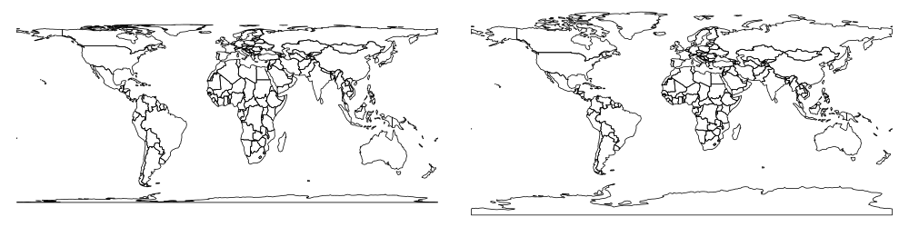

```{r, echo=FALSE}
# download.file("https://raw.githubusercontent.com/Robinlovelace/geocompr/master/refs.bib", "refs.bib")
# download.file("https://raw.githubusercontent.com/Robinlovelace/geocompr/master/packages.bib", "packages.bib")
```

```{r, echo=FALSE}
library(methods)
```


This mini-workshop will introduce you to recent developments that enable work with spatial data 'in the tidyverse'. By this we mean handling spatial datasets using functions (such as ` %>% ` and `filter()`) and concepts (such as type stability) from R packages that are part of the metapackage **tidyverse**, which can now be installed from CRAN with the following command:

```{r, eval=FALSE}
install.packages("tidyverse")
```

This functionality is possible thanks to **sf**, a recent package (first release in 2016) that implements the open standard data model *simple features*. Get **sf** with:

```{r, eval=FALSE}
install.packages("sf")
```

The workshop will briefly introduce both packages (which should be installed on your computer before attending) before demonstrating how they can work in harmony using a dataset from the **spData** package, which can be installed with:

```{r, eval=FALSE}
install.packages("spData")
```

The workshop is based on our work on the forthcoming book *Geocomputation with R* - please take a look at the book and its source code prior to the workshop here: [github.com/Robinlovelace/geocompr](https://github.com/Robinlovelace/geocompr). 

---


## Context

- Software for 'data science' is evolving
- In R, packages **ggplot2** and **dplyr** have become immensely popular and now they are a part of the **tidyverse**
- These packages use the 'tidy data' principles for consistency and speed of processing (from `vignette("tidy-data")`):


>    - Each variable forms a column.
>    - Each observation forms a row.
>    - Each type of observational unit forms a table

- Historically spatial R packages have not been compatible with the **tidyverse**

---
background-image: url("https://pbs.twimg.com/media/CvzEQcfWIAAIs-N.jpg")
background-size: cover

---

## Enter sf

- **sf** is a recently developed package for spatial (vector) data
- Combines the functionality of three previous packages: **sp**, **rgeos** and **rgdal**
- Has many advantages, including:
    - Faster data I/O
    - More geometry types supported
    - Compatibility with the *tidyverse*
    
That's the topic of this workshop

---
background-image: url("https://media1.giphy.com/media/Hw5LkPYy9yfVS/giphy.gif")

## Geocomputation with R

- A book we are working on for CRC Press (to be published in 2018)
- Chapters 3 and 4 of this book form the basis of the worked examples presented here

---

## Prerequisites

- Install the required packages. You need a recent version of the GDAL, GEOS, Proj.4, and UDUNITS libraries installed for this to work on Mac and Linux. More information on that at https://github.com/r-spatial/sf#installling.

```{r, eval=FALSE}
devtools::install_github("robinlovelace/geocompr")
```

- Load the ones we need:

```{r, message=FALSE}
library(spData)
library(dplyr)
library(sf)
```

- Check it's all working, e.g. with this command:

```{r, eval=FALSE}
world %>%
  plot()
```

---

## Reading spatial data

```{r}
library(sf)
library(spData)
vector_filepath = system.file("shapes/world.gpkg", package = "spData")
vector_filepath
world = st_read(vector_filepath)
```

A list of supported formats could be found using `sf::st_drivers()`.

---

## Structure of the sf objects 

```{r, eval = FALSE}
world
```

```{r, echo = FALSE}
print(world, n=3)
```

```{r}
class(world)
```

---

## Structure of the sf objects 

```{r, eval=FALSE}
world$name_long
```

```{r, echo=FALSE}
world$name_long[1:3]
```

```{r, eval=FALSE}
world$geom
```

```{r, echo=FALSE}
print(world$geom, n = 3)
```

---
## sf vs sp


- The **sp** package is a predecessor of the **sf** package 
- together with the **rgdal** and **rgeos** package it creates a powerful tool to works with spatial data
- Many spatial R packages still depends on the **sp** package, therefore it is important to know how to convert **sp** to and from **sf** objects

```{r}
library(sp)
world_sp = as(world, "Spatial")
world_sf = st_as_sf(world_sp)
```

<!-- sp has more complicated structure -->

```{r}
str(world_sf)
str(world_sp)
```

---
## Non-spatial operations on the sf objects

```{r, warning=FALSE}
world %>% 
  left_join(worldbank_df, by = "iso_a2") %>%
  select(name_long, pop, pop_growth, area_km2) %>%
  arrange(area_km2) %>% 
  mutate(pop_density = pop/area_km2) %>%
  rename(population = pop)
```

---

## Non-spatial operations

```{r}
world_cont = world %>% 
        group_by(continent) %>% 
        summarize(pop_sum = sum(pop, na.rm = TRUE))
```

```{r, echo=FALSE}
print(world_cont, n = 1)
```


- The `st_set_geometry` function can be used to remove the geometry column:

```{r}
world_df =st_set_geometry(world_cont, NULL)
class(world_df)
```

---

## Spatial operations


---

## CRS

```{r}
world_3410 = st_transform(world, 3410)
st_crs(world_3410)
```

```{r, echo=FALSE, eval=FALSE}
png('slides/figs/coord_compare.png', width = 1000, height = 250)
par(mfrow = c(1, 2), mar=c(0,0,0,0))
plot(world[0]);plot(world_3410[0])
dev.off()
```



---
## Basic maps

- Basic maps of `sf` object can be quickly created using the `plot()` function:

```{r, eval=FALSE}
plot(wrld[0])
```

```{r, eval=FALSE}
plot(wrld["pop"])
```

```{r, echo=FALSE, message=FALSE, eval=FALSE, warning=FALSE, results='hide'}
png('slides/figs/plot_compare.png', width = 800, height = 300)
par(mfrow = c(1, 2), mar=c(0,0,1,0))
plot(world[0]);plot(world["pop"])
dev.off()
```


---
## tmap

- https://cran.r-project.org/web/packages/tmap/vignettes/tmap-nutshell.html

```{r, fig.align='center', fig.height=4}
library(tmap)
tm_shape(world, projection="wintri") +
        tm_polygons("lifeExp", style="pretty", palette="RdYlGn",
                    auto.palette.mapping=FALSE, title=c("Life expactancy")) +
        tm_style_grey()
```

---
## leaflet

```{r, eval=FALSE}
library(leaflet)
leaflet(world) %>%
        addProviderTiles(providers$Stamen.Watercolor) %>% 
        # addTiles() %>%
        addPolygons()
```

```{r, echo=FALSE, message=FALSE}
library(widgetframe)
library('leaflet')
l = leaflet(world) %>%
        addProviderTiles(providers$Stamen.Watercolor) %>% 
        # addTiles() %>%
        addPolygons()
frameWidget(l, height = '400')
```

---

## Writing spatial data

```{r, eval=FALSE}
st_write(world, 'data/new_world.gpkg')
```

---

# mention the raster package (it's not very tidyverse, however you can adjust it, for example using sfraster) + stars

---

# one more time mention the book + encourage people to contribute

https://github.com/robinlovelace/geocompr

---

# Thanks + references

Slides created via the R package [**xaringan**](https://github.com/yihui/xaringan).

add a list of resources (e.g. vignette for sf) and packages websites (e.g. tmap, sf, leaflet)

