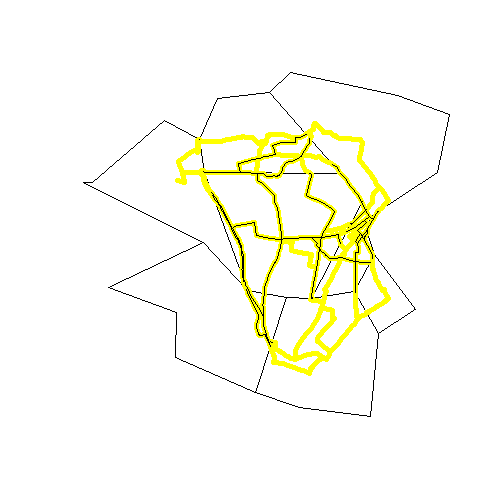

```r
# Packages

# Uncomment next line if devtools not installed
# install.packages("devtools")

# Install and load development version of stplanr package (uncomment)
# devtools::install_github("ropensci/stplanr")
library(stplanr)

# Look at the help for the function
# ?toptail_buff
# example("toptail_buff")

# Run example code
plot(zones)
plot(routes_fast, col = "yellow", lwd = 5, add = T)
r_anon <- toptail_buff(l = routes_fast, buff = zones)
plot(r_anon, add = T)
```

 

```r
# compile this code to html
# knitr::spin("R/stplanr-example.R")
```

