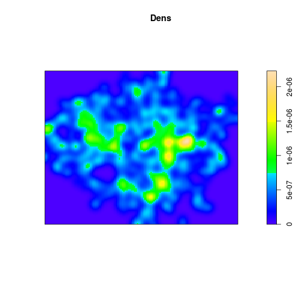
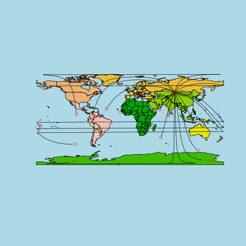

Aggregating spatial points to reduce dataset size
========================================================

With ubiquitous collection devices (e.g. smartphones), having *too much*
data may become an increasingly common problem for spatial analysts, 
even with increasingly powerful computers. This is ironic, 
because a few short decades ago, *too little* data was a primary constraint.

This tutorial will build on the 'Attribute joins' section of the 
Creating maps in R tutorial to demonstrate how clusters can be identified 
in a field of spatial points and then used as the basis of aggregation 
to reduce the total number of points. 

So, starting from within the project's folder (which can be downloaded 
from here), lets start by reaffirming our starting point: 
transport points in London:


```r
library(sp)
load("data/stations.RData")
load("data/lnd.RData")
plot(stations)
```

 

```r
library(spatstat)
```

```
## Loading required package: mgcv
## Loading required package: nlme
## This is mgcv 1.7-28. For overview type 'help("mgcv-package")'.
## Loading required package: deldir
## deldir 0.0-22
## 
## spatstat 1.32-0     (nickname: 'Logistical Nightmare') 
## For an introduction to spatstat, type 'beginner'
```

```r
library(maptools)  # to convert to point pattern
```

```
## Checking rgeos availability: TRUE
```

```r
sSp <- as(SpatialPoints(stations), "ppp")
# Z <- spatstat::kppm(sSp) plot(Z)
Dens <- density(sSp, adjust = 0.2)
class(Dens)
```

```
## [1] "im"
```

```r
plot(Dens)
```

 

```r
contour(density(sSp, adjust = 0.2), nlevels = 4)
```

 


It seems that these points are quite evenly distributed, with 
some minor clusters. How can we identify these?

## Extract densities

Converting to Spatial objects. 


```r
Dsg <- as(Dens, "SpatialGridDataFrame")
Dim <- as.image.SpatialGridDataFrame(Dsg)
Dcl <- contourLines(Dim)
SLDF <- ContourLines2SLDF(Dcl)
proj4string(SLDF) <- proj4string(lnd)  # assign correct CRS - for future steps
plot(SLDF, col = terrain.colors(8))
```

 

```r
library(rgeos)
```

```
## rgeos version: 0.2-19, (SVN revision 394)
##  GEOS runtime version: 3.3.8-CAPI-1.7.8 
##  Polygon checking: TRUE
```

```r
Polyclust <- gPolygonize(SLDF[6, ])
gas <- gArea(Polyclust, byid = T)/10000
Polyclust <- SpatialPolygonsDataFrame(Polyclust, data = data.frame(gas), match.ID = F)
```


Now summarise the data for each of the polygons.


```r
cAg <- aggregate(stations, by = Polyclust, FUN = length)
# lb <- gBoundary(lnd)
plot(lnd)
plot(SLDF, col = terrain.colors(8), add = T)
plot(cAg, col = "red", add = T)
graphics::text(coordinates(cAg) + 2000, labels = cAg$CODE)
```

 


