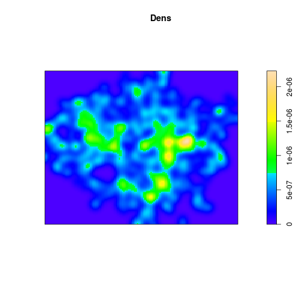
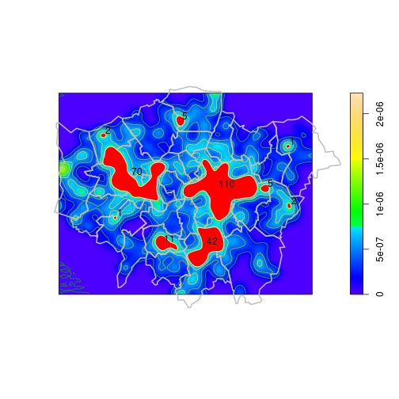
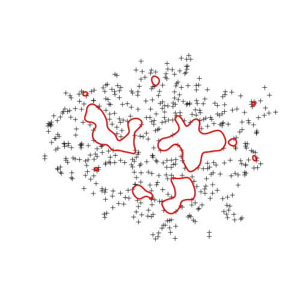

Aggregating spatial points to reduce dataset size
========================================================

With ubiquitous collection devices (e.g. smartphones), having *too much*
data may become an increasingly common problem for spatial analysts, 
even with increasingly powerful computers. This is ironic, 
because a few short decades ago, *too little* data was a primary constraint.

This tutorial builds on the 'Attribute joins' section of the 
[Creating maps in R tutorial](https://github.com/Robinlovelace/Creating-maps-in-R/raw/master/intro-spatial-rl.pdf)
to demonstrate how clusters can be identified 
in a field of spatial points and then used as the basis of aggregation 
to reduce the total number of points. 

## Load the data

So, starting from within the project's folder (which can be downloaded 
from [here](https://github.com/Robinlovelace/Creating-maps-in-R/archive/master.zip)),
lets start by reaffirming our starting point: 
transport points in London:


```r
library(sp)  # add spatial package to load the S4 spatial objects
load("data/stations.RData")  # load 731 station points
class(stations)  # double-check what type of data we have
```

```
## [1] "SpatialPointsDataFrame"
## attr(,"package")
## [1] "sp"
```

```r
load("data/lnd.RData")  # load London zones for context
plot(stations)
```

 


## Plotting density

From the above plot it seems that these points are quite evenly distributed, with 
some minor clusters. How can we identify these? A common option is to 
convert the point data into a 2d continuous field of *point density*.
In order to do this,
and then create density contours, we will first convert them into the `ppp`
class. This allows us to use the powerful functions of the `spatstat`
package to be used on the points.


```r
library(spatstat)  # to calculate field of point density
```

```
## Loading required package: mgcv
## Loading required package: nlme
## This is mgcv 1.7-28. For overview type 'help("mgcv-package")'.
## Loading required package: deldir
## deldir 0.0-22
## 
## spatstat 1.32-0     (nickname: 'Logistical Nightmare') 
## For an introduction to spatstat, type 'beginner'
```

```r
library(maptools)  # to convert to point pattern
```

```
## Checking rgeos availability: TRUE
```

```r
sSp <- as(SpatialPoints(stations), "ppp")  # convert points to pp class
Dens <- density(sSp, adjust = 0.2)  # create density object
class(Dens)  # just for interest: it's got it's of pixel image class
```

```
## [1] "im"
```

```r
plot(Dens)  # default plot for density
```

 


The density plot illustrates that there are some areas of relatively 
high density close to the centre of London. This is as we'd expect. 
Another way to represent this density information is with contours of 
equal value, similar to those used in topographic maps to simultaneously 
represent slope (the closeness of the lines) and altitude.
`spatstat` enables simple plotting of countours with the sensibly named
`contour` function.


```r
contour(density(sSp, adjust = 0.2), nlevels = 4)  # plot as contours - this is where we're heading
```

 


In the above image, it is the "islands" of high dot density that we are most 
interested in. Having successfully visualised these, the next stage is to
save them into R's native spatial data format, before extracting the polygons.
These polygons will be used to aggregate the points.

## Save the contour lines 

To extract the contours, first as lines and then finally as polygons, 
we need to convert the data into two more formats: a spatial grid and 
then as a raster image. Both of these file formats are supported by the 
basic `sp` package.


```r
Dsg <- as(Dens, "SpatialGridDataFrame")  # convert to spatial grid class
Dim <- as.image.SpatialGridDataFrame(Dsg)  # convert again to an image
Dcl <- contourLines(Dim, nlevels = 9)  # create contour object - change 8 for more/fewer levels
SLDF <- ContourLines2SLDF(Dcl, CRS(proj4string(lnd)))  # convert to SpatialLinesDataFrame
plot(SLDF, col = terrain.colors(8))
```

 


## Extract the density polygons

Now the lines have been saved as the `SLDF` object, it is 
time to convert the level we are are interested in into polygons. 
This is quite a tricky task and can involve many steps using the basic 
`sp` package (see from code chunk 60 onwards [here](http://www.asdar-book.org/book2ed/cm_mod.R)).
Fortunately, the wonderful `rgeos` provides a single line solution, with the 
intuitively named `gPolygonize` function.


```r
library(rgeos)
```

```
## rgeos version: 0.2-19, (SVN revision 394)
##  GEOS runtime version: 3.3.8-CAPI-1.7.8 
##  Polygon checking: TRUE
```

```r
Polyclust <- gPolygonize(SLDF[5, ])
gas <- gArea(Polyclust, byid = T)/10000
Polyclust <- SpatialPolygonsDataFrame(Polyclust, data = data.frame(gas), match.ID = F)
plot(Polyclust)
```

 


## Aggregated the points within high density zones

The next task is to aggregate the points within each high density zone.
This is done automatically with base R's `aggregate` function. Note that 
when the `sp` package is installed, `aggregate` behaves differently if it is provided 
with spatial data as its input, outputting spatial data with aggregate statistics for the 
specified variable (or indeed all variables). 
Now summarise the data for each of the polygons.


```r
cAg <- aggregate(stations, by = Polyclust, FUN = length)
# lb <- gBoundary(lnd)
plot(Dens, main = "")
plot(lnd, border = "grey", lwd = 2, add = T)
plot(SLDF, col = terrain.colors(8), add = T)
plot(cAg, col = "red", border = "white", add = T)
graphics::text(coordinates(cAg) + 1000, labels = cAg$CODE)
```

 


## Save points inside and outside the points

In terms of visualisation, our work here is done. 
But that is not enough for most projects: we need to export the 
results. Remember from the beginning that the aim was to reduce the 
number of points we had to deal with? Well it is in this stage
that we find out how many points we've removed by aggregation
and save only the points lying outside the aggregation zones.


```r
sIn <- stations[cAg, ]  # select the stations inside the clusters
sOut <- stations[!row.names(stations) %in% row.names(sIn), ]  # stations outside the clusters
plot(sOut)  # the more sparsely distributed points - notice the 'holes' of low density
plot(cAg, border = "red", lwd = 3, add = T)
```

 


The plot shows that we've reduced the number of points, by removing those in 
areas of high density. But how much space have saved by removing closely clustered points?


```r
nrow(sIn)/nrow(stations)  # proportion of points in cluster
```

```
## [1] 0.3406
```

```r
gArea(cAg)/gArea(lnd)
```

```
## [1] 0.1178
```


The results of the final commands show that we have squeezed out 1/3
of the points from only only of the area. This is not a huge saving
because the points are quite evenly distributed. For more highly clustered 
datasets, however, the savings could be vast.

## Conclusion

We have seen how to create polygons of high point density in R and then, 
in relatively few lines of code, we have identified and aggregated the 
points that fit into these high density zones. This has applications for 
reducing data redundancy in highly clustered datasets. But the methods 
shown here have many other applications, including:

- Objective identification of zones to "target" based on point data
- Visualisation of zones of interest from the point data
- Provision of spatial data on which to base a stratified spatial sampling strategy

This final application could be of interest if one is trying to identify if the 
density of certain points of pollutants (e.g. petrol stations) related to 
other variables (e.g. species diversity). By creating zones of low density
and high density, and then taking measurements from each zone type, one could 
test the hypothesis that the former has an impact on the latter. 

Other applications could be found for the method. The take home message is 
that R has powerful spatial capabilities that would be difficult to implement
in conventional GIS software. By usin scripts, we can ensure that the code to create the results of 
such an analysis are reproducible and can be used by others. 
To this end, all the example code and data used in this example are reproducible - 
see the vignettes folder of the "Creating-maps-in-R"
[GitHub repository](https://github.com/Robinlovelace/Creating-maps-in-R). 


