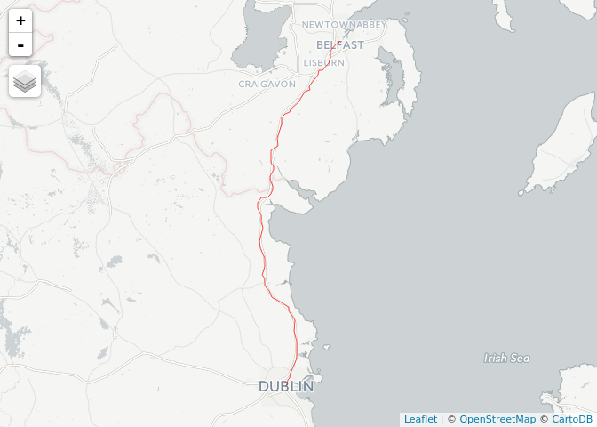

Measuring distance with stplanr
================

Use development versions of osmdata and stplanr packages plus a few others:

``` r
devtools::install_github("ropensci/stplanr")
devtools::install_github("ropensci/osmdata")
```

``` r
library(stplanr)
```

    ## Loading required package: sp

``` r
library(osmdata)
```

    ## Data (c) OpenStreetMap contributors, ODbL 1.0. http://www.openstreetmap.org/copyright

``` r
library(tmap)
```

Ensure you have a valid routing API key (e.g. Graphhoper - apply online).

Identify the origins and destinations.

For distance-to-border calculations the destination would be the nearest point on the border, or location over the border.

An illustrative example is shown below:

``` r
(o = geo_code("Dublin"))
```

    ##      lon      lat 
    ## -6.26031 53.34981

``` r
(d = geo_code("Belfast"))
```

    ##      lon      lat 
    ## -5.93012 54.59729

For each OD pair, find the route between them:

``` r
r = route_graphhopper(from = o, to = d, vehicle = "car")
tmap_mode("view")
```

    ## tmap mode set to interactive viewing

``` r
qtm(r)
```


