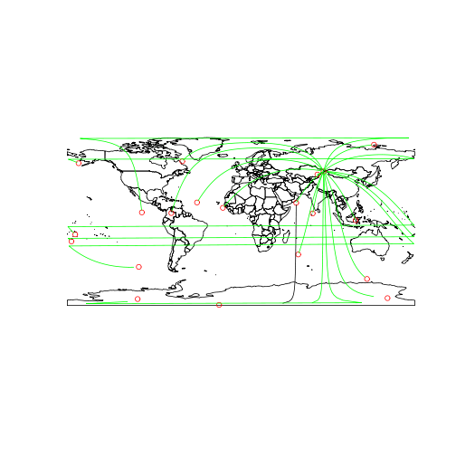
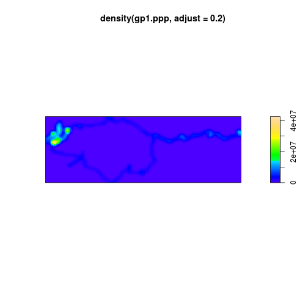

Reading and processing .gpx files
========================================================

## To do
 - Add previous examples of GPX data in R
 - Upload GPX data to OSM

.gpx is the standard format for saving georeferenced (lat/long)
location data taken from GPS (Global Positioning System) devices.
The file system itself is a type of xml and can be read as plain text.

Hundreds of thousands of .gpx files are now generated each day worldwide,
a massive source of information about where and when processes take places.
Processing, analysing and visualising .gpx files is therefore a useful skill, 
for example for tracing the movements of vehicles, geolocating photos 
by comparing their timestamp with a .gpx file, or, as demonstrated in this article,
simply for tracing a cycle trip and one's exploration of a new city by
non-motorised transport.

There are many software products designed specifically for handling .gpx
files and most Geographical Information Systems (GIS) applications allow
for .gpx files to be loaded. Being a fan of reproducible research and believer
in the empowering potential of free software and statistical knowhow, 
I decided to try explore some of my own .gpx data in R, to see what it could do.

This article presents the results of my investigations. It demonstrate
some basic methods for loading, analysing and visualisting .gps data in
the world's favourite free statistical programming language: R.

## Loading the data

The go-to package for loading spatial data in R is
rgdal, using the `readOGR` function. This method has many advantages over
alternative methods, including computational efficiency and the wide range of
formats available: typing `ogrDrivers()[which(ogrDrivers()[,2]),]`


```r
library(rgdal)
```

```
## Loading required package: sp
## rgdal: version: 0.8-10, (SVN revision 478)
## Geospatial Data Abstraction Library extensions to R successfully loaded
## Loaded GDAL runtime: GDAL 1.10.0, released 2013/04/24
## Path to GDAL shared files: /usr/share/gdal/1.10
## Loaded PROJ.4 runtime: Rel. 4.8.0, 6 March 2012, [PJ_VERSION: 480]
## Path to PROJ.4 shared files: (autodetected)
```

```r
(layers <- ogrListLayers("data/2014-03-22.gpx"))
```

```
## [1] "waypoints"    "routes"       "tracks"       "route_points"
## [5] "track_points"
```

```r
gp1 <- readOGR("/home/robin/Dropbox/georoutes2/2014-03-170750_20140317_0750.gpx", 
    layer = layers[5])
```

```
## OGR data source with driver: GPX 
## Source: "/home/robin/Dropbox/georoutes2/2014-03-170750_20140317_0750.gpx", layer: "track_points"
## with 2131 features and 26 fields
## Feature type: wkbPoint with 2 dimensions
```

```r
gt1 <- readOGR("/home/robin/Dropbox/georoutes2/2014-03-170750_20140317_0750.gpx", 
    layer = layers[3])
```

```
## OGR data source with driver: GPX 
## Source: "/home/robin/Dropbox/georoutes2/2014-03-170750_20140317_0750.gpx", layer: "tracks"
## with 1 features and 13 fields
## Feature type: wkbMultiLineString with 2 dimensions
```

```r
names(gp1)
```

```
##  [1] "track_fid"          "track_seg_id"       "track_seg_point_id"
##  [4] "ele"                "time"               "magvar"            
##  [7] "geoidheight"        "name"               "cmt"               
## [10] "desc"               "src"                "link1_href"        
## [13] "link1_text"         "link1_type"         "link2_href"        
## [16] "link2_text"         "link2_type"         "sym"               
## [19] "type"               "fix"                "sat"               
## [22] "hdop"               "vdop"               "pdop"              
## [25] "ageofdgpsdata"      "dgpsid"
```

```r
gp1@data[1:5, 1:6]
```

```
##   track_fid track_seg_id track_seg_point_id    ele                   time
## 1         0            0                  0  85.54 2014/03/17 07:00:34+00
## 2         0            1                  0 128.40 2014/03/17 07:00:47+00
## 3         0            1                  1 118.48 2014/03/17 07:01:50+00
## 4         0            2                  0 126.84 2014/03/17 13:07:03+00
## 5         0            3                  0 104.69 2014/03/17 13:07:04+00
##   magvar
## 1     NA
## 2     NA
## 3     NA
## 4     NA
## 5     NA
```

```r
plot(gp1)
plot(gt1, add = T, col = "red")
```

 


Here we have loaded the data as a point and a track layer (`gp1` and `gt1` respectively)
As the plots illustrate, the track contains a dense network in the west of the plot 
and then a more extensive loop extending to the east. We shall further explore
these data and interpret their meaning in the next section. For now, however, 
let's see another way to load the dataset.


```r
library(plotKML)
```

```
## plotKML version 0.4-2 (2013-01-15)
## URL: http://plotkml.r-forge.r-project.org/
```

```r
p1 <- readGPX("~/Dropbox/georoutes2/2014-03-22.gpx")
names(p1)
```

```
## [1] "metadata"  "bounds"    "waypoints" "tracks"    "routes"
```

```r
head(p1$tracks[[1]][[1]])
```

```
##     lon   lat    ele                 time
## 1 2.823 41.98 110.75 2014-03-22T10:20:54Z
## 2 2.823 41.98  83.00 2014-03-22T10:22:40Z
## 3 2.823 41.98  77.26 2014-03-22T10:23:09Z
## 4 2.823 41.98  75.47 2014-03-22T10:23:17Z
## 5 2.823 41.98  73.67 2014-03-22T10:23:29Z
## 6 2.823 41.98  69.64 2014-03-22T10:23:48Z
```

```r
head(unlist(gp1$tracks))
```

```
## NULL
```

```r
t1 <- do.call("rbind", unlist(p1$tracks, recursive = F))
plot(t1$lon, t1$lat)
```

 

```r
## Extract data frames
```


You can also embed plots, for example:

## Extracting basic statistics

## A heat-map of activity

A heat map can demonstrate where location is most concentrated,
even in cases where the points or lines are so densly packed that
overlap. A basic heat map of the area can be created very rapidly 
using `spatstat


```r
library(spatstat)
```

```
## Loading required package: mgcv
## Loading required package: nlme
## This is mgcv 1.7-28. For overview type 'help("mgcv-package")'.
## Loading required package: deldir
## deldir 0.0-22
## 
## spatstat 1.32-0     (nickname: 'Logistical Nightmare') 
## For an introduction to spatstat, type 'beginner'
```

```r
library(maptools)
```

```
## Checking rgeos availability: TRUE
```

```r
gp1.ppp <- as(SpatialPoints(gp1), "ppp")
plot(density(gp1.ppp))
```

 


As might have been expected, the results of this preliminary heat map plot are
rather dissapointing: the zone of high density to the west totally dominates,
while the loop is barely visible. The density increases slightly where
the two sides of the loop meet just to east of centre, indicating that
this line is overlapped. The first way to deal with this is to plot the
heatmap with a lower bandwidth, reducing the area over which points are
spatially aggregated.


```r
plot(density(gp1.ppp, adjust = 0.2))
```

 


Still it is difficult to extract useful information from this visualisation
because we are essentially dealing processes on two different spatial scales.
The large loop out to the east is many times the area of the high density
blob to the west. So, using the information gleaned in the previous section
we take a subset of the data for future heatmaps to see what is going on in that
western blob.

## Looking at elevation

Recalling the contents of the `@data` slot of the data, let's take a quick
look at elevation, which can be useful for various applications.


```r
plot(gp1$track_seg_point_id, gp1$ele)
```

 


