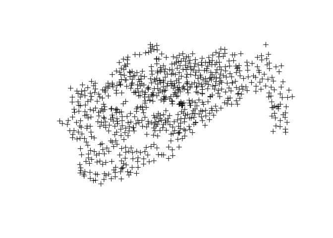

This tutorial aims to teach the basics of point pattern analysis in R.

``` r
library(sp)
```

The input data is

``` r
cycle_hire = rgdal::readOGR("data/cycle_hire.geojson")
```

    ## OGR data source with driver: GeoJSON 
    ## Source: "data/cycle_hire.geojson", layer: "OGRGeoJSON"
    ## with 742 features
    ## It has 5 fields

``` r
plot(cycle_hire)
```


