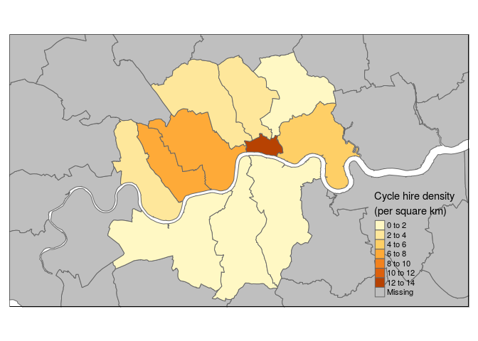
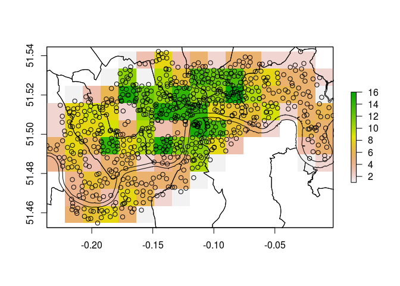
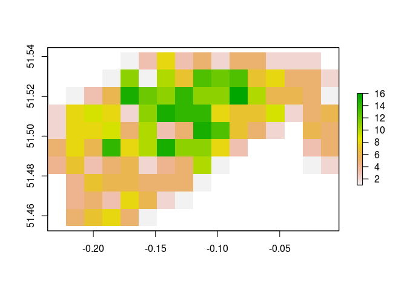
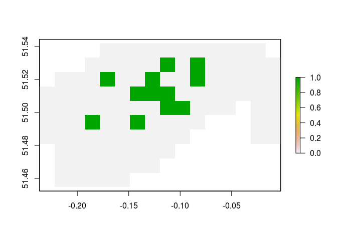
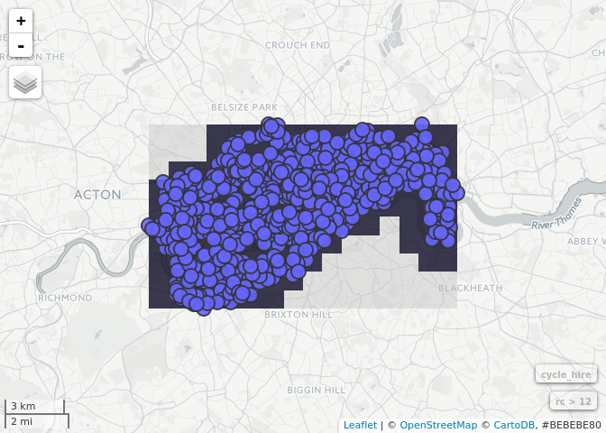
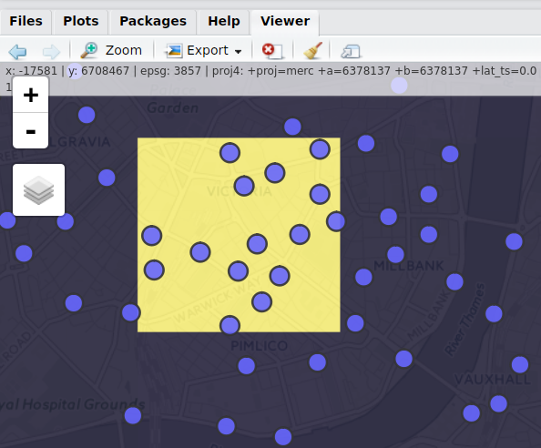
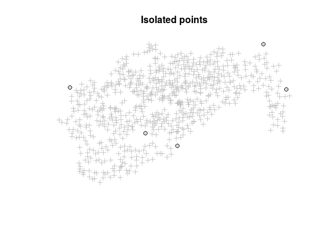
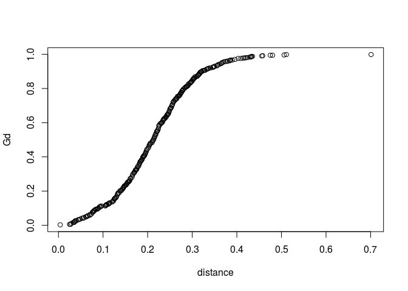

Point Pattern analysis and spatial interpolation with R
================

-   [Introduction](#introduction)
    -   [Data](#data)
-   [Point density](#point-density)
    -   [Exercises](#exercises)
    -   [Challenges](#challenges)
-   [Points in polygons and raster cells](#points-in-polygons-and-raster-cells)
    -   [Exercises](#exercises-1)
    -   [Challenge](#challenge)
    -   [Exercises](#exercises-2)
-   [Point distance analysis](#point-distance-analysis)
-   [Spatial interpolation](#spatial-interpolation)
-   [References](#references)

Introduction
============

This tutorial teaches the basics of point pattern analysis in R. It is influenced by the chapter on Spatial Point Pattern Analysis in *Applied Spatial Data Analysis with R* (Bivand, Pebesma, and Gómez-Rubio 2013) and an [online tutorial](http://rspatial.org/analysis/rst/8-pointpat.html) on Point Pattern Analyis by Robert Hijmans.

We will use the **sp** package for this rather than the newer **sf** package, as point pattern analysis is more established for the formers `Spatial` class system than the latter's `sf` classes. We will also use **raster** as it has concise and well-designed functions for spatial data:

``` r
library(sp)
library(raster)
```

Data
----

This tutorial assumes you have downloaded the GitHub repo [`robinlovelace/Creating-maps-in-R`](https://github.com/Robinlovelace/Creating-maps-in-R) and that the working directory of your R session is the root directory of this project.

<!-- Could say how to this with download.file... -->
The input datasets, cunningly stored in the `data/` directory, are on 'Boris Bikes' docking stations around London, and can be read-in and visualised with the following commands:

``` r
lnd = rgdal::readOGR("data/lnd.geojson")
```

    ## OGR data source with driver: GeoJSON 
    ## Source: "data/lnd.geojson", layer: "OGRGeoJSON"
    ## with 33 features
    ## It has 7 fields

``` r
cycle_hire = rgdal::readOGR("data/cycle_hire.geojson")
```

    ## OGR data source with driver: GeoJSON 
    ## Source: "data/cycle_hire.geojson", layer: "OGRGeoJSON"
    ## with 742 features
    ## It has 5 fields

``` r
cycle_hire_osm = rgdal::readOGR("data/cycle_hire-osm.geojson")
```

    ## OGR data source with driver: GeoJSON 
    ## Source: "data/cycle_hire-osm.geojson", layer: "OGRGeoJSON"
    ## with 532 features
    ## It has 5 fields

``` r
plot(cycle_hire)
points(cycle_hire_osm, col = "red")
plot(lnd, add = TRUE)
```


It is immediately clear that the two datasets on cycle hire points are closely related (they have a high degree of spatial correlation) and have a distinctive pattern. `cycle_hire` represents official data on cycle parking, and will be the main point dataset analysed. `cycle_hire_osm` is the community contributed dataset on cycle hire locations, downloaded from OpenStreetMap. Both sets of points overlay some of London's 33 boroughs, the central ones, and seem to follow the River Thames, especially along the north bank of the river. But how to describe that information quantitively, and extrapolate the values from the plotted location to other areas?

It is the purpose of this tutorial to provide the know-how to answer such questions, that should be extensible to many applications that involve point data.

Point density
=============

A basic statistic to compute on points within a polygon is the number of points per polygon, and the related statistic of point density. Let's first compute that for London overall, before doing a zone-by-zone breakdown:

``` r
nrow(cycle_hire)
```

    ## [1] 742

``` r
lnd_area = sum(area(lnd)) / 1e6
```

The results show that there are 742 cycle hire points and that London covers an area of just over one and a half thousand square kilometres (1 km<sup>2</sup> = 1000000 m<sup>2</sup> = 1e6 m<sup>2</sup> in scientific notation). That represents on average roughly one cycle parking rental space per 2 square kilometers, or half a rental point per square kilometer, as revealed by the results of the calculation below:

``` r
nrow(cycle_hire) /
  lnd_area
```

    ## [1] 0.4714415

This is not a good indicator of the density of the bike hire scheme overall, because they are so concentrated in central London. A more representative result can be found by calculating the average point density *within the extent of the bike hire scheme*. We can coerce the bounding box (or extent in **raster** terminology) of the stations into a polygon whose area can be measured with the following commands:

``` r
bb_hire = as(extent(cycle_hire), "SpatialPolygons")
crs(bb_hire) = crs(lnd)
c_area = area(bb_hire) / 1e6
```

Exercises
---------

-   What is the average point density of cycle hire points within the scheme's bounding box?

<!-- ```{r} -->
<!-- c_area = area(bb_hire) / 1e6 -->
<!-- nrow(cycle_hire) / c_area -->
<!-- ``` -->
-   Why did we add the second line of code in the previous code chunk?
-   Why are there two `crs()` calls?
-   The above chunk uses **raster** functions. How would you write the above code using **sp** code?

Challenges
----------

-   Reproduce the result using **sp** code.
-   Reproduce the resuts using **sf** code.

Points in polygons and raster cells
===================================

A useful level of analysis at which to analyse the geographical distribution of points is the zone-level. We can aggregate the points per zone and provide summary statistics. Starting with the number of points per polygon, this would calculated as follows:

``` r
cycle_hire_ag = aggregate(cycle_hire["id"], lnd, FUN = "length")
```

Exercises
---------

Based on an analysis of the `cycle_hire_ag`:

-   How many zones contain no cycle hire points?
-   What is the average number of cycle hire points per zone?

Challenge
---------

Find the average density of cycle hire points per zone in London.

-   Plot the result in an attractive map (e.g. as shown below).
-   Find which zone has the highest density of cycle hire points.

<!-- ```{r zonedense} -->
<!-- lnd_areas = area(lnd) / 1e6 -->
<!-- lnd$`cycle_hire_density` = cycle_hire_ag$id / lnd_areas -->
<!-- library(tmap) -->
<!-- bb = tmaptools::bb(cycle_hire, 2) -->
<!-- ft = "Cycle hire density\n(per square km)" -->
<!-- # tmap_mode("view") -->
<!-- (m = qtm(lnd, "cycle_hire_density", fill.title = ft, bbox = bb)) -->
<!-- # save_tmap(tm = m, filename = "figure/cyle-hire-lnd.png", width = 600) -->
<!-- lnd$NAME[which.max(lnd$cycle_hire_density)] -->
<!-- ``` -->


A problem with the zonal representation of point density is that the results are dependent on the somewhat arbitrary shapes and sizes of the zones in which the points are aggregated. To overcome this problem we can create a raster representation of the points:

``` r
r = raster(bb_hire, ncol = 16, nrow = 10)
rc = rasterize(cycle_hire@coords, r, fun = "count")
plot(rc)
points(cycle_hire)
plot(lnd, add = TRUE)
```



This is already very useful. The results show that there are 5 clusters of cycle parking with much higher density than the surrounding areas. We can visualise these clusters using a static plot as follows:

``` r
plot(rc)
```



``` r
plot(rc > 12)
```



More useful, in terms of characterising the geographical characteristics of each cluster, would be to plot these 5 clusters interactively. Do this with **mapview**:

``` r
library(mapview)
```

    ## Loading required package: leaflet

``` r
mapview(rc > 12) +
  mapview(cycle_hire)
```



The resulting interactive plot draws attention to the areas of high point density, such as the area surrounding Victoria station, illustrated below.



Exercises
---------

-   Explore the interactive map created by **mapview** above.
-   Try to explain the location of the high density clusters: what are they near?
-   Where would you suggest building more cycle hire points?

Point distance analysis
=======================

Another important characteristic of point patterns is the distances between points, which can be calculated using **raster**'s `dist()` function:

``` r
d = spDists(cycle_hire, longlat = TRUE)
dm = as.matrix(d)
dm[1:3, 1:5]
```

    ##          [,1]     [,2]     [,3]      [,4]     [,5]
    ## [1,] 0.000000 6.913473 1.966592 0.7700464 5.164896
    ## [2,] 6.913473 0.000000 8.205219 6.3051094 2.916743
    ## [3,] 1.966592 8.205219 0.000000 2.7062514 5.915129

The results show the distance, in km, form every point to every other. The `dm` object is known as a distance matrix: not the diagonal of zero values. This distance matrix is very useful for various types of analysis, a couple of which we'll explore below.

To find the minimum distance of each point to every other, we can use the `apply` function, for each row, and then select the top 5:

``` r
diag(dm) <- NA
dmin = apply(X = dm, MARGIN = 1, FUN = min, na.rm = TRUE)
sel_isolated = order(dmin, decreasing = TRUE)[1:5]
plot(cycle_hire, col = "grey", main = "Isolated points")
points(cycle_hire[sel_isolated,])
```



Another plot that is useful is that of the 'G function' for exploring the extent to which points cluster or separate compared with what would be expected from a random distribution (Bivand, Pebesma, and Gómez-Rubio 2013):

``` r
distance <- sort(unique(round(dmin, digits = 3)))
Gd <- sapply(distance, function(x) sum(dmin < x))
Gd <- Gd / length(dmin)
plot(distance, Gd)
```



Spatial interpolation
=====================

References
==========

Bivand, Roger S, Edzer J Pebesma, and Virgilio Gómez-Rubio. 2013. *Applied Spatial Data Analysis with R*. Vol. 747248717. Springer.
