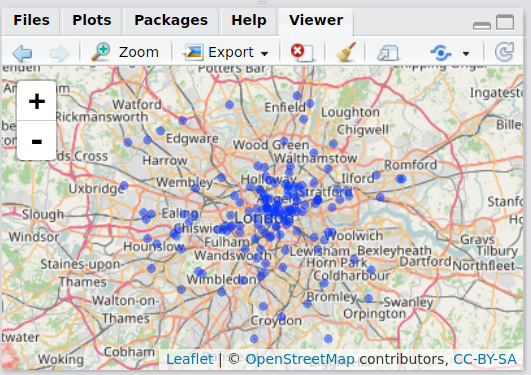
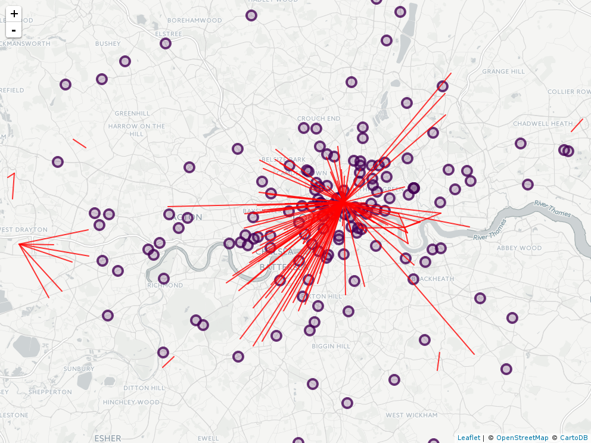

---
author:
  - name: Robin Lovelace
    affiliation: University of Leeds
    address: >
      First line
      Second line
    email: r.lovelace@leeds.ac.uk
    url: http://www.robinlovelace.net
title:
  formatted: "Visualising Spatial Data with R, from base to \\pkg{tmap}"
  # If you use tex in the formatted title, also supply version without
  plain:     "Visualising Spatial Data with R, from base to tmap"
  # For running headers, if needed
  short:     "Visualising Spatial Data with R"
abstract: >
  This article traces the development spatial data visualisation methods and capabilities in statistical statistical software since the beginning of the 21^st^ Century. Although the focus is on R, the progression from rudimentary and inflexible bitmap images to interactive online maps is applicable to other languages for statistical programming. The paper is primarily a historical review of the evolving state of the art, with the finding that making informative and aesthetically pleasing maps with \proglang{R} has become a more intuitive and interactive process over time. A secondary purpose of the paper is dissemination of best practice (with reproducible and extensible examples) in the field with a view to the future developments in the context of \proglang{R}'s rapidly evolving spatial capabilities.
keywords:
  # at least one keyword must be supplied
  formatted: [visualisation, spatial data, "\\proglang{R}"]
  plain:     [visualisation, spatial data, R]
preamble: >
  \usepackage{amsmath}
output: rticles::jss_article
bibliography: references.bib
---

# Introduction

Maps have a long history, closely bound-up with scientific progress, imperial expansion and humanity's sense of place on the Earth [e.g. @roller_eratosthenes_2010;@livingston_geographical_1992]. Computer aided maps can be seen as an extension of the story of cartography, the art and science of map making, into the digital age. Although the media have changed, maps are still manifestations of political power and (apparent) scientific objectivity [@dodge_crowdsourced_2013]. Within this long-established cartographic tradition, software dedicated to the geographic visualisation of statistical data is a relatively recent development.

It is the aim of this paper to review the history of software for geographic data visualisation, with reference to \proglang{R} packages. The focus on a single language was deliberate, allowing greater depth of discussion (with reproducible code examples) than would be possible in a paper of the same length that attempted to cover implentations in all languages. Many programs have been developed for map making [@steiniger_2012_2013]. However, the majority do not focus on visualising statistical data (e.g. through choropleth maps, maps for point pattern analysis and raster heatmaps). It is difficult to trace the overall development of the sub-field through the wide range of software products described by @steiniger_2012_2013, which use diverse interfaces.

R packages for geographic data visualisation are more consistent. They all rely on the same user interface (unless they are part of a '**shiny** app'), the \proglang{R} command line; make use the same **sp** class system (except **ggmap**), so can be directly compared for plotting the same datasets; and are all maintained to the present day on CRAN; and \proglang{R}'s origins in statistical computing mean that they all have at least some geostatistical visualisation capabilities. An additional reason for using \proglang{R} packages to trace the development of geographic visualisation software is that \proglang{R} have often been at the forefront of geographic data visualisation methods, for example through early interfaces to web-mapping libraries. Despite its focus on a single language, this paper therefore aims to provide an indication of the state-of-the-art of geographic data visualisation in statistical software overall.

Geographic data visualisation in \proglang{R} is usually done as part of a wider process, which can be broadly defined as *command line GIS* [@cheshire_spatial_2015]. This article's focus on visualisation is designed to fill a gap in the literature and demonstrate recent developments in the field.  Much has been written about handling, processing and modelling spatial data already [e.g. @dorman_learning_2014;@bivand_applied_2013], but there is little in the academic literature focussed explicitly on spatial data visualisation.

A further motivation for focussing on visualisation is that iteratively creating maps is an excellent way to gain understanding of spatial data and the underlying spatial phenomena that they represent, from species's response to climate change to the design of sustainable cities. Humans are adept and processing and deriving conclusions from visual data:
"A well-crafted graph [or map] can help you make meaningful comparisons among thousands of pieces of information, extracting patterns not easily found through other methods ... one area where \proglang{R} shines" [@kabacoff_r_2011, p. 45]. For people new to spatial data, visualisation may therefore be a rewarding place to start.

# Geographical data in R

Methods for geographic data visualisation are closely bound up with methods for representing geographic data. This section therefore briefly describes the main types of spatial data, and how they can be represented in R.

There are 2 branches of spatial data: raster and vector. Rasters are 2D images composed of pixels that treat space as a series of uniform blocks or raster 'cells'. They be represented as a matrix or array. Vectors are 2D assemblages of points and edges in which the points (and the lines that join them) can exist anywhere in continuous space. Although some exotic data structures are possible (e.g. [voxels](https://en.wikipedia.org/wiki/Voxel)), the majority of spatial datasets can be represented by just 2 types of raster and 3 types of vector object:

```{r}
# Note: I think this information would be better presented as a table
```


- Raster data
    - Single band raster data: this is essentially a greyscale image, in which each pixel represents an area on Earth's surface. Native formats for these include `SpatialPixelsDataFrame` from **sp** and the `RasterLayer` class from the **raster** package.
    - Multi-layered raster data: these are assemblages of multiple raster layers such as color bands (red, green, blue) used for color vision

- Vector data
    - Points: points on a map, often saved as a `SpatialPointsDataFrame` from the **sp** package.
    - Lines: points with an order to trace lines, often represented with the `SpatialLinesDataFrame` class in R.
    - Polygons: representing areas on the map, often saved as a `SpatialPolygonsDataFrame`

To how each spatial data type can be visualised, the example datasets include at least one of each. To demonstrate how different datasets can be layered, they all have the same geographic extent (Greater London). Real data related to transport planning are used as an illustrative use-case of the visualisation methods. The datasets are outlined below (see the Appendix for further details):

- `crashes`: A `SpatialPointsDataFrame` from the 'Stats19' dataset on road traffic collisions reported to the police.
- `commutes`: A `SpatialLinesDataFrame` representing commuter desire lines in London.
- `rnet`: A network of lines representing the cycling potential in different parts of London.
- `msoas`: Areas of London, stored as a `SpatialPolygonsDataFrame`.
- `topo`: The topography of London, saved as a `RasterLayer`.

These datasets can be found at https://github.com/Robinlovelace/vspd-base-shiny-data and (assuming they are placed in a folder called vspd-data) can be loaded as folows:

```{r, message=FALSE}
library(sp)
lnd = readRDS("vspd-data/lnd84.Rds")
crashes = readRDS("vspd-data/ac_cycle_lnd.Rds")
killed = crashes[crashes$Casualty_Severity == "Fatal",]
commutes = readRDS("vspd-data/l-lnd.Rds")
msoas = readRDS("vspd-data/z.Rds")
rnet = readRDS("vspd-data/rnet-lnd.Rds")
topo = readRDS("vspd-data/lnd-topo.Rds")
```

\section{R packages for visualising spatial data}\label{s:rpack}


The visualisation packages used, in roughly ascending order of release date on CRAN and sophistication/complexity, are described and installed below:

```{r}
pkgs = c(
  "sp",       # spatial data classes and functions
  "ggmap",    # maps the ggplot2 way
  "tmap",     # powerful and flexible mapping package
  "leaflet",  # interactive maps via the JavaScript library of the same name
  "mapview",  # a quick way to create interactive maps (depends on leaflet)
  "shiny"     # for converting your maps into online applications
    # choroplethr?
)
```

```{r, eval=FALSE, echo=FALSE}
install.packages(pkgs)
```

```{r, echo=FALSE, eval=FALSE}
# additional packages used
pkgs = c(pkgs, c(
  "OpenStreetMap", # for downloading OpenStreetMap tiles 
  "rasterVis",# raster visualisation (depends on the raster package)
  "dplyr",    # data manipulation package
  "tidyr"     # data reshaping package
))

(to_install = pkgs[!pkgs %in% installed.packages()])
if(length(to_install) > 0){
  install.packages(to_install)
}
```


```{r}
library(sp)
```

Spatial datasets defined by **sp** classes can be plotted quickly using the base function `plot()`, after **sp** has been loaded. The source code of **sp** is a  is passed to `plot()`. Two main differences from this source code should be noted: `pch = 3` and `axes = FALSE`. This switches the symbol of the points to a cross and stops the graphic from containing intrusive axes. Another major difference is the addition of the `add` argument (set to `FALSE` by default).

To see the difference between the generic and **sp** versions of `plot()`, let's plot some points using both methods:

```{r}
par(mfrow = c(1, 2))
plot(killed)
plot(coordinates(killed))
par(mfrow = c(1, 1))
```

It is instructive to realise that because any arguments available to `plot()` will work for plotting spatial data. Plots of spatial data using `plot()` are therefore as flexible as any `plot()`: very. The following, for example, makes the plot look more like the base version of `plot()`, with the major difference being that the axis breaks use degrees as their units and that the plot has the right height-width proportions:

```{r}
plot(killed, pch = 1, axes = T)
```

The above shows that although they *look* like base graphics, basic maps produced with `plot()` should technically be called **sp** graphics. Adding multiple such layers on top of each other using the `add = T` argument (an extension of `plot()` for `Spatial` data classes) can generate insights into the spatial relationships between one layer and another.

```{r}
plot(lnd)
plot(rnet, add = T, col = "blue",
     lwd = rnet$bicycle / mean(rnet$bicycle))
plot(killed, col = "yellow", add = T)
```

The above code shows how the use of `add = TRUE` can be used to create a layered map, with each call to `plot()` overlaying the previous one. This is enables quick visualision exploration of data, for example whether datasets spatially overlap. Be warned, however: any plot containing `add = T` will fail if a plot has yet to be called (a problem solved by **tmap** and **ggmap**).

The plots may look a little rudimentary and dated. However, the advantage is that if you are already good with base graphics, you will naturally be good at map making. If you are not proficient with \proglang{R}'s base graphics, it is recommended that you skip this phase directly to something more sophisticated like **tmap**.

## spplot

`spplot()` is an extension of base `plot()` provided by the **sp** package for plotting objects side-by-side. The plot below, for example, plots the spatial distribution of the age of casualty alongside the age of the vehicle driver. 

```{r}
spplot(obj = killed, c("Age_of_Casualty", "Age_of_Driver"))
```

`spplot()` is a quick way to compare the spatial distribution of two variables within a spatial dataset. It is limited by the fact that the variables being compared must have range of values (or levels if they are factors). The following fails, for example:

```{r, eval=FALSE}
spplot(obj = killed, c("Sex_of_Casualty", "Road_Type"))
# Error in stack.SpatialPointsDataFrame(as(data, "SpatialPointsDataFrame"),  : 
#   all factors should have identical levels
```

More recent packages offer a more intuitive interface for creating plots with aesthetically pleasing defaults. Furthermore **ggmap** and **tmap** packages also allow for faceted maps.

## ggmap

**ggmap** provides a few extensions to the popular graphics library **ggplot2** for map making. Prime among these is its ability to automatically download tiles from services such as Google Maps, to create static base maps on which the user's own data can be plotted. **ggmap** has an emphasis on online data (e.g. providing `geocode()` and `route()` functionality) rather than GIS. Unlike the other packages presented here, **ggmap** does not work with data of `Spatial*` classes directly: instead **ggmap**, like **ggplot2**, demands data frames.

```{r, results='hide', message=FALSE}
library(ggmap)
killed$lon = coordinates(killed)[,1]
killed$lat = coordinates(killed)[,2]
ggplot(data = killed@data, mapping = aes(lon, lat)) +
  geom_point() +
  coord_map()
```

Note that the above code added the geometry data of the points to the data frame in the data slot of the `killed` geographic object, represented by `@data`. Because there is only one x/y (lon/lat in this case) pair for each row of data, this could be done by creating new columns. To convert more complex spatial data structures (`SpatialLinesDataFrames` and `SpatialPolygonsDataFrames`) into data frames, **ggmap** relies on `ggplot2::fortify()`, which is similar to `raster::geom()`:

```{r}
library(maptools) # a dependency for fortify to work
fortified = fortify(lnd, region = "ons_label")
head(fortified)
```

The output of `fortify()` is a data frame, as illustrated by its first 6 rows, shown above. Now rather than each row of data representing a London borough, each row in `fortified` now represents a single vertex on the `lnd` object. For this reason the data frame `lnd@data` has `r nrow(lnd)` whereas the `fortified` object has `r nrow(fortified)` rows.

<!-- Todo: create a dataframe of lat/lon pairs other ways -->

Notice that `fortified` still lacks attribute data, which needs to be joined. We can use `dplyr::left_join()` to do this:

```{r, warning=FALSE}
fortified = dplyr::left_join(fortified, lnd@data, c("id" = "ons_label"))
ggplot(data = fortified, aes(long, lat)) +
  geom_polygon(aes(group = group, fill = Pop_2001)) +
  coord_map()
```

We can make this map look a little more finished by removing the distracting axis labels, adding borders to the boroughs and changing the legend of the population variable, as illustrated by the code chunk below.

```{r}
pbreaks = c(0, 1e5, 2e5, 4e5)
plabs = c("0 - 100", "200 - 300", "300+")
fortified$`Population (1000s)` =
  cut(fortified$Pop_2001, breaks = pbreaks, labels = plabs)
ggplot(data = fortified, aes(long, lat, group = group)) +
  geom_polygon(aes(fill = `Population (1000s)`)) +
  geom_path() +
  coord_map() +
  theme_nothing(legend = T)
```

The above examples show that even though **ggplot2** was designed to make graphing as intuitive as possible, it still requires a decent amount of data preparation and domain-specific knowledge to create nice maps. Before moving on to **tmap**, which resolves some of these issues, we will reproduce the faceted map of the age/space distribution of victims/perpetrators in cycle/vehicle collisions. As you may have guessed, this also requires some data manipulation.

```{r, warning=FALSE}
library(tidyr)
killed_df = dplyr::select(killed@data,
                   Age_Band_of_Casualty, Age_Band_of_Driver, lon, lat)
killed_df = gather(killed_df, Role, Age, -lon, -lat)
ggplot(killed_df, aes(lon, lat)) +
  geom_path(data = fortified,
               aes(long, lat, group = group)) +
  geom_point(aes(color = Age)) +
  facet_grid(. ~Role) +
  coord_map() 
```

The results show that young adults, particularly in the 21 to 35 year-old band, are disproportionately killed by older drivers. This result can also be visualised non-spatially with **ggplot2**, so your skills can be cross-transferable:

```{r, warning=FALSE}
ggplot(data = killed_df) +
  geom_bar(aes(x = Age, fill = Role), position = "dodge")
```

## tmap

**tmap** is a recent package for spatial data visualisation that takes the best of both **ggplot2** and **sp** graphic worlds. Like **ggplot2** has an intuitive interface that uses the `+` symbol to build up layers. But, like **sp**'s `plot()` functions and unlike **ggplot2**, it works directly with spatial data classes. It is perhaps the quickest way to create a useful map in R, e.g. using the `qtm()` function:

```{r}
library(tmap)
qtm(lnd, fill = "Partic_Per")
```

`qtm()` is a wrapper function for `tm_shape()`, which is analogous to the plot initialisation function `ggplot()` in **ggplot2**, and functions which draw the features, such as `tm_bubbles()`, `tm_lines()` and `tm_fill()` for plotting points, lines and polygons respectively (see `?vignette('tmap-nutshell')` for further information).

To see how **tmap** graphics are constructed, let's create an identical graphic the verbose way, changing the colorscheme of the fill and border width to give an indication of the kinds of thing that can be customised:

```{r, eval=FALSE}
# Not shown
tm_shape(shp = lnd) +
  tm_fill("Partic_Per", palette = "BrBG") +
  tm_borders(lwd = 3)
```

Thus `tm_shape()` takes a spatial object and subsequent `tm_*()` functions take variable names contained in the `Spatial*DataFrame`. The `+` operator is very useful for building up plots one on top of another. Here is a **tmap** version of the multi-layered plot created towards the end of the base graphics section:

```{r}
tm_shape(lnd) + tm_borders() +
  qtm(killed, dot.col = "yellow") +
  tm_shape(rnet) + tm_lines("blue") +
  tm_shape(killed) + tm_dots(col = "red", size = 0.1)
```

**tmap** has a concise interface to create faceted plots, as demonstrated above with **spplot** and **ggplot2**:

```{r, eval=FALSE}
tm_shape(killed) +
  tm_dots(col = c("Age_of_Casualty", "Age_of_Driver"), size = 0.1)
```

The output shows that **tmap** creates facetted plots automatically, when multiple variable names are provided as a visualisation arguement (`col`, short for color, in this case). The example demonstrates another useful feature of **tmap**: if passed a continuous variable, it automatically created categories (bins) for the output, the `palette` (or colourscheme) of which can be controlled with `palette = "Reds"` The number and nature of the breaks can be controlled by the `n` and `style` arguments in the `tm_*` plotting functions. 

**tmap** has many additional features. The function `tm_layout()`, for example, controls the layout of the plot: `tm_layout(legend.outside = T)`, creates a self-standing legend outside the panel used by the map, as illustrated below.

```{r, echo=FALSE}
tm_shape(rnet) + tm_lines(col = "grey") +
  tm_shape(killed) +
  tm_dots(c("Age_of_Casualty", "Age_of_Driver"),
          breaks = c(0, 20, 40, 60, 100), palette = "RdYlBu",
          title = "Age", size = 0.1,
          auto.palette.mapping = F) +
  tm_layout(legend.outside = T)
```

### Interactive maps with tmap

To make an interactive map with **tmap**, enter `tmap_mode("view")` and run the same code you have been using for static maps. Below is an example of the multi-layered plot of London used previously:

```{r, eval=FALSE}
tmap_mode("view")
qtm(killed, dot.col = "yellow") +
  tm_shape(lnd) + tm_borders() +
  tm_shape(rnet) + tm_lines("blue") +
  tm_shape(killed) + tm_dots(col = "red", size = 0.1)
tmap_mode("plot") # return to plotting mode
```

```{r, echo=FALSE, out.width="60%"}
knitr::include_graphics("vspd-base-shiny_files/figure-markdown_github/tmap-view-mode.png")
```

## leaflet

**leaflet** is an \proglang{R} package for interacting with the Leaflet \proglang{JavaScript} library. It creates an object of class `htmlwidget` that is automatically displayed in RStudio, as illustrated below.

```{r}
library(leaflet)
m = leaflet() %>%
  addTiles() %>%
  addCircles(data = killed)
class(m)
```

```{r, echo=FALSE, out.width="60%"}

```

Other interactive mapping approaches covered in this paper (**tmap**, **mapview**, **shiny**) use **leaflet** which is well-developed and documented, e.g. on the online tutorial at [rstudio.github.io/leaflet/](https://rstudio.github.io/leaflet/).

## mapview

**mapview** provides convenient wrappers around **leaflet** to ease the creation of interactive maps. While the **leaflet** map example took 3 functions to create, with mapview (like tmap) you can do it with just one:

```{r}
library(mapview)
```

```{r, eval=FALSE}
m = mapview(killed) +
  mapview(commutes, color = "red")
m # display the map
```

As well as providing the option to save in html (via `htmlwidgets::saveWidget(m@map, "m.html")`), the `mapshot()` function allows you to save a snapshot of you map at it's initial zoom level:

```{r, eval=FALSE, echo=FALSE}
mapshot(m, "mapview.png")
```

```{r, echo=FALSE, out.width="60%"}

```

## shiny

**shiny** is a package for creating interactive web applications in R. This allows for maps to be created with a level of interactivity that goes beyond the panning, zooming and layer switching functionality presented in the previous sections. **shiny** allows the user to create not only maps but *mapping applications*. Building on the previous examples, **shiny** enables the creation of web applications that allow the user to explore, for example, the relationship between cycling levels and cycling casualties, without needing to run \proglang{R} directly. In terms of public engagement in the geographic visualisation process, this is clearly a huge benefit: people can explore patterns in geographic data by accessing a web page.

# Appendix
These were created/stored locally in the `vspd-data/` subdirectory of `vignettes/` the working directory of this tutorial. Set your working directly to this folder:

```{r, echo=FALSE}
# switch to the vignettes directory if not in it already
if(!grepl(pattern = "vignettes", x = getwd())){
  old = setwd("vignettes")
}
```

**The datasets can all be downloaded from the following link: [github.com/Robinlovelace/vspd-data](https://github.com/Robinlovelace/vspd-data).**

They can be automatically downloaded and placed into the correct folder as follows:

```{r, eval=FALSE}
u = "https://github.com/Robinlovelace/vspd-data/archive/master.zip"
download.file(u, destfile = "master.zip")
unzip("master.zip")
dir.create("vspd-data")
f = list.files(path = "vspd-data-master/", full.names = T)
file.copy(f, "vspd-data")
```

The datasets used in this tutorial were downloaded using the code presented below:


```{r, eval=FALSE}
u1 = "https://github.com/npct/pct-data/raw/master/london/l.Rds"
download.file(u1, "vspd-data/l-lnd.Rds")
u2 = "https://github.com/npct/pct-data/raw/master/london/z.Rds"
download.file(u2, "vspd-data/z.Rds")
u3 = "https://github.com/npct/pct-data/raw/master/london/rnet.Rds"
download.file(u3, "vspd-data/rnet-lnd.Rds")
u4 = "https://data.gov.uk/dataset/road-accidents-safety-data/datapackage.zip"
download.file(u4, "vspd-data/datapackage-stats19.zip") # warning: downloads 0.5 GB

# subsetting the data
l = readRDS("vspd-data/l-lnd.Rds")
commutes = l[l$all > 500,]
saveRDS(commutes, "vspd-data/l-lnd.Rds")
sp::plot(commutes)

# get the data from github.com/npct/pct-data/:
rnet = readRDS("~/npct/pct-data/london/rnet.Rds")
summary(rnet$dutch_slc)
rnet$length = stplanr::gprojected(rnet, fun = rgeos::gLength, byid = T)
summary(rnet$length)
summary(rnet$dutch_slc)
rnet = rnet[rnet$dutch_slc > 1000 | rnet$length > 500,]
rnet = rnet[rnet$dutch_slc < 10000,]
saveRDS(rnet, "vspd-data/rnet-lnd.Rds")
```

The Stats19 data required processing before it could be used:

```{r, eval=FALSE}
library(stplanr)
library(dplyr)
unzip("vspd-data/datapackage-stats19.zip")
unzip("vspd-data/Stats19_Data_2005-2014.zip")
ac = read_stats19_ac(data_dir = ".")
ca = read_stats19_ca(data_dir = ".")
ve = read_stats19_ve(data_dir = ".")
levels(ve$Age_Band_of_Driver)[2:3] = c("01 - 05",  "06 - 10")
levels(ca$Age_Band_of_Casualty)[2:3] = c("01 - 05",  "06 - 10")
ve_not_cycle = filter(ve, Vehicle_Type != "Pedal cycle")
ve_not_cycle = ve_not_cycle[!duplicated(ve_not_cycle$Accident_Index),]
ac_joined = inner_join(ac, ca, "Accident_Index")
ac_cycle = filter(ac_joined, Casualty_Type == "Cyclist")
ac_cycle = filter(ac_cycle, !is.na(Latitude))
ac_cycle = left_join(ac_cycle, ve_not_cycle, "Accident_Index")
summary(ac_cycle$Vehicle_Type)
summary(ac_cycle$Casualty_Severity)
# ac_cycle_sev = filter(ac_cycle, Casualty_Severity == "Fatal" |
#                         Casualty_Severity == "Serious")
lnd = readRDS("../data/lnd84.Rds")
ac_cycle_sp = SpatialPointsDataFrame(
  coords = cbind(ac_cycle$Longitude, ac_cycle$Latitude),
  data = as.data.frame(ac_cycle), # fails if it's a tibble
  proj4string = CRS(proj4string(lnd))
)

crashes = ac_cycle_sp[lnd,]
plot(killed) # nearly 40k cyclist casualties
object.size(crashes) / 1000000
names(crashes)
# crashes$Age_of_Casualty[crashes$Age_of_Casualty == -1]
crashes$Age_Band_of_Driver[is.na(crashes$Age_Band_of_Driver)] = factor(NA)
levels(crashes$Age_Band_of_Casualty)
crashes@data = select(crashes@data,
                           Accident_Index,
                           Date,
                           Day_of_Week,
                           Time,
                           Road_Type,
                           Age_of_Casualty,
                           Age_Band_of_Casualty,
                           Sex_of_Casualty,
                           Casualty_Severity,
                           Age_of_Driver,
                           Age_Band_of_Driver
                           )
saveRDS(crashes, "vspd-data/ac_cycle_lnd.Rds")
```

The topographical data was saved using the **raster** package:

```{r, eval=FALSE}
eng_topo = raster::getData("alt", country = "GBR")
topo = raster::crop(eng_topo, lnd)
plot(topo)
points(killed)
saveRDS(topo, "vspd-data/lnd-topo.Rds")
```

```{r, echo=FALSE, eval=FALSE}
# to include
plot(rnet)
names(rnet)

plot(rnet, lwd = rnet$dutch_slc / mean(rnet$dutch_slc))
rnet_long = rnet[rnet$length > 2000,]
rnet_short = rnet[rnet$length < 200,]
plot(rnet_long, add = T, col = "red")
plot(rnet_short, add = T, col = "green")
plot(rnet$bicycle, rnet$dutch_slc)
library(ggplot2)
ggplot(data = rnet@data, aes(bicycle, dutch_slc)) +
  geom_point(aes(size = length), alpha = 0.1)

crashes = readRDS("vspd-data/ac_cycle_lnd.Rds")
rnet_f = fortify(rnet)
crashes_f = crashes@data
crashes_f$long = coordinates(crashes)[,1]
crashes_f$lat = coordinates(crashes)[,2]

# qmap(location = "London") +
# ggplot() +
#   geom_point(data = crashes_f,
#              aes(x = long, y = lat), alpha = 0.1) +
#   geom_path(data = rnet_f, aes(long, lat, group = group),
#             col = "red") +
#   coord_map()

# names(crashes_f)
# ggplot(rnet_f, aes(long, lat)) +
#   geom_path()
```

# Discussion and conclusion

# Ideas and references to cite

- Show that **tmap** maps work regardless of the order to the layers, unlike `plot()`, in which `add = TRUE` must be added if it's not the 1st.

@dorling_area_2011

@baath_state_2012

@bivand_applied_2013

@zastrow_science_2015

@zhang_icon_2004


# References

