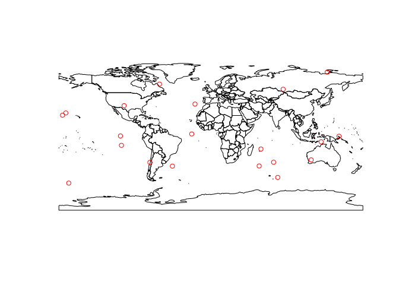
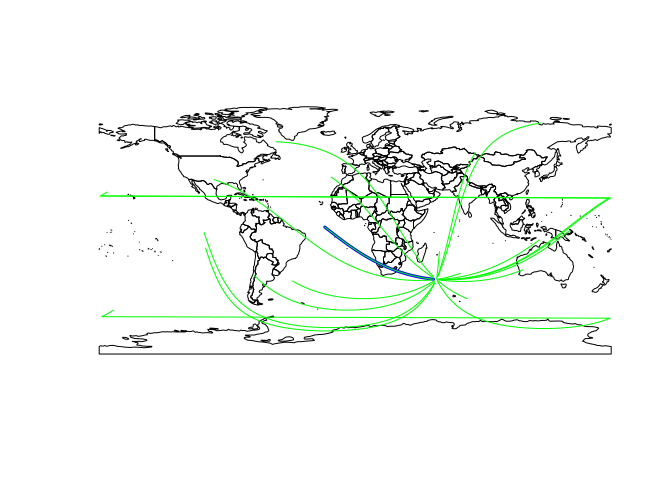
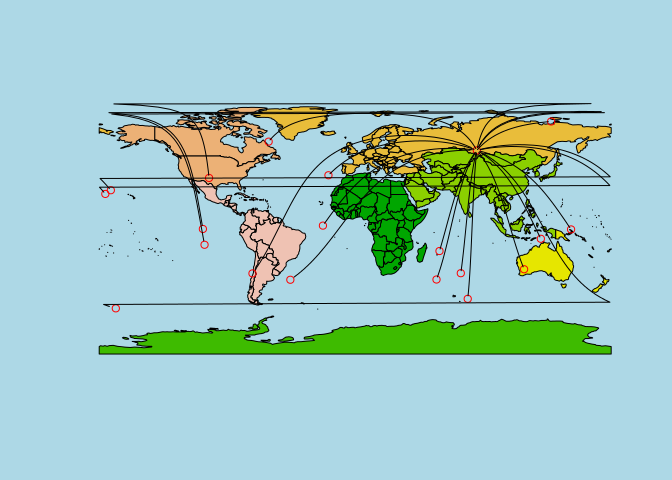
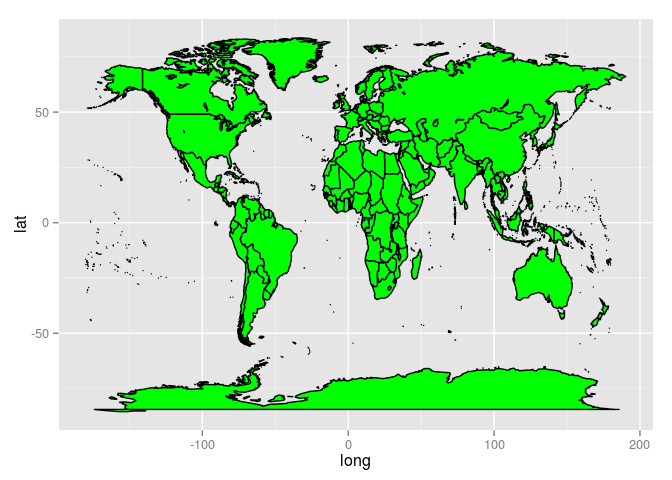
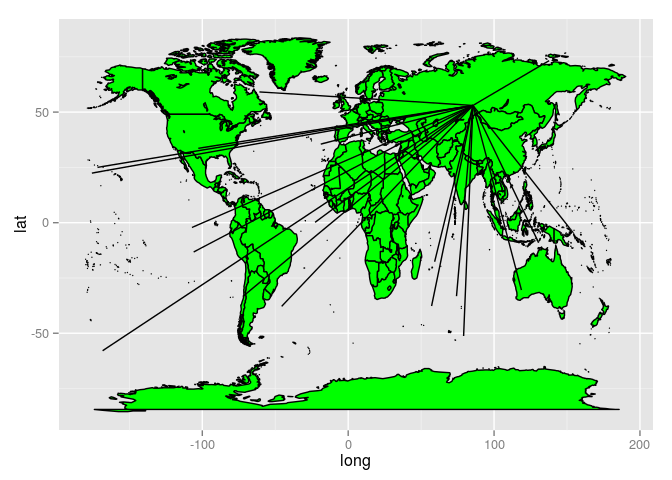
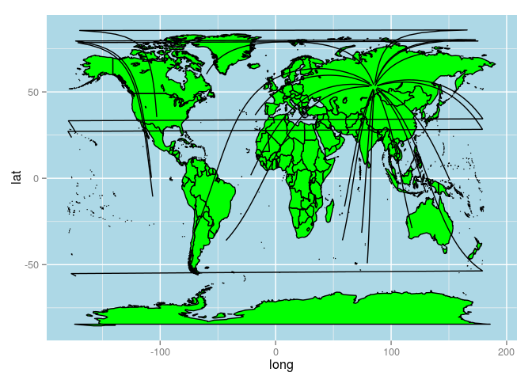
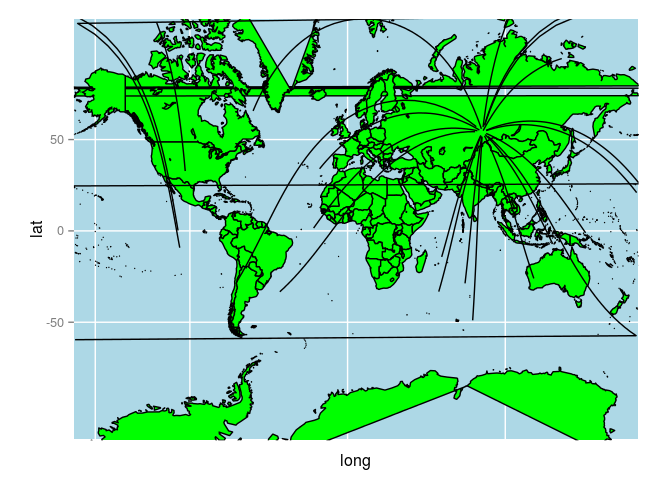
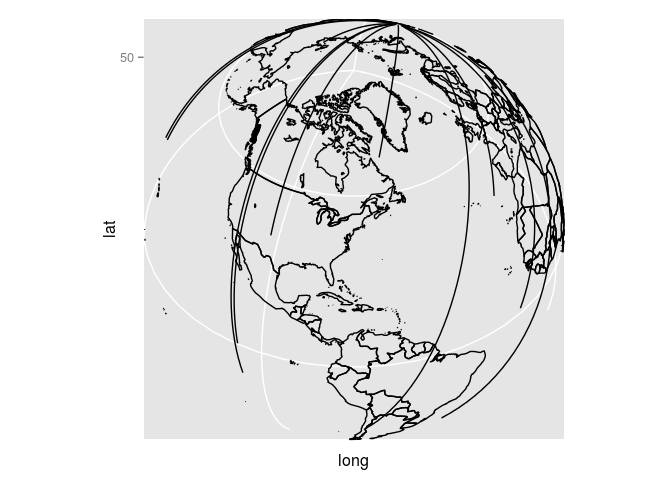

Great circles lines on a world map with **rworldmap** and **ggplot2**
========================================================

Sometimes you will want to plot maps on a much larger
scale that we have covered previously in the
'Introduction to visualising spatial data in R'
[tutorial](https://github.com/Robinlovelace/Creating-maps-in-R/raw/master/intro-spatial-rl.pdf),
hosted on the
[Creating-maps-in-R github repository](https://github.com/Robinlovelace/Creating-maps-in-R/).
For this there are a range of options, including packages called
[**maps**](http://cran.r-project.org/web/packages/maps/index.html),
a function called [`map_data`](http://docs.ggplot2.org/0.9.3/map_data.html) from
**ggplot2** package and [**rworldmap**](http://cran.r-project.org/web/packages/rworldmap/index.html).

In this post we will use the latter two (newer) options
to show how maps of the entire world
can easily be produced in R and overlaid with shortest-line
paths called *great circles*. Amazingly, in each package, the geographic
data for the world and many of its subregions
are included, saving the
need to download and store files of unknown quality from the internet.

## Plotting continents and great circle lines in base graphics

The first stage is to load the packages we'll be using:


```r
x <- c("rworldmap", "geosphere", "ggmap")
lapply(x, require, character.only = T)
```

```
## Loading required package: rworldmap
## Loading required package: sp
## ### Welcome to rworldmap ###
## For a short introduction type : 	 vignette('rworldmap')
## Loading required package: geosphere
## Loading required package: ggmap
## Loading required package: ggplot2
```

```
## [[1]]
## [1] TRUE
## 
## [[2]]
## [1] TRUE
## 
## [[3]]
## [1] TRUE
```

Let us proceed by loading an entire map of the world from
the **rworldmap** function `getMap`:


```r
library(ggmap)
s <- getMap() # load the map data
class(s) # what type of are we dealing with?
```

```
## [1] "SpatialPolygonsDataFrame"
## attr(,"package")
## [1] "sp"
```

```r
nrow(s) # n. polygons
```

```
## [1] 244
```

```r
plot(s) # the data plotted (not shown)
bbox(s) # the bounding box... of the entire world
```

```
##    min    max
## x -180 180.00
## y  -90  83.65
```

The above shows that in single line of code we have loaded
`s`, which represents the entire world and all its countries.
This impressive in itself,
and we can easily add further details like colour based on
the countries' attributes (incidentally, you can see
the attribute data by typing `s@data`).

## Adding points randomly scattered over the face of the Earth

But what if we want to add up points to the map of
the world and join them up? This can be done in
the same way as we'd add points to any R graphic.
Using our knowledge of `bbox` we can define the limits
of random numbers (from `runif`) to scatter points randomly
over the surface of the earth in terms of longitude. Note the use of
`cos(abs(l))` to avoid oversampling at the poles,
which have a much lower surface area than the equator, per
[line of longitude](http://en.wikipedia.org/wiki/Cylindrical_equal-area_projection).


```r
set.seed(1984)
n = 20
x <- runif(n=n, min=bbox(s)[1,1], max = bbox(s)[1,2] )
l <- seq(from = -90, to = 90, by = 0.01)
y <- sample(l, size = n, prob = cos(abs(l) * pi / 180))
p <- SpatialPoints(matrix(cbind(x,y), ncol=2), proj4string=CRS("+proj=longlat +datum=WGS84"))

plot(s)
points(p, col = "red")
```

 

## Joining the dots

So how to join these randomly scattered points on the planet?
A first approximation would be to join them with straight lines.
Let's join point 1, for example, to all others to test this method:


```r
plot(s)
segments(x0 = rep(coordinates(p[1,])[1], n), y0 = rep(coordinates(p[1,])[2], n),
         x1 = coordinates(p)[,1], y1 = coordinates(p)[,2])
```

 

(Incidentally, isn't the use of `segments` here rather clunky - any suggestions
of a more elegant way to do this welcome.)
The lines certainly do join up, but something doesn't seem right in the map, right?
Well the fact that you have perfectly straight lines in the image means bendy
lines over the Earth's surface: these are not the shortest,
[great circle](http://en.wikipedia.org/wiki/Great_circle) lines.
To add these great circle lines, we must use the **geosphere** package:


```r
head(gcIntermediate(p[1,], p[2]), 2) # take a look at the output of the gcIntermediate function
```

```
##        lon    lat
## [1,] 55.15 -37.46
## [2,] 53.15 -37.23
```

```r
plot(s)
lines(gcIntermediate(p[1,], p[2,]), col = "blue", lwd = 3)

# for loop to plot all lines going to zone 5
for(i in 1:length(p)){
  lines(gcIntermediate(p[1,], p[i,]), col = "green")
}
```

 

Fantastic. Now we have great circle lines represented on a
map with a [geographic coordinate system (CRS)](http://en.wikipedia.org/wiki/Geographic_coordinate_system)
(as opposed to a projected CRS, which approximates Euclidean distance).

## Beautifying the map

The maps we created so far are not exactly beautiful.
Let's try to make the map look a little nicer:


```r
names(s@data)
```

```
##  [1] "ScaleRank"    "LabelRank"    "FeatureCla"   "SOVEREIGNT"  
##  [5] "SOV_A3"       "ADM0_DIF"     "LEVEL"        "TYPE"        
##  [9] "ADMIN"        "ADM0_A3"      "GEOU_DIF"     "GEOUNIT"     
## [13] "GU_A3"        "SU_DIF"       "SUBUNIT"      "SU_A3"       
## [17] "NAME"         "ABBREV"       "POSTAL"       "NAME_FORMA"  
## [21] "TERR_"        "NAME_SORT"    "MAP_COLOR"    "POP_EST"     
## [25] "GDP_MD_EST"   "FIPS_10_"     "ISO_A2"       "ISO_A3"      
## [29] "ISO_N3"       "ISO3"         "LON"          "LAT"         
## [33] "ISO3.1"       "ADMIN.1"      "REGION"       "continent"   
## [37] "GEO3major"    "GEO3"         "IMAGE24"      "GLOCAF"      
## [41] "Stern"        "SRESmajor"    "SRES"         "GBD"         
## [45] "AVOIDnumeric" "AVOIDname"    "LDC"          "SID"         
## [49] "LLDC"
```

```r
library(rgdal)
```

```
## rgdal: version: 0.8-10, (SVN revision 478)
## Geospatial Data Abstraction Library extensions to R successfully loaded
## Loaded GDAL runtime: GDAL 1.10.0, released 2013/04/24
## Path to GDAL shared files: /usr/share/gdal/1.10
## Loaded PROJ.4 runtime: Rel. 4.8.0, 6 March 2012, [PJ_VERSION: 480]
## Path to PROJ.4 shared files: (autodetected)
```

```r
# s <- spTransform(s, CRSobj=CRS("+proj=robin +lon_0=0 +x_0=0 +y_0=0 +ellps=WGS84 +datum=WGS84 +units=m +no_defs"))
rcols <- terrain.colors(length(unique(s$REGION)))
s$col <- as.numeric(factor(s$REGION))
par(bg = 'lightblue')
plot(s, col = rcols[s$col], xlim = c(-180, 180))
points(p, col = "red")
for(i in 1:length(p)){
  lines(gcIntermediate(p[5,], p[i,]), col = "black")
}
```

 

```r
par(bg = 'white')
```

## Doing it in ggplot2

The 'beautified' map above certainly is more interesting visually, with added
colours. But it's difficult to call it truly beautiful. For that, as with
so many things in R plotting, we turn to ggplot2.


```r
s <- map_data("world")
m <- ggplot(s, aes(x=long, y=lat, group=group)) +
  geom_polygon(fill="green", colour="black")
m
```

 

When we add the lines in projected maps (i.e. with a Euclidean coordinate system)
based solely on origins and destinations, this works fine, but
as with the previous example, generates incorrect
shortest path lines:


```r
# adding lines
# for all combinations of lines, use this code
# p1 <- do.call(rbind, rep(list(coordinates(p)),n ))
# p2 <- cbind(rep(coordinates(p)[,1], each=n ), rep(coordinates(p)[,2], each=n ))

# for all lines goint to point 5:
p1 <- coordinates(p[5,])[rep(1, n),]
p2 <- coordinates(p)

# test plotting the lines
# ggplot() + geom_segment(aes(x = p1[,1], y = p1[,2], xend = p2[,1], yend = p2[,2]))

ggplot() + geom_polygon(data = s,aes(x=long, y=lat, group=group), 
  fill="green", colour="black") +  
  geom_segment(aes(x = p1[,1], y = p1[,2], xend = p2[,1], yend = p2[,2]))
```

 

## Adding great circle lines to ggplot2 maps

Adding great circle lines in ggplot2 is similar, but we must
save all of the coordinates of the paths in advance before plotting,
because ggplot2 like to add all its layers in one function: you
cannot iteratively add to the map using a `for` loop as we did
in the base graphics example above.

To create the for loop, first create a data frame of a single line.
The iterate for all zones and use `rbind` to place one data frame on
top of the next:


```r
paths <- gcIntermediate(p[5,], p[1,])
paths <- data.frame(paths)
paths$group <- 1

sel <- setdiff(2:length(p), 5)
for(i in sel){
  paths.tmp <- gcIntermediate(p[5,], p[i,])
  paths.tmp <- data.frame(paths.tmp)
  paths.tmp$group <- i
  paths <- rbind(paths, paths.tmp)
}
```

To plot multiple paths, we can use the `geom_segment` command.
Before plotting the lines on the map, it's sometimes best to first
plot them on their own to ensure that everything is working.
Note the use of the command `ggplot()`, which initiates an
empty ggplot2 instances, ready to be filled with layers.
This is more flexible than stating the data at the outset.


```r
ggplot() + geom_polygon(data = s, aes(x=long, y=lat, group=group), 
  fill = "green", colour="black") +
  geom_path(data = paths, aes(lon, lat , group = group)) +
  theme(panel.background = element_rect(fill = 'lightblue'))
```

 

## Changing projection in ggplot

*ggplot2* has inbuilt map projection functionality with the
function `coord_map`. This distorts the Euclidean axis of the
map and allows some truly extraodinary shapes (these
transformations can also be done in base graphics, 
e.g. by using `spTransform`). However,
as shown in the examples below, the library is currently buggy
for plotting polygons.


```r
# to see the range of projections available using this method, try ?mapproject
m <- last_plot()
m + coord_map()
```

 

```r
# remove fill as this clearly causes problems:
m <- ggplot() + geom_path(data = s, aes(x=long, y=lat, group=group), colour="black") +
  geom_path(data = paths, aes(lon, lat , group = group)) 
# m + coord_map("bicentric", lon = 0)
# m + coord_map("bonne", lat= 0)
m + coord_map("ortho", orientation=c(41, -74, 0)) # for ortho maps
```

 

## Conclusion

We've seen 2 ways of plotting maps of the world and overlaying
'great circles' lines on them. There are probably more, but
these two options seem to work well, except with
the bugs in **ggplot2** for plotting polygons in
many map projections. The two methods are not incompatible
(see `fortify` for plotting **sp** objects in **ggplot2**)
and can be combined in many other ways.

For more information on plotting spatial data in R,
I recommend checking out R's range of
[spatial packages](http://cran.r-project.org/web/views/Spatial.html).
For an introductory tutorial on visualising spatial data
in R, you could do much worse than start with
[Visualising Spatial Data in R](https://github.com/Robinlovelace/Creating-maps-in-R/raw/master/intro-spatial-rl.pdf)
by [James Cheshire](http://spatial.ly/) and [myself](http://robinlovelace.net/).


