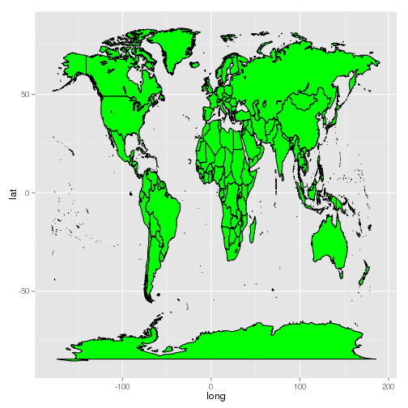

Great circles lines on a world map
========================================================

Sometimes you will want to plot maps on a much larger
scale that we have covered in the majority of
the [Creating-maps-in-R repository](https://github.com/Robinlovelace/Creating-maps-in-R/).
For this there are a range of options, including packages called
[*maps*](http://cran.r-project.org/web/packages/maps/index.html),
[`map_data`](http://docs.ggplot2.org/0.9.3/map_data.html) from the
*ggplot2* package and [*rworldmap*](http://cran.r-project.org/web/packages/rworldmap/index.html).

We will use the latter two options to show how maps of the entire world
can easily be produced in R. Amazingly, in each of the packages, the geographic
data for the world and many of its subregions have already been saved, saving the
need to download and store files of unknown quality from the internet.

# Plotting continents and great circle lines in base graphics


```r
library(rworldmap)
```

```
## Loading required package: sp
## ### Welcome to rworldmap ###
## For a short introduction type : 	 vignette('rworldmap')
```

```r
library(geosphere)

s <- getMap()
plot(s)
bbox(s)
```

```
##    min    max
## x -180 180.00
## y  -90  83.65
```

```r

set.seed(1984)
n = 20
x <- runif(n = n, min = bbox(s)[1, 1], max = bbox(s)[1, 2])
y <- runif(n = n, min = bbox(s)[2, 1], max = bbox(s)[2, 2])
p <- SpatialPoints(matrix(cbind(x, y), ncol = 2), proj4string = CRS("+proj=longlat +datum=WGS84"))

points(p, col = "red")

head(gcIntermediate(p[1, ], p[2]))  # take a look at the output of the gcIntermediate function
```

```
##        lon    lat
## [1,] 57.15 14.024
## [2,] 57.13 11.946
## [3,] 57.11  9.867
## [4,] 57.09  7.789
## [5,] 57.07  5.710
## [6,] 57.05  3.632
```

```r
lines(gcIntermediate(p[1, ], p[2, ]))

# for loop to plot all lines going to zone 5
for (i in 1:length(p)) {
    lines(gcIntermediate(p[5, ], p[i, ]), col = "green")
}
```

 


```r
# beautify the map a little
names(s@data)
```

```
##  [1] "ScaleRank"    "LabelRank"    "FeatureCla"   "SOVEREIGNT"  
##  [5] "SOV_A3"       "ADM0_DIF"     "LEVEL"        "TYPE"        
##  [9] "ADMIN"        "ADM0_A3"      "GEOU_DIF"     "GEOUNIT"     
## [13] "GU_A3"        "SU_DIF"       "SUBUNIT"      "SU_A3"       
## [17] "NAME"         "ABBREV"       "POSTAL"       "NAME_FORMA"  
## [21] "TERR_"        "NAME_SORT"    "MAP_COLOR"    "POP_EST"     
## [25] "GDP_MD_EST"   "FIPS_10_"     "ISO_A2"       "ISO_A3"      
## [29] "ISO_N3"       "ISO3"         "LON"          "LAT"         
## [33] "ISO3.1"       "ADMIN.1"      "REGION"       "continent"   
## [37] "GEO3major"    "GEO3"         "IMAGE24"      "GLOCAF"      
## [41] "Stern"        "SRESmajor"    "SRES"         "GBD"         
## [45] "AVOIDnumeric" "AVOIDname"    "LDC"          "SID"         
## [49] "LLDC"
```

```r
library(rgdal)
```

```
## rgdal: version: 0.8-14, (SVN revision 496)
## Geospatial Data Abstraction Library extensions to R successfully loaded
## Loaded GDAL runtime: GDAL 1.9.2, released 2012/10/08
## Path to GDAL shared files: /usr/share/gdal
## Loaded PROJ.4 runtime: Rel. 4.8.0, 6 March 2012, [PJ_VERSION: 480]
## Path to PROJ.4 shared files: (autodetected)
```

```r
# s <- spTransform(s, CRSobj=CRS('+proj=robin +lon_0=0 +x_0=0 +y_0=0
# +ellps=WGS84 +datum=WGS84 +units=m +no_defs'))
rcols <- terrain.colors(length(unique(s$REGION)))
s$col <- as.numeric(factor(s$REGION))
par(bg = "lightblue")
plot(s, col = rcols[s$col], xlim = c(-180, 180))
points(p, col = "red")
for (i in 1:length(p)) {
    lines(gcIntermediate(p[5, ], p[i, ]), col = "black")
}
```

 

```r
par(bg = "white")
```


# Doing it in ggplot2

The 'beautified' map above certainly is more interesting visually, with added
colours. But it's difficult to call it truly beautiful. For that, as with
so many things in R plotting, we turn to ggplot2.


```r
s <- map_data("world")
m <- ggplot(s, aes(x = long, y = lat, group = group)) + geom_polygon(fill = "green", 
    colour = "black")
m
```

 


When we add the lines in projected maps (i.e. with a Euclidean coordinate system)
based solely on origins and destinations, this works fine, but generates incorrect
shortest path lines in ggplot2.


```r
# adding lines for all combinations of lines, use this code p1 <-
# do.call(rbind, rep(list(coordinates(p)),n )) p2 <-
# cbind(rep(coordinates(p)[,1], each=n ), rep(coordinates(p)[,2], each=n ))

# for all lines goint to point 5:
p1 <- coordinates(p[5, ])[rep(1, n), ]
p2 <- coordinates(p)

ggplot() + geom_segment(aes(x = p1[, 1], y = p1[, 2], xend = p2[, 1], yend = p2[, 
    2]))
```

 

```r
ggplot() + geom_polygon(data = s, aes(x = long, y = lat, group = group), fill = "green", 
    colour = "black") + geom_segment(aes(x = p1[, 1], y = p1[, 2], xend = p2[, 
    1], yend = p2[, 2]))
```

 


# Adding great circle lines

Adding great circle lines in ggplot2 is similar, but we must
save all of the coordinates of the paths in advance before plotting,
because ggplot2 like to add all its layers in one function: you
cannot iteratively add to the map using a `for` loop as we did
in the base graphics example above.

To create the for loop, first create a data frame of a single line.
The iterate for all zones and use `rbind` to place one data frame on
top of the next:


```r
paths <- gcIntermediate(p[5, ], p[1, ])
paths <- data.frame(paths)
paths$group <- 1

sel <- setdiff(2:length(p), 5)
for (i in sel) {
    paths.tmp <- gcIntermediate(p[5, ], p[i, ])
    paths.tmp <- data.frame(paths.tmp)
    paths.tmp$group <- i
    paths <- rbind(paths, paths.tmp)
}
```


To plot multiple paths, we can use the `geom_segment` command.
Before plotting the lines on the map, it's sometimes best to first
plot them on their own to ensure that everything is working.
Note the use of the command `ggplot()`, which initiates an
empty ggplot2 instances, ready to be filled with layers.
This is more flexible than stating the data at the outset.


```r
ggplot() + geom_path(data = paths, aes(lon, lat, group = group))
```

 

```r
ggplot() + geom_polygon(data = s, aes(x = long, y = lat, group = group), fill = "green", 
    colour = "black") + geom_path(data = paths, aes(lon, lat, group = group)) + 
    theme(panel.background = element_rect(fill = "lightblue"))
```

 


## Changing projection in ggplot

*ggplot2* has inbuilt map projection functionality with the
function `coord_map`. This distorts the Euclidean axis of the
map and allows some truly extraodinary shapes (these
transformations can also be done in base graphics, 
e.g. by using `spTransform`). However,
as shown in the examples below, the library is currently buggy
for plotting polygons.


```r
# to see the range of projections available using this method, try
# ?mapproject
m <- last_plot()
m + coord_map()
```

 

```r

# remove fill as this clearly causes problems:
m <- ggplot() + geom_path(data = s, aes(x = long, y = lat, group = group), colour = "black") + 
    geom_path(data = paths, aes(lon, lat, group = group))
m + coord_map("bicentric", lon = 0)
```

 

```r
m + coord_map("bonne", lat = 0)
```

 

```r
m + coord_map("ortho", orientation = c(41, -74, 0))  # for ortho maps
```

 


