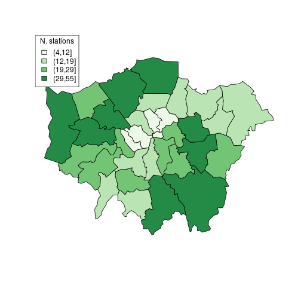
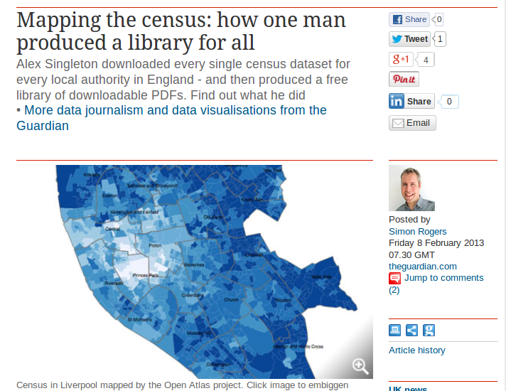
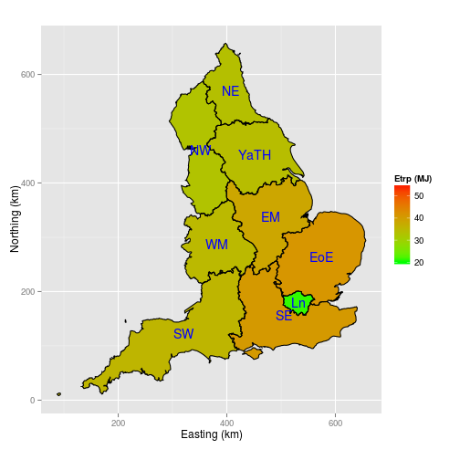

```{r setup, include=FALSE}
knitr::opts_chunk$set(echo = TRUE)
```

## What's this talk all about? | Source [wikipedia.org](https://en.wikipedia.org/wiki/John_Snow)

```{r, out.width="50%"}
knitr::include_graphics(c("https://upload.wikimedia.org/wikipedia/commons/thumb/2/27/Snow-cholera-map-1.jpg/300px-Snow-cholera-map-1.jpg", "https://upload.wikimedia.org/wikipedia/commons/thumb/0/00/Chol_an.gif/300px-Chol_an.gif"))
```

## Why R for spatial data?

- Extensive and rapidly expanding spatial packages
- Interface with 'conventional' GIS software
- The advantages of the command-line:

> "With the advent of “modern” GIS software, most people want 
> to point and click their way through life.
> That’s good, but there is a tremendous amount of 
> flexibility and power waiting for you with the command
> line. Many times you can do something on the command
> line in a fraction of the time you can do it with
> a GUI (Sherman 2008, p. 283)

## Visualisation

- R's visualisation capabilities have evolved over time
- Used to create plots in the best academic journals
- ggplot2 has **revolutionised** the visualisation of quantitative 
information in R, and (possibly) overall
- Thus there are different camps with different preferences when it comes to maps in R

## Why focus on visualisation?

If you cannot visualise your data, it is very difficult to understand your data. 
Conversely, visualisation will greatly aid in communicating your results.

> Human beings are remarkably adept at discerning relationships from visual
> representations. A well-crafted graph can help you make meaningful comparisons among thousands of pieces of information, extracting patterns not easily found through other methods. ... Data analysts need to look at their data, and this is one area where R shines.
(Kabacoff, 2009, p. 45).

## Maps, the 'base graphics' way



Source: Cheshire and Lovelace (2014) - [available online](https://github.com/geocomPP/sdvwR)

## The 'ggplot2' way of doing things

<!--  -->

```{r, echo=FALSE}
knitr::include_graphics("figure/faceteg.png")
```


Source: [This tutorial](https://github.com/Robinlovelace/Creating-maps-in-R)!

## R in the wild 1: Maps of all census variables for local authorities



## R in the wild 2: Global shipping routes in the late 1700s


Source: [R-Bloggers](http://www.r-bloggers.com/mapped-british-and-spanish-shipping-1750-1800/)

## R in the wild 3: Reproducible maps of energy use in commuting




## R in the wild 4: Infographic of housing project finances

<!--

-->

<div style="float:center"></div>

Flexibility of ggplot2 - see [robinlovelace.net](http://robinlovelace.net/r/2013/12/27/coxcomb-plots-spiecharts-R.html)

## R in the wild 5: the Propensity to Cycle Tool (PCT)

See http://www.pct.bike/

[](https://github.com/npct/pct/raw/master/figures/rnet-leeds-base-to-godutch.png)

## Course plan

**13:30 - 14:00**: Introduction and downloading the data 

**14:00 - 15:00**: Base graphics and ggplot2

> - 14:00 - 14:30 Loading and exploring the data, base graphics
> - 14:30 - 15:00 ggplot2 (bonus: spatial data classes)
> - 15:00 - 15:30 `**Coffee break**` and discussion/questions

**15:30 - 17:00**: tmap and interactive maps

> - 15:30 - 16:00 tmap
> - 16:00 - 16:30 leaflet and mapview
> - 16:30 - 17:00 leaflet/shiny

## Modus operandi

- Work from the printed tutorial - don't copy and paste!
- Don't just enter the code, run it then move on.
- Play with it, break it, explore it.
- I will interject at intervals with demos/advice
- It will be an iterative process - don't worry too much about timings

```{r}
# Make lots of comments!
```


## Getting up-and-running for the tutorial

Before progressing further: **Any questions?**

- Download the input data from here:  https://github.com/Robinlovelace/vspd-base-shiny-data

- The tutorial itself can be found here: https://github.com/Robinlovelace/Creating-maps-in-R/blob/master/vignettes/vspd-base-shiny.md
  
## Further resources I

1: The internet!

Bivand, R. S., Pebesma, E. J., & Rubio, V. G. (2013). Applied spatial data analysis with R. Springer. 2nd ed.

Cheshire, J., & Lovelace, R. (2015). Spatial data visualisation with R. In C. Brunsdon & A. Singleton (Eds.), Geocomputation (pp. 1–14). SAGE Publications. Retrieved from https://github.com/geocomPP/sdv . Full chapter available from
https://www.researchgate.net/publication/274697165_Spatial_data_visualisation_with_R

Lovelace, R., Cheshire, J., 2014. Introduction to visualising spatial data in R. Comprehensive R Archive Network.

## Further resources II

Dorman, M. (2014). Learning R for Geospatial Analysis. Packt Publishing Ltd.

Everitt, B. S., & Hothorn, T. (2015). HSAUR: A Handbook of Statistical Analyses Using R. Retrieved from http://cran.r-project.org/package=HSAUR

Harris, R. (2012). A Short Introduction to R.
[social-statistics.org](http://www.social-statistics.org/).

## Further resources III

Lamigueiro, O. P. (2012). solaR: Solar Radiation and Photovoltaic Systems with R. Journal of Statistical Software, 50(9), 1–32. Retrieved from http://www.jstatsoft.org/v50/i09

Wickham, H. (2009). ggplot2: elegant graphics for data analysis. Springer.


Wickham, H. (2014). Tidy data. The Journal of Statistical Software, 14(5), Retrieved from http://www.jstatsoft.org/v59/i10

Wilkinson, L. (2005). The grammar of graphics. Springer.
